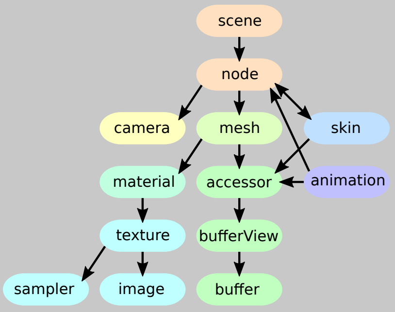

# GLTF

**[glTF](https://github.com/KhronosGroup/glTF)**

[glTF-Sample-Models/2.0 at master · KhronosGroup/glTF-Sample-Models](https://github.com/KhronosGroup/glTF-Sample-Models/tree/master/2.0)

### fbx to GLTF

[将fbx文件转换成gltf格式的模型文件(解决3dmax导出gltf模型时会出现异常的情况)](https://blog.csdn.net/weixin_44870969/article/details/125433999)

[fbx 到 gltf 转换问题 - 云风](https://blog.codingnow.com/2021/03/fbx_gltf.html)

**[FBX2glTF](https://github.com/facebookincubator/FBX2glTF)** ：A command-line tool for the conversion of 3D model assets on the FBX file format to the glTF file format.

Blender ：FBX to GLTF
