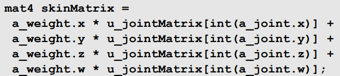

# 皮肤

JointMatrix 相应骨骼在改变姿势后的位移矩阵

vec4 joint,weight 受到的骨骼的序号的影响以及相应的权重

skinMatrix 是顶点在骨骼改变姿势后的位移矩阵

骨骼由坐标和向量表示

ModelMatrix 模型空间下的骨骼坐标

Inverse Model Matrix 

LocalMatrix 上个骨骼空间下的当前骨骼坐标

Mshoulder = Lroot * Lhip * ... * Lshoulder

AM[i] = AM[p(i)] * L[i] * A[i]

JM = AM[i] * InvM[i]

JM = AM[p(i)] * L[i] * A[i] * InvM[i]
