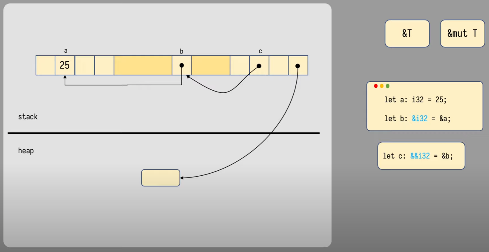
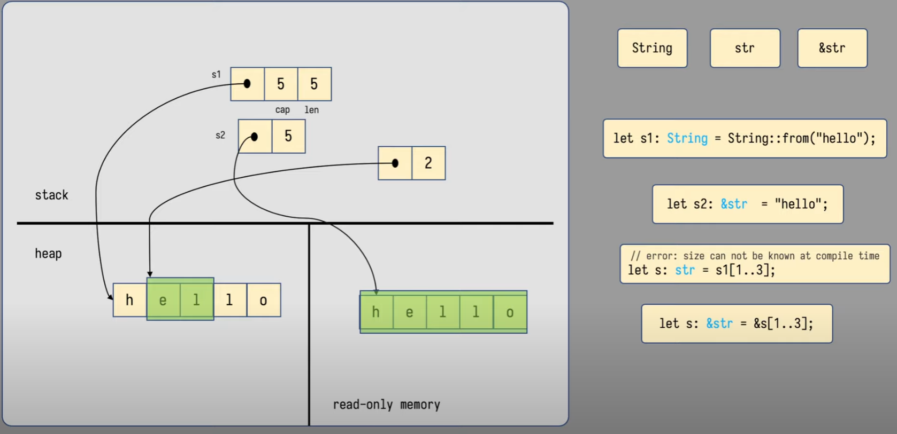
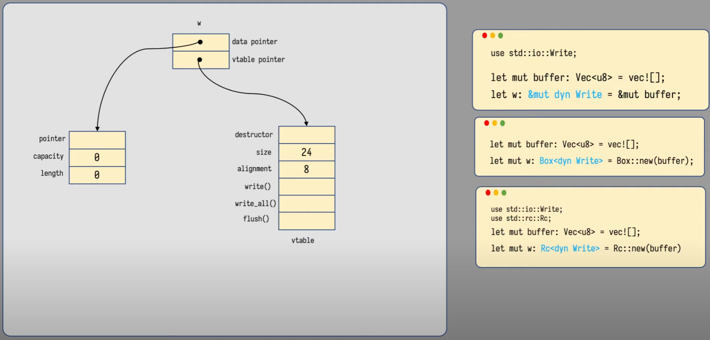
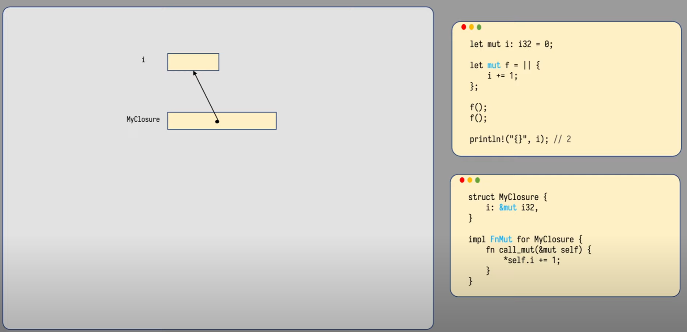
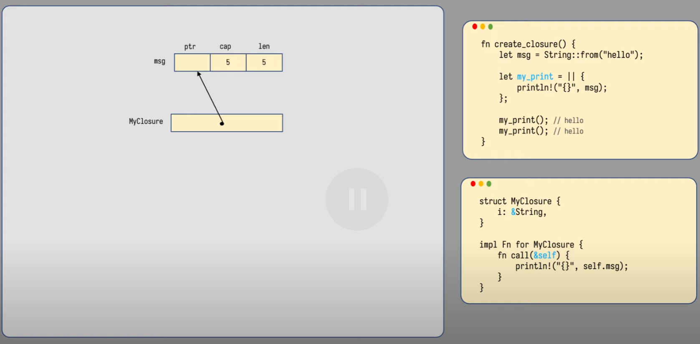

# Rust 内存管理

[Visualizing memory layout of Rust&#39;s data types](https://www.bilibili.com/video/BV1KT4y167f1)

## Stack & Heap

## Stack

Stack 存储数据和待执行的方法地址

## Data Types

## Char

字符，4 Bytes

## Turple

sizeof 得到大小

align_of 得到对其单位

## Ref

## Array and Vector

## Slice 切片

切片只能引用

## String, str, &str

## Struct

一个 Struct 类型的变量占据的空间是其所有成员占据的空间总和

## Enum

一个 Enum 类型所占据的空间是它占据空间最大的成员的空间

使用 Box 指针优化最大成员空间

## Option Box

* Option 是一个描述是否有值的枚举
* 使用 Option <Box `<>>` 描述一个可空的指针
* Option<Box<?>> 不需要序号占据枚举位

## Copy & Move

### 值类型拷贝

### 引用类型移动

## RC

- RC 是智能指针指向内存区域一个类型，并多一个字节记录引用计数
- 相比于 Box 是使用引用计数来释放内存
- 当使用 clone 后将会浅拷贝指向的地址并让引用计数增加

## Send & Sync

Send 类型：支持可以在线程间移动的类型

Sync 类型：支持可以在线程间共用数据

而 RC 不是 Send 和 Sync，因为可能会在更改数据时出现数据竞争

## Arc

arc 在 rc 的基础上，对数据的访问进行了原子化限制，防止数据竞争，有额外开销

## Trait object

特征对象，指的是对具体对象的特征的引用，类似于使用接口对象代表实体

Rust 中使用 dyn 声明

特征对象有两个指针，一个是指向具体数据，一个是特征虚函数表，这也称为胖指针

## 函数指针

指向函数机器码

## 闭包

闭包可以有三种特征 trait

Fn,FnOnce, FnMut

#### FnOnce

创建 struct 存储外部变量，相当于移动值或引用

#### FnMut

创建 struct 引用外部变量，

需要声明为可变的，因为闭包方法会改变 struct 里变量而影响到外部变量

#### Fn

不改变外部变量的闭包，

如果返回闭包，闭包中的引用变量超过变量作用域，需要使用move 语义，转移变量所有权到闭包中

