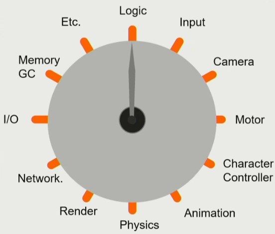
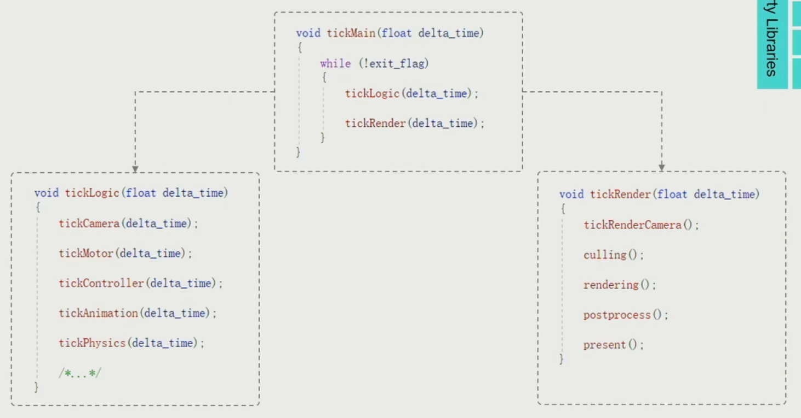
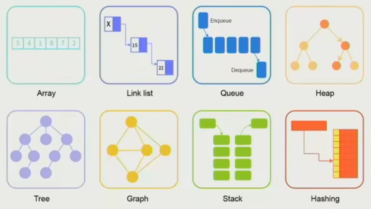
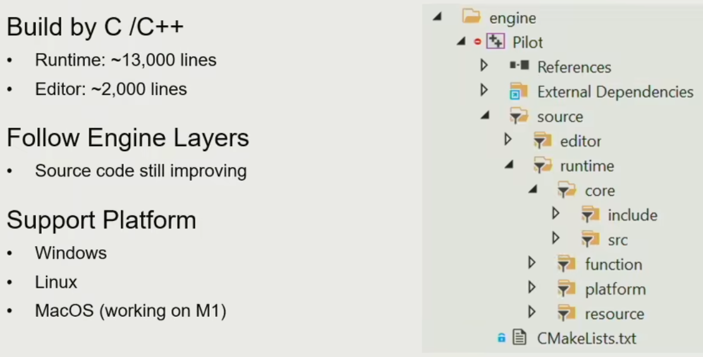
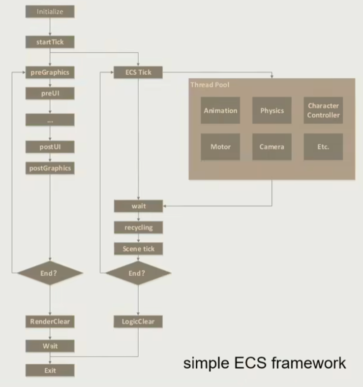

## 第二节：引擎架构分层

### 游戏引擎分层简介

#### Layers

- Tool Layer
- Function Layer
- Resource Layer
- Core Layer
- Platform Layer
- 3rd Party Libraries

5 + 1 层次涵盖了几乎所有引擎功能

#### Chans of Editor

- Editor GUI

#### Make it visible movable and playable

- Physics
- Animation
- Rendering
- Camera HUD and Input
- Script FSM and AI

#### Data and Files

#### Swiss Knife of Game Engine

#### Launch on Different Platforms

- Operation Systems
- Platform File Systems
- Graphics API
- Platform SDK

etc

- Consoles
- Input Devices
- Publishing Platforms

#### Practice

make an animate character

### Resource Layer

- How to Access My Data
  - Resource -> asset
- Rentime Asset Manager
- Manage Asset Life Cycle

### Function Layer

- How to Make the world alive
- 
- 每个 Tick 进行一遍所有的系统执行

#### Dive into Tick

- tick logic 先世界模拟
- tick render 再进行渲染

#### Heavy - duty Hotchpotch

#### Multi-Threading

难点在 Dependency 管理

### Core Layer

#### Math Library

- math efficiency
- 倒数平方根很慢，quake 3 有一个近似算的很快
- SIMD ：专门做向量运算的组件，可以同时进行 4 次相加

#### Data Structure and Container

需要重新写游戏引擎手动控制的容器数据结构，因为语言自带的托管内存的数据结构所占据的内存会产生很多空洞，内存的消耗是不可控的。

出现很多内存碎片，访问效率很低。

#### Memory Management 内存管理

现代计算机的内存数据读写还是图灵机方式

高效的内存分配模式

- Put data together 数据在一块
- Access data in order 数据按顺序读写
- Allocate and de-allocate as a block 按照块状分配内存

#### Foundation of Game Engine

### Platform Layer

#### Target on Different Platform

需要做到平台无关性

- File system
- Graphic api
- Hardware Architecture 特定机器优化

### Tool Layer

#### Allow artists to create game

Manual Editors

- Level Editor
- Logical Editor
- Shader Editor
- Animation Editor
- UI Editor
- Flexible of coding languages

#### Digital Content Creation

Asset conditioning pipeline

tool chains

### Why Layered Architecture

- Decoupling and Reducing Complexity
- Response for Evolving Demands

### Mini Engine : Pilot

### Simple ECS framework

### Takeaways

- Engine is designed with a layered architecture
- Lower levels are more stable and upper levels are more customizable
- Virtual world is composed by a set of clocks - ticks
