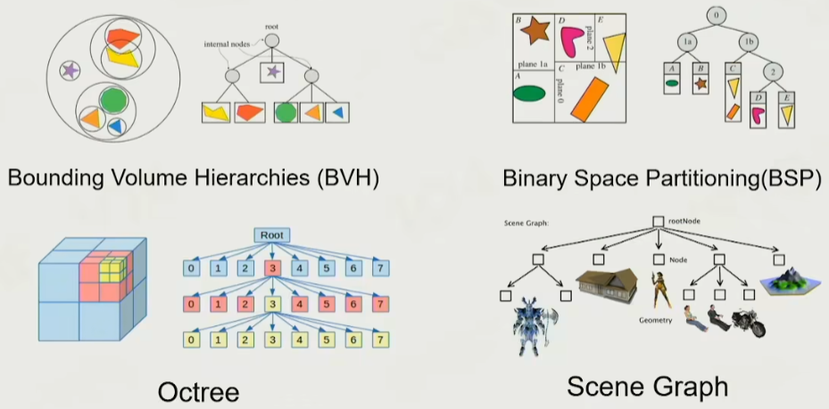

# 第三节：如何构建游戏世界

## 如何让游戏世界活起来

### Dynamic Game Object

- Drone
- Air-defense Missile
- Solider
- Artillery
- Tank

### Static Game Object

- Boxes
- Watchtower
- Shack
- Shed
- Stone

### Environment

- Sky (tone of day 日夜变换系统)
- Vegetation (植被)
- Terrain

### Other Game Objects

- Air wall
- Trigger Area
- Ruler
- Navigation mesh

### Everything is a Game Object

## How to Describe a GameObject

- Name
- Property
  - Shape
  - Position
  - Capacity of battery
- Behavior
  - Move
  - Scout

### OOP

- 通过面向对象的方式描述游戏物体，
- 但是实际上多派生会出现问题
- 实际上的现实中的物体不是清晰的树状派生关系，而是功能组合居多

### Component Base

组件化，通过组件组合成游戏对象

### Takeaways

- Everything is a game object in the game world
- Game object could be described in the component-based way

### Make world alive

- Object-based Tick 是直观的，但是是效率低的
- 高效的 Tick 的执行是遍历同类型的每个个体，而不是同个体的每个类型
- 按照流水线的做法比较高效，把同样的 component 放在一起进行批处理

### Interactive

- Events
- Interface
- 可拓展的消息系统

#### Manage Game Object

- Game object uid
- position
- Scene management 空间管理的核心
  - No division
  - Divided by grid
    - Quadtree
  - Hierarchical segmentation 树状结构划分

#### 复杂情况

- GO Binding，父子节点情况，时序很重要，因为有并行情况
  - 逻辑上的混乱性，而好的程序执行是确定性的
  - 挑战性是在多线程情况下执行还是确定性的
  - 需要有同步点，GameObject 间不能直接发送消息
  - 可能逻辑间有循环依赖，根据处理方式可能会导致延时情况
