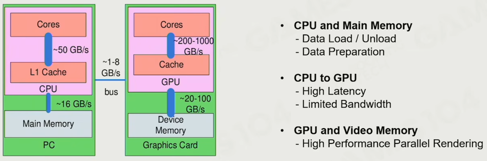
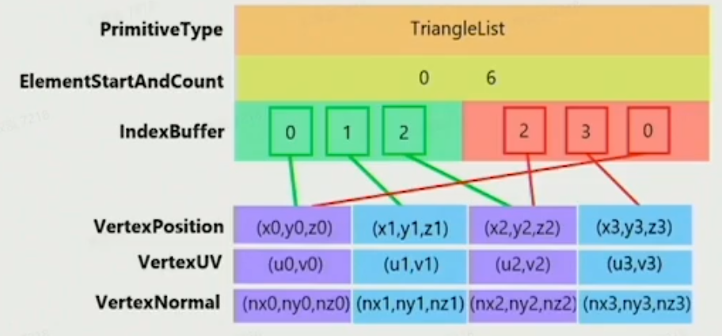
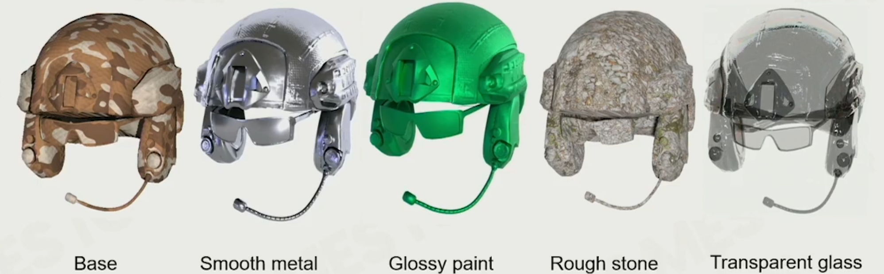
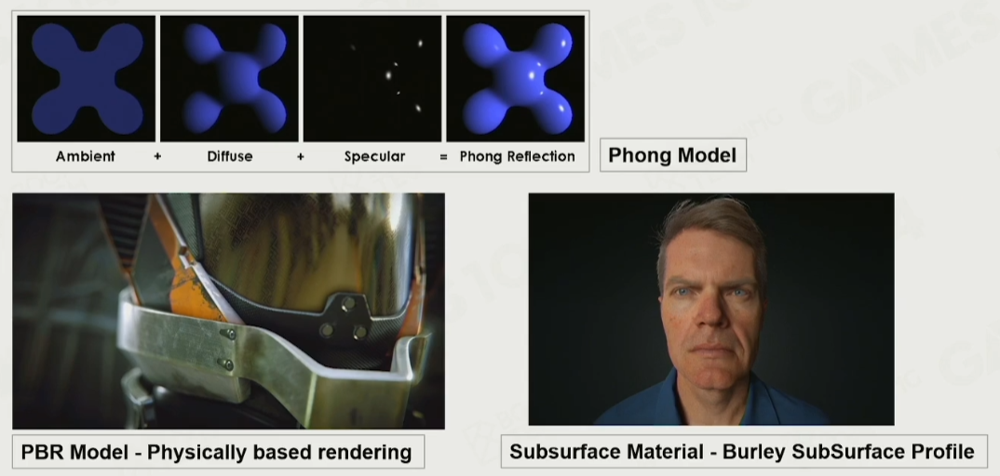
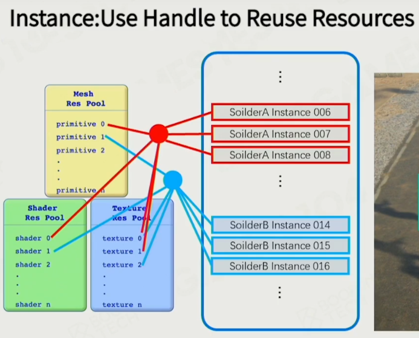
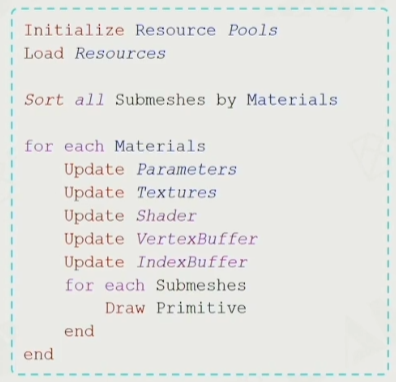
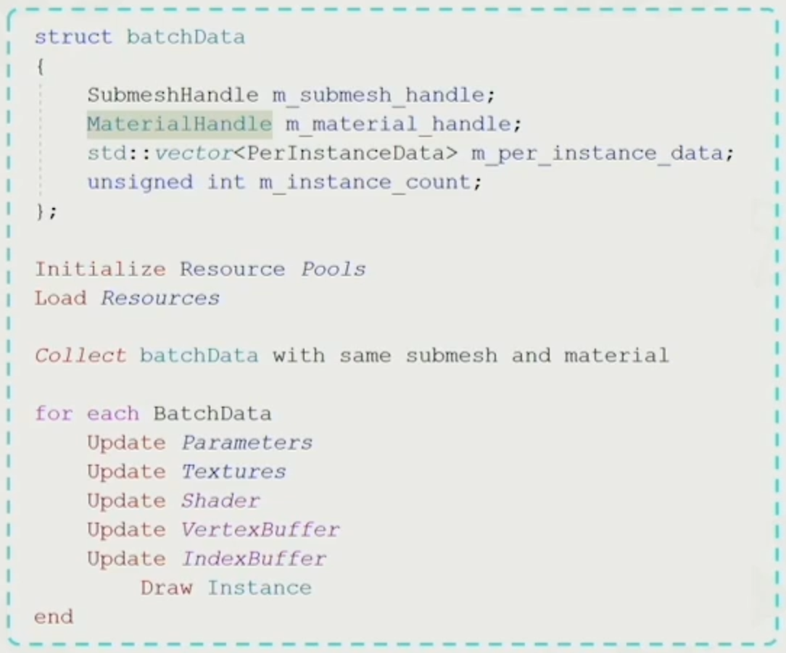
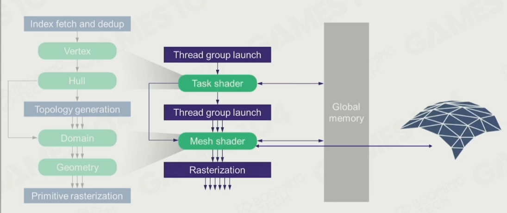

## 第四节：游戏引擎中的渲染实现

### 渲染概述

#### Challenges on Game Rendering

1. Complex render objects
2. Deal with architecture of modern computer with a complex combination of CPU and GPU
3. Commit a bullet-proof framerate,
   1. 30 or 60 or 120 fps
   2. HD, 1080p, 4k, 8k
4. CPU memory

#### Rendering on Game Engine

A heavily optimized parctical software framework to fulfill the critical rendering requirements of games on modern hadware

#### Outline of Rendering

1. Basics of Game Rendering
   - Hardware architecture
   - Render data organization
   - Visibility
2. Materials, Shaders and Lighting
   - PBR
   - Shader permutation
   - Lighting
   - Point / Directional lighting
   - IBL / Simple GI
3. Special Rendering
   - Terrain
   - Sky / Fog
   - Postprocess
4. Pipeline
   - Forward, deferred rendering forward plus
   - Real pipeline with mixed effects
   - Ring buffer and V-Sync
   - Tiled-based rendering

### 渲染系统的对象

#### Building Block of Rendering

#### Computation - Texture Sampling

昂贵的三线性滤波，采样 8 个像素点，7 次滤波

1. Use tow nearest mipmap levels
2. Perform bilinear inerpolation in both mip-maps
3. Linear interpolate between the results

### GPU 架构

The dedicated hardware to solve massive jobs

#### SIMD and SIMT

- SIMD 单指令多数据

- SIMT 单指令多线程

#### GPU Architecture

架构和不同核心

数据流动

cpu 到 gpu 的高延迟

多级缓存，数据尽量要放在一起

#### GPU Bounds and Performance

- Memory Bounds 内存瓶颈
- ALU Bounds 计算瓶颈
- TMU (Texture Mapping Unit) Bound 纹理采样瓶颈
- BW (Bandwidth) Bound 数据传输瓶颈

### Renderable

可绘制的东西

- Mesh Render Component
- Building Blocks of Renderable
- Mesh Primitive

  - struct Vertex
    - position
    - color
    - normal
  - struct Triangle
    - Vertex[3]
- Vertex and Index Buffer

  - Vertex Datda
  - Index Data

  
- We Need Per-Vertex Normal
- Materials

  
- Material Model

  
- Various Textures in Materials
- Variety of Shaders

### Render Objects on Engine

- Coordinate System and Transformation
- Object with Many Materials
- Resource Pool

  - Use Handle to Reuse Resources

    

    
- Instancing 实例化，前边的都是物体绘制的定义，实际上绘制到屏幕上才是实例
- Sort by Material
- GPU Batch Rendering

  

### Visibility Culling 可见性裁剪

- Culling One Object
  - View Frustum
  - Bounding Box
  - Hierarchial View Frustum Culling
  - Construction and Insertion of BVH in GameEngine
    - BVH 在动态物体多的情况下构建成本低
    - PVS (Potential Visibility Set) 对于空间上的一点关于其他物体的潜在可见性，即是否不会被其他物体遮挡
    - The Idea of Using PVS in Stand-alone Games
  - GPU Culling
    - Depth pre pass / early z 提前渲染深度到 z buffer，防止重复像素点着色

### Texture Compression

纹理压缩

- Traditional image compression like JPG and PNG
- In game texture compression
  - 需要支持随机访问
- Block Compressions
  - Common block-based compression format
  - On PC BC7 or DXTC
  - On mobile, ASTC or ETC

### Authoring Tools of Modeling

- Modeling
  - Polymodeling : MAX, MAYA, Blender 网格建模
  - Sculptiong : 雕刻
  - Scanning : 扫描
  - Procedural Modeling : 程序化生成

### Cluster-Based Mesh Pipeline

- Sculpting Tools Create Infinite Details 无数的细节
- GPU-Driven Rendering Pipeline
- Geometry Rendering Pipeline Architecture
- Programmable Mesh Pipeline
- Mesh shader, cluster base mesh

  
- GPU Driven

  - 把越来越多 CPU 上的计算放到 GPU 上做

### PILOT

小引擎项目 https://github.com/BoomingTech/Pilot
