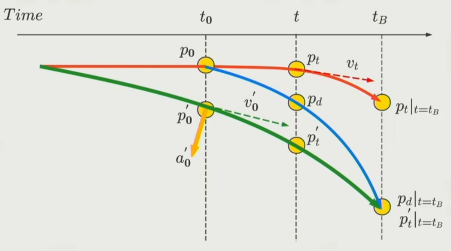
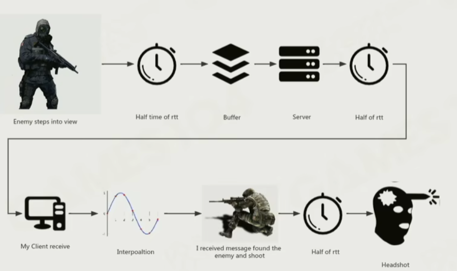
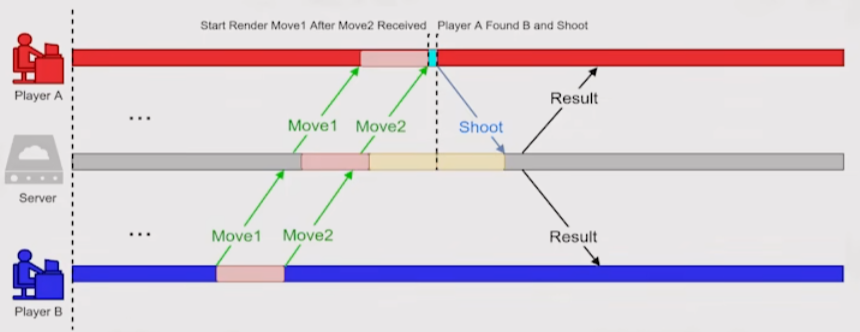

# 网络架构进阶 上

## Movement Replication

1. 位移同步，直接同步位置的话会有大量延时
2. 使用插值优化

- Interpolation
- Extrapolation

#### 内插值

使用内插值在网络同步间的渲染帧，平滑插值出角色位移

需要加剧延时，在当前状态和之前状态使其平滑

#### 外插值

使用外插值预测敌方角色位置

##### Dead Reckoning

##### Projective Velocity Blending （PVB）

如果外插值预测的位置和主机的位置不符合，

不要立即瞬移位置，而是要先计算出如果按照主机位置的未来位置。

然后缓慢插值到这个未来位置。

实际运行的时候，蓝色曲线是本地预测运行线总是和追绿色曲线在未来交汇，当前永远交汇不了。

#### Collision Issues

外插值插到了碰撞体里面，导致碰撞过大

#### 应用场景

内插通常用在大量不规则位移变化，rpg 角色移动（加速，跳跃，碰撞。。。）

外插用在大量惯性运动，载具，军队。。

## Hit Registration

命中判定

- Client-side hit-detection
- rver-side hit-registration

### 客户端判断

适合在场景很复杂的情况

判断方式

- Hitscan 直线
- Projectile 弹体
- Projectile + Gravity 弹体加重力

非常简单的服务端检验

- 射击位置
- 命中位置
- 是否会碰撞

高效，手感好，非常不安全

作弊

- 短暂断网爆头

### 服务端判断

服务端世界和客户端世界不一样

#### Lag Compensatin 延迟补偿

当遇到关键事件，（开枪）时，

服务端回退到客户端开枪时间，执行开枪，然后回放中间指令至当前帧

服务端通常会慢客户端半个 RTT 时间

其他客户端会慢本地 1 个 RTT + 内插值时间

所以服务端需要猜测补偿半个 RTT 时间 + 内插值时间给客户端

需要服务器有快照 Buffer

延时补偿没法解决掩体问题

#### Running into Cover

1. 躲进掩体时在对方世界中还没进去，被服务端延时补偿杀死
2. 开枪延时补偿是枪手优势，从掩体中出来击杀别人别人没法看到

#### StartFrames 施法前摇

给网络同步争取时间

#### Local Feedback

先把反馈做出来，结算以服务端为准
