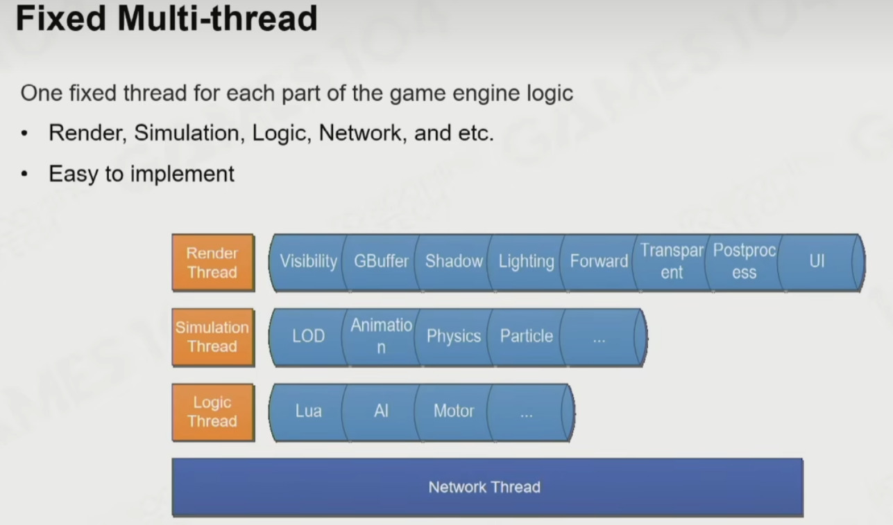

# Data-Oriented Programming and Job System 面向数据编程

对算力要求很高

## Basics of Parallel Programming 并行编程基础

Multitasking

1. Preemptive Multitasking
2. Non-preemptive Multitasking

Thread context switch 线程切换昂贵

Parallel Problems in Parallel computing : 并行计算的数据交互问题

Data Race in Parallel Programming : 数据竞争

Blocking Algorithm - Locking Primitives : 加锁

Other Issues with Locks : 阻断式编程

- 死锁
- 一个线程报错，整个进程错误
- 没有优先级

尽量不要使用 Lock

Lock-free Programming 无锁编程

- Atomic Operation : 原子操作，硬件来支持，
- Lock free vs Wait free

编译器编译后的代码，无法保证按照代码编写的顺序执行

## Parallel Framework of Game Engine

- Fixed multi-thread
- Thread Fork-Join （树结构）
- Task graph (有向无环图结构)

Task graph 无法动态增加节点，无法暂停等待

### Job System

coroutine 协程，暂时暂停当前程序，运行别的代码，不会切换核，需要能够恢复栈空间的局部变量

#### Fiber-based Job System

几个核就生成几个 Work Thread / Fiber

#### LIFO and FIFO Mode

需要分配任务，JobSystem 工作优先级，一般是 LIFO，像个堆栈一样

#### Job Stealing

需要在 Work Thread 间调整任务
