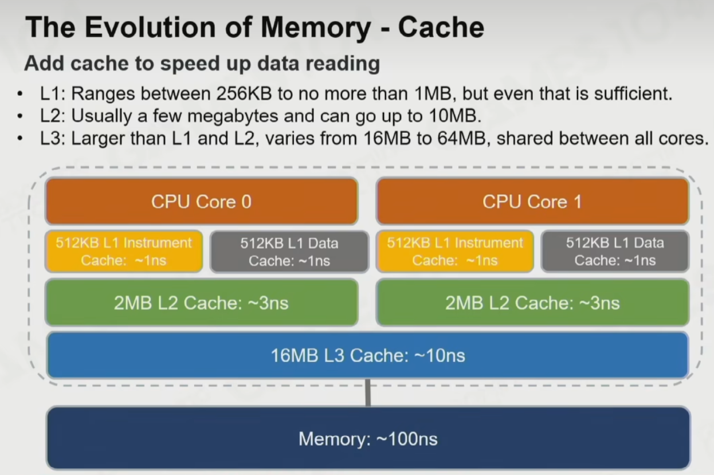
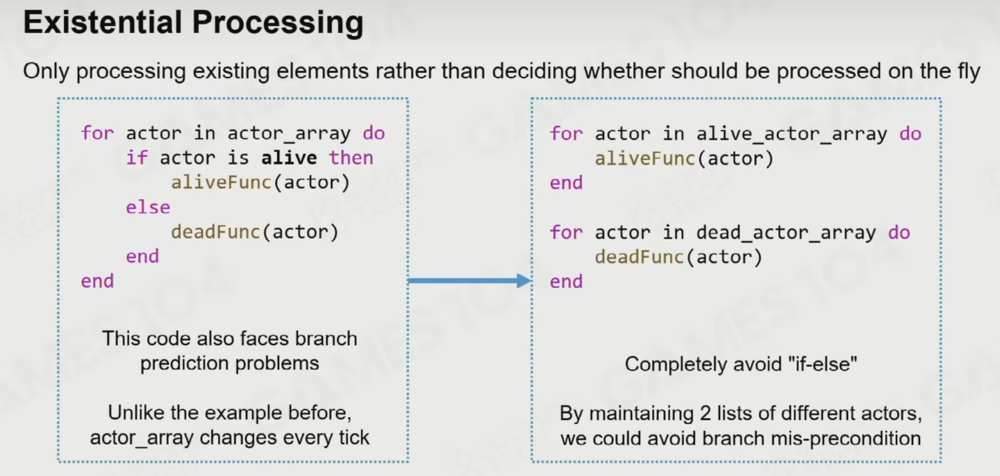
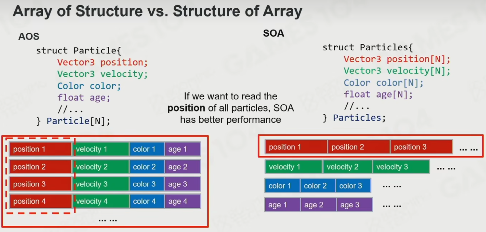
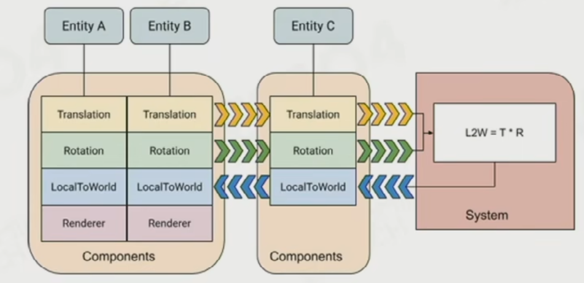
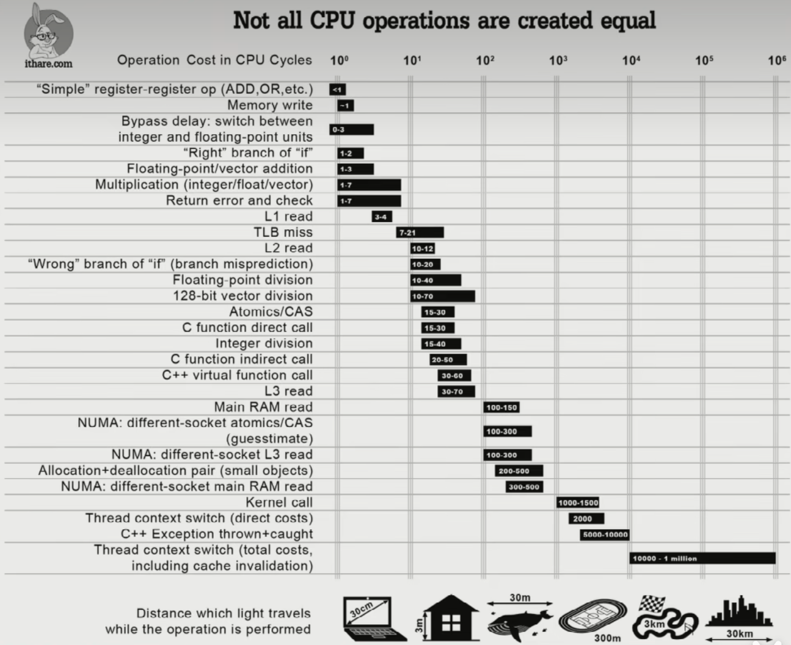

# Data Oriented 下

## OOP 面向对象编程

Object-Oriented Programming

Problem of OOP

函数应该写在执行者还是被执行者

很深的继承树，该如何抽象出基础函数

大型系统的基类很繁琐

性能很低，分散在内存的各个角落

可测试性低

## Data Oriented Programming

内存访问速度比 CPU 运算慢的多

所以可以为了提高内存访问效率，可以增加 CPU 无用操作

多级缓存

高性能编程，要关注是否 Cache 友好

原则：数据的批量处理

Single instruction multiple data (SIMD) 16 个 byte 批处理，四倍加速

Cache 管理 LRU，丢弃最不常用的数据

Cache line，CPU 加载内存一次性加载一行，而不是一个一个。

二维数组横向读比纵向读快得多。

降低 Cache miss

## Performance-Sensitive Programming 高性能编程

尽量让代码顺序无关，

#### Branch prediction

大型代码切换，也会耗费加载时间，所以尽量让代码在同一个块内重复执行，减少 if else

## Performance-Sensitive Data Arrangements

## Entity Component System

