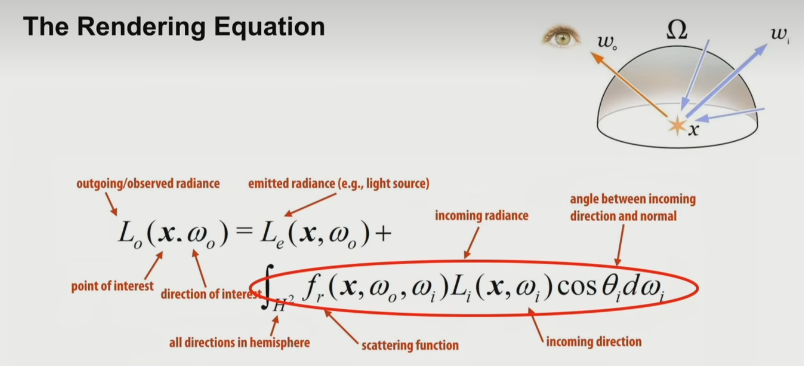
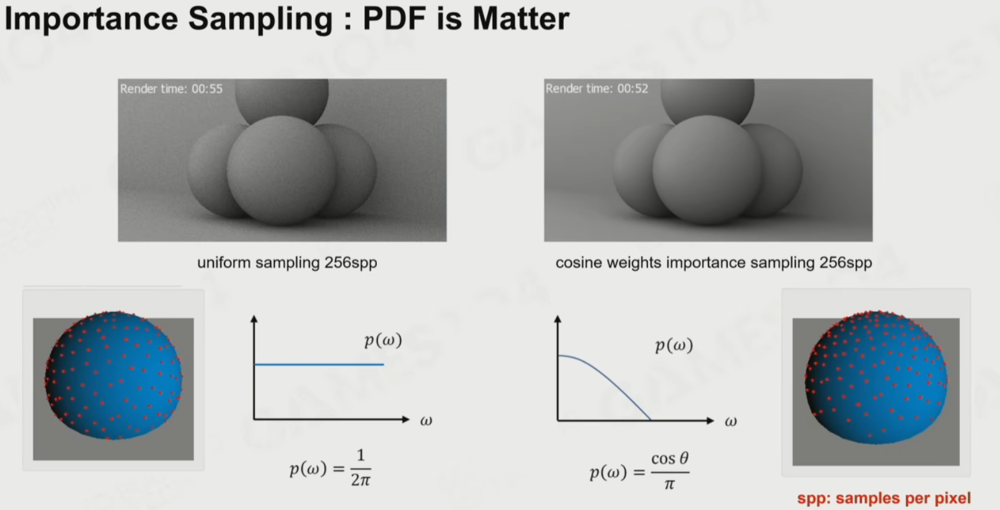
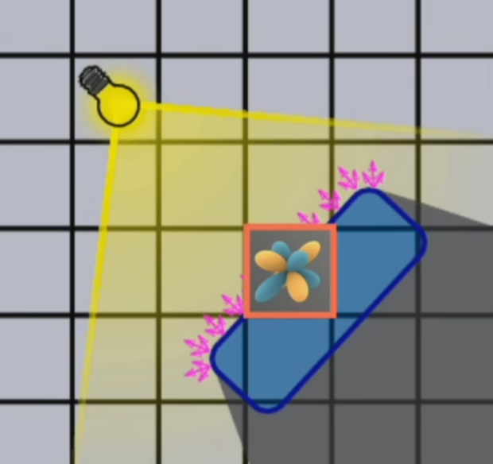
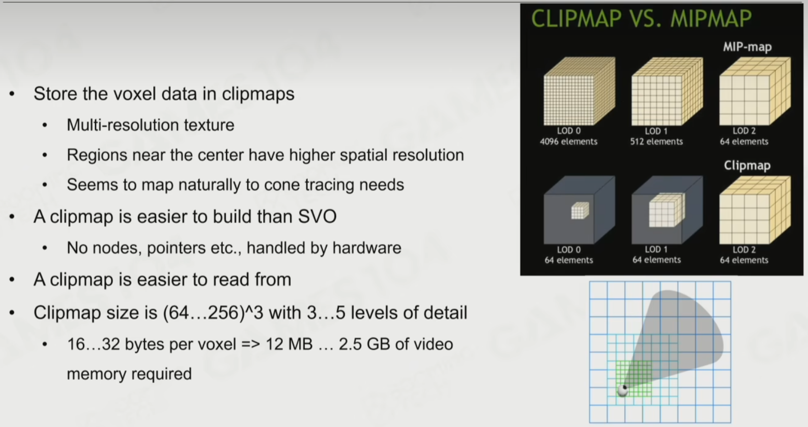

# 动态全局光照和 Luman

dynamic-global-illumination-and-lummen

## Global illumination

## Monte Carlo Integration

蒙特卡洛积分

monte carlo ray tracing 蒙特卡洛光线追踪

大量采样，采样不到光源就会黑，所以有大量噪声

### Sampling is the key

如何更好的采样是核心点

#### Uniform Sampling 均匀采样

#### PDF 采样

对函数分布进行估计，然后进行重要性采样

Importance Sampling，尽可能朝着光源，朝着法线采样

法线方向对光线最敏感，diffuse 的 PDF 选 cos lob 采样效果最好

PBR 材质用 GGX 法线分布，选 GGX Lob 效果最好

## Reflective Shadow Maps （RSM）

实时 GI

Photon Mapping 光子映射

shadow map 就是光子所停留的位置

## Light Propagation Volumes （LPV）

光在空间中的扩散路径

光在空间中的分布场

迭代遍历每个格子，对周围格子扩散光能

这种算法，光扩散，能量不守恒

### Sparse Voxel Octree for Real-time Global illumination （SVOGI）

对上面算法进行八叉树

保守光栅化，每个三角形至少一个像素

### Cone Tracing

天然合适八叉树，SVOGI

## Voxelization Based Global illumination （VXGI）

体素全局光照

Clip map 更新

使用类似 Virtual texture 的方式更新数据，就是当前数据只是整块大区域中的一小块的引用

Voxelization for Opacity

Voxel 具有透明度

1. 使用 RSM 为 Voxel 注入光照信息
2. Voxel 向周围 Voxel 散射光照信息
3. 每个像素向 Voxel 进行 Cone tracing

### Problem

Light leaking

Incorrect Occlusion

## Screen Space Global illumination（SSGI）

- Linear Raymarching
- Hierachial Tracing
- High z，效率比均与采样高得多
- 相邻空间的采样到的光源可以重用，时序上也可以重用
- 精度高，反射质量好
- 场景复杂度无关

## Lumen

Ray tracing 效果费力

重要性采样困难

Light probe 尽量贴着物体表面

### Fast Ray Trace in Any Hardware

任意硬件的快速光线追踪

#### SDF 光线追踪

Per-Mesh SDF

SDF for Thin meshes

Ray tracing with SDF

Cone Tracing with SDF

Sparse Mesh SDF

Mesh SDF LoD

##### Ray Tracing Cost in Read Scene

Per mesh SDF 合并，低精度的 Global SDF

Cache Global SDF around Camera

4 clipmaps around camera
