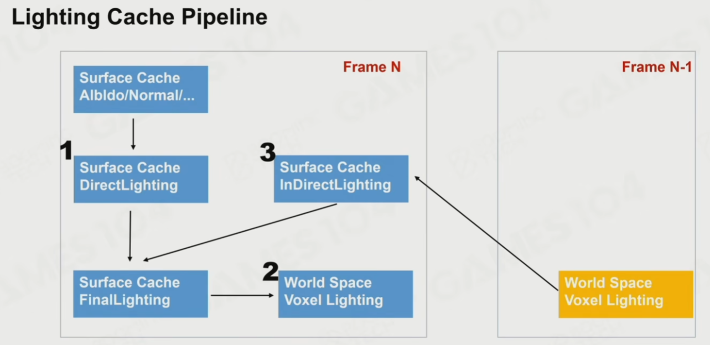
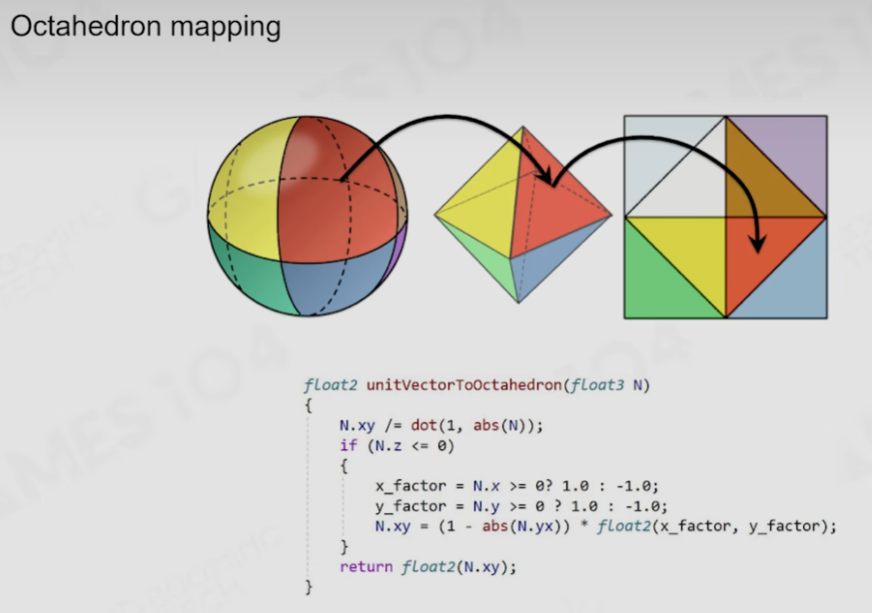
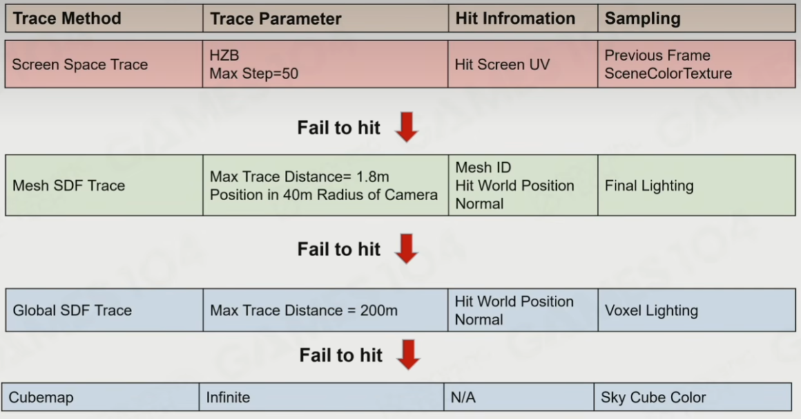

# 全局光照和 lumen 下

## Radiance Injection and Caching

Mesh card - 六面正交

直接被光照亮的六个面

#### Generate Surface Cache

1. Card capture
2. copy card to surface cache

整个场景每个 Instance 的六面光照信息，存在一张 4096 * 4096 的纹理上

是 lumen 工作的基础

Surface cache 照亮 voxel，每帧对上间接光做一次 bounce，用直接光补充光线衰减，相当于时序上的无限次弹射

获取空间的 Voxel 光照信息表达

整个场景体素化

## Build a lot of Probes with Different Kinds

### Screen Probe structure

屏幕上每隔 16 * 16 个像素点对应的屏幕空间位置，放置一个 Light probe，用二阶 SH 存在颜色内表示

八面体映射

在像素点在世界空间中相距过的地方，放置 Light probe 更密，存在方形纹理无用的下面。

Screen Probe Jitter

### Importance Sampling

入射光位置和法线方向最重要

从上一帧的 light probe 判断入射光位置

法线分布从 GBuffer 中的像素附近的随机采样获得

### Connecting rays

光线拐弯来解决漏光问题

## Shading Full Pixels with Screen Space Probes

把光用在每个屏幕空间上的 Probe 上用 SH 存储。

是自然的低通滤波

