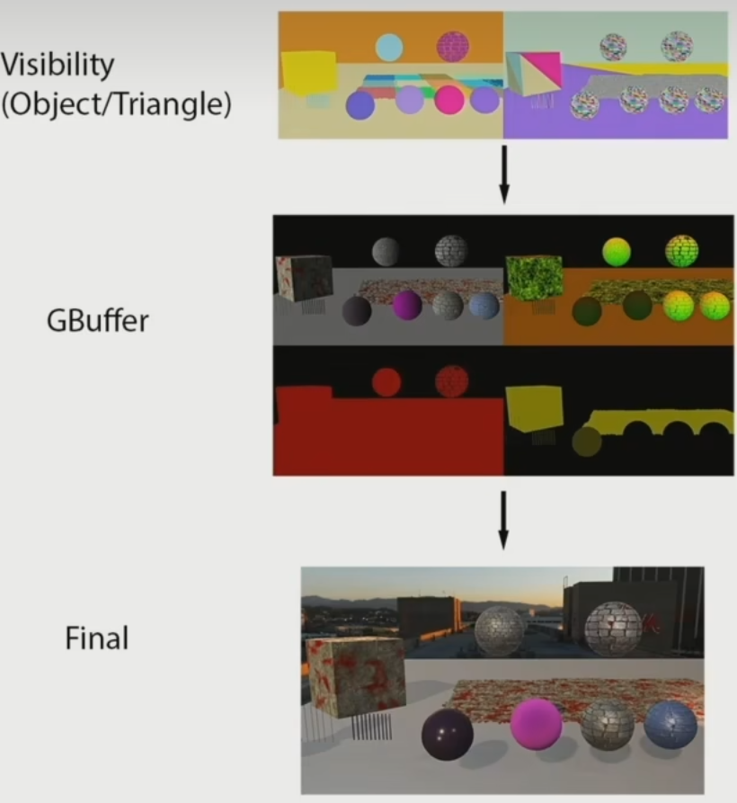

# GPU-Driven Geometry pipeline - Nanite

传统 Pipeline 设置 render state 费时费力

## GPU Driven

整个场景都放到 GPU 里

### 刺客信条大革命

让 Mesh 由 Cluster 组成，可以尽可能的裁剪掉不可见的三角形

### GPU Instance Culling

判断 Cluster 和 Chunk 的可见性

compute shader 里计算几何点，成为一个超大的 VertexBuffer

### Index Buffer Compaction

要保证几何绘制顺序，不然会 z fighting 不然会闪烁

## Occlusion Culling

### Occlusion Depth Generation

### Two-Phase Occlusion Culling

先用上一帧的 z cull 当前所有物体生成粗略的当前 z，

再用当前 z 测试当前所有物体，生成真正的当前 z

### Crazy Stressing Cases

25w 个小行星

### Fast Occlusion for Shadow

在渲染 shadow map 时候需要尽量少的渲染物体

也是使用 z buffer 剔除物体

Camera Depth Reprojection for Shadow Culling

## Visibility Buffer

### Deferred Shading, G-Buffer

1. 所有可见的几何信息存在 Screen Space buffer 里
2. 对于每个 Screen Space pixel，进行着色

会产生很多屏幕这么大的中间数据

Challenges of Complex Scene

在街道场景中，距离深度图较远的物体可能可以在做 shadow map 时被 cull 掉

1. Filling 先画物体 index buffer
2. shader 从 CPU 里的场景所有网格数据，拿到对应三角型的信息并处理

### Visibility Buffer + Deferred Shading

场景中的物体越细碎，visibility buffer 效果越好

visibility buffer 对于单个物体的绘制代价小，缓存友好，

压力在最终着色时的根据像素visibility buffer从重心坐标插值出当前顶点数据时的计算量
