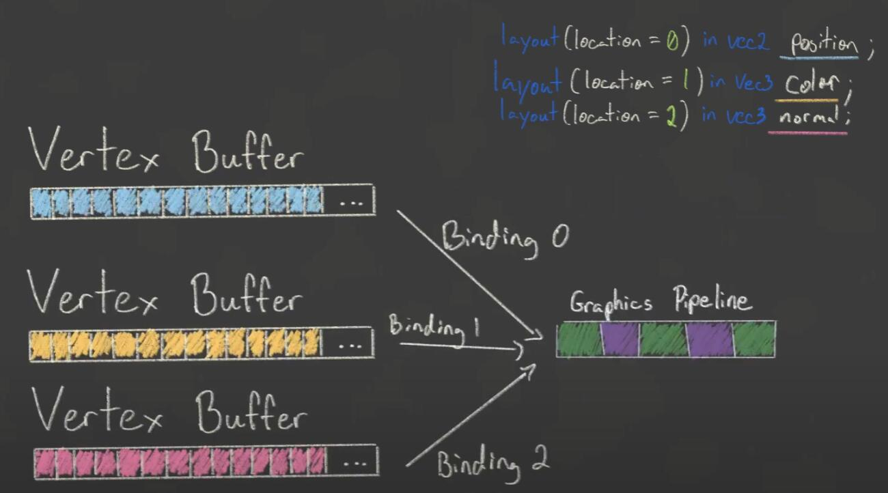

# Vulkan Game Enggine

[工程地址](https://github.com/blurrypiano/littleVulkanEngine)

## 3. Device Setup & Pipeline cont

1. Initializing vulkan and picking a physical device
2. Setup validation layers to help debug

## 4. FIxed Function Pipeline Stages

#### viewport transform

#### frontFace

`configInfo.rasterizationInfo.frontFace`

#### Depth Buffer explained

#### MSAA

## 5. Swap Chain

1. We will have multiple framebuffers
2. We can use wapChain.acquireNextImage() to get the next index of our framebuffers

### flow

### Double buffer vs Triple buffer

### Swap chain present modes explained

#### fifo

#### Mailbox

#### Present Modes Comparison

##### fifo

- Vsync Bound
- Good for Mobile
- Always Supported

* Latency

##### Mailbox

- Low Latency

* Not always Supproted
* High Power Consumption

##### Immediate

- Low Latency
- Usually Supported

* Tearing
* High Power Consumption

### Render pass

## 5.2 Command Buffer Overview

1. Record commands buffers once at initialization and then reuse for each frame
2. Record command buffer every frame, just before submitting

### Secondary command buffer

## Vertex buffers

vertex binding descriptions

vertex attribute descriptions

- float:VK_FORMAT_R32_SFLOAT
- vec2:VK_FORMAT_R32G32_SFLOAT
- vec3:VK_FORMAT_R32G32B32_SFLOAT
- vec4:VK_FORMAT_R32G32B32A32_SFLOAT
- ivec2:VK_FORMAT_R32G32_SINT (signed integer)
- uvec2:VK_FORMAT_R32G32_UINT (unsigned integer)
- double:VK_FORMAT_R32_SFLOAT (double precision float)

暂时没有那种更好的结论，一般使用交叉的大 vertex buffer 而不是 binding

### Host & device memory

