# Games 202

## Introduction and Overview

### Real-Time High Quality Rendering

- Real-Time：speed Interactivity
- High Quality: Realism, Dependability

### Topics

- Shadow and Environment Mapping
- Global illumination
- Precomputed Radiance Transfer
- Real -Time Ray Tracing
- Participating Media Rendering, Image Space Effects
- Non-Photorealistic Rendering
- Anti-Aliasing and super-sampling

## Recap of CG Basics

1. Graphics Pipeline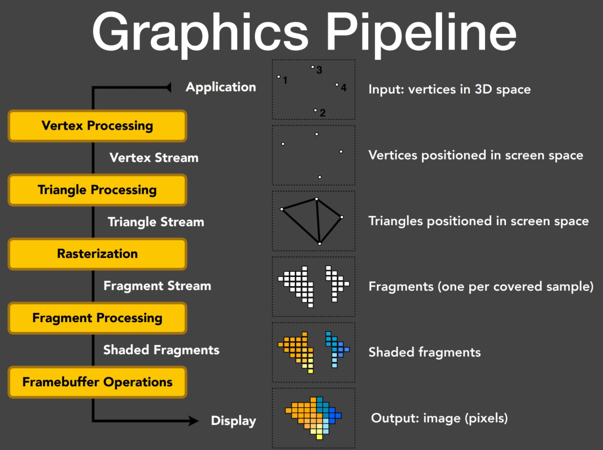
2. OpenGL
3. Shader Languages
4. The Rendering Equation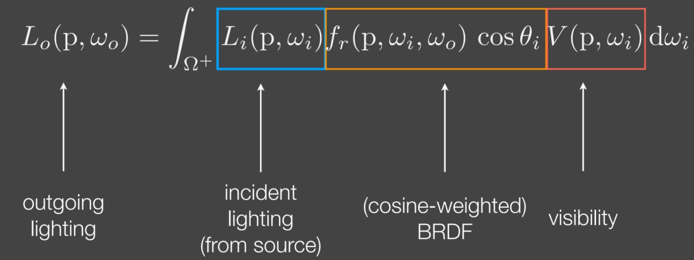
5. Environment Lighting

## Real-Time Shadow

### shadow Mapping

#### algorithm

1. Render from Light
2. Render form Eye
3. Project to light from shadows

#### Issues in Shadow Mapping

1. Self occlusion ：shadowmap 分辨率造成自遮挡条纹，shadow map 上一个像素表示的表面距离只是实际表示平面的中心点距离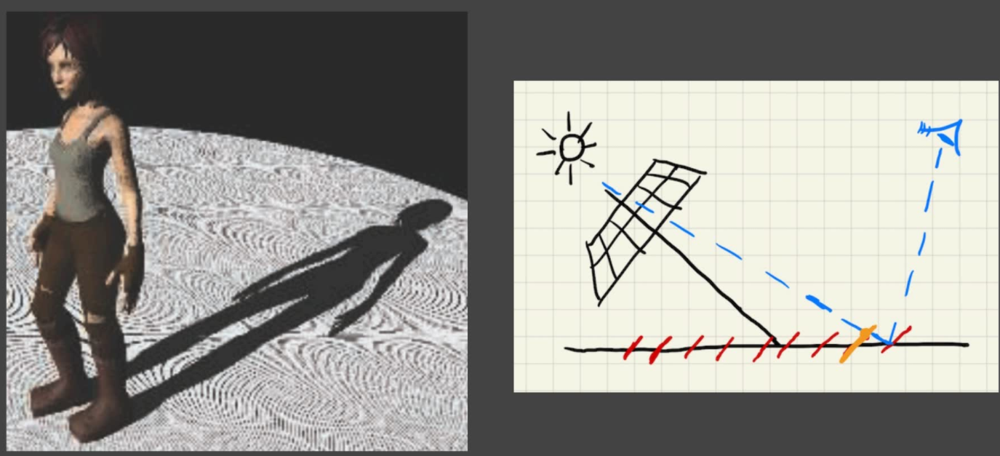
    1. Bias 解决自遮挡问题，会有漏光问题
    2. Second-depth shadow mapping，实际上没人用
2. Aliasing ：shadow map 分辨率造成锯齿，
    1. 使用级联阴影解决，cascade shadow map

### Inequalities in Calculus (WIT)

### Soft Shadow

#### Percentage Close Filter (PCF)

使用卷积核，对 shadow map 比较后的结果进行平均

1. compare its depth with all pixels in the box
2. get the compared results
3. take avg to get visibility atten

#### Percentage closer soft shadows (PCSS)

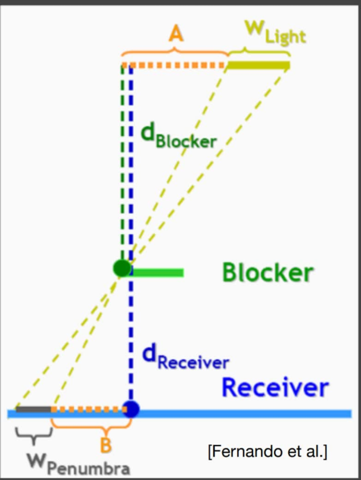

离遮挡物越远使用 PCF 的卷积核就越大

1. Blocker search
2. Penumbra estimation
3. Percentage closer filtering

Slow steps

1. 像素点 Blocker 太大导致采样多速度慢
2. 通过稀疏采样提速，可能出现 Flicker，每帧的噪声不同导致画面抖动

#### Variance soft shadow mapping (VSM)

使用正态分布近似 Blocker 中的阴影分布

Quickly compute the mean and variance of depths in an area

- Mean : Map pre compute

    - Hardware  MIPMAPing
    - Summed Area Tables （SAT）
- Variance

    - Var(X) = E(X^2) - E(X)^2
    - generate a square-depth map along with the shadow map

##### Function

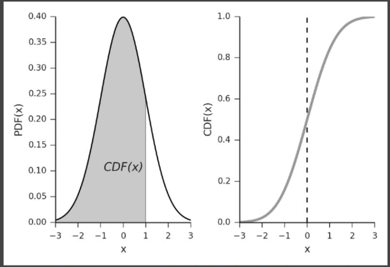

- PDF : 概率分布函数，Gaussian 是一种 PDF
- CDF : 概率积分函数，误差函数

对于 Shadow map 上的每个点，都可以构建一个 PCF，对应的 CDF 为物体处在阴影中的概率。

根据这个概率来决定光线的衰减值，PCF 是通过 Blocker Search 的方式来通过像素点测试和权重累加来确定概率。

##### 切比雪夫不等式

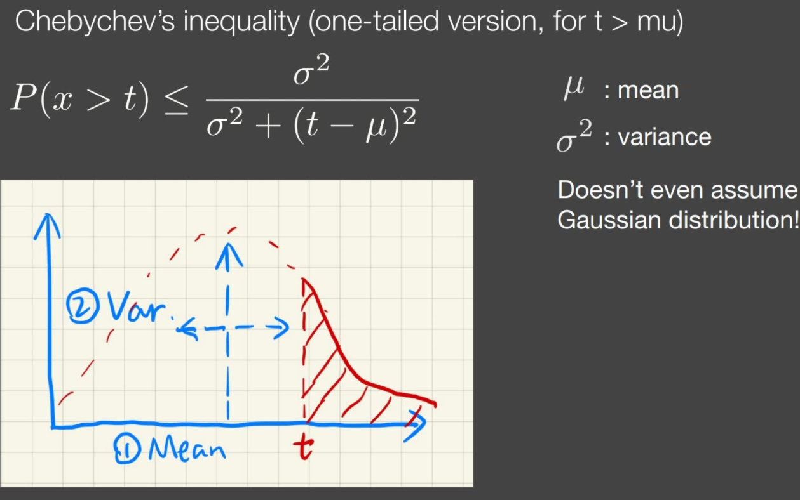

快速得到当前距离大于 ShadowMap 距离的概率，非常的近似。

容易出现 Light Leaking，当遮挡物分布与高斯分布不符合

##### MIPMAP for Range Query

MipMap 预处理图片保存均值来支持大范围查找

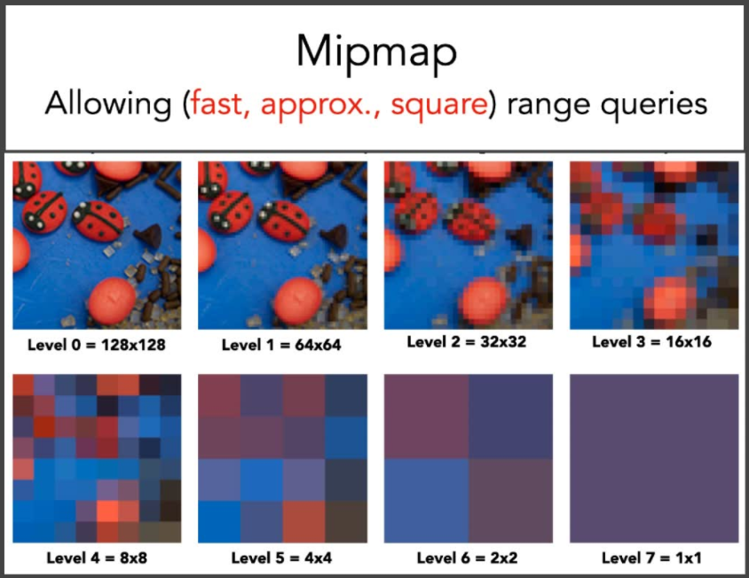

##### SAT for Range Query

Sum Area Table ，提前保存累加信息到纹理上来支持大范围查找

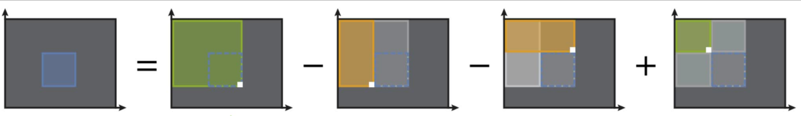

#### Moment Shadow Mapping

使用多项式来近似 PCF

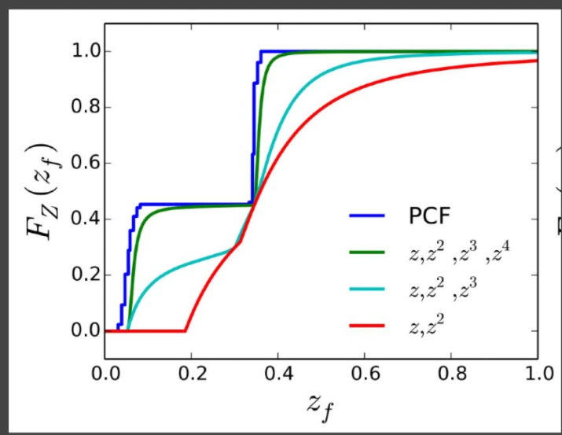

#### Distance field soft shadow

速度快，效果好，但是存储困难

##### Distance Functions

定义空间中的一个点，到任意物体表面的总的最小距离

##### Ray Matching

光线步进，向摄像机往像素点射出的方向，让光线前进一段距离，并对当前位置进行采样。

##### Usage

生成 3D 纹理存储场景 SDF，光线步进 SDF 采样出的距离，如果到目标光栅化物体深度前，进入其他物体内部，说明处在阴影中。

受光强度可以通过最小 SDF 距离得到。

- Pros
    - Fast
    - High quality
- Cons
    - Precomputation
    - heavy stoage
    - Artifact

## Real-Time Environment Mapping

### Environment Lighting

#### Image base lighting (IBL)

基于图的环境光

- 可以为整个场景原点烘培一个 CubeMap，表示 Environment map，也可以为环境中的一个点烘培 EnvMap
- EnvMap 可以是天空盒，也可以是实际用摄像机渲染出的 6 面的结果，缺点是不知道光源距离

#### The Classic Approxiamtion

对物体表面的渲染要考虑到整个环境的光照对其的贡献，蒙特卡洛积分需求对 EnvMap 进行多次采样，所以提前对 EnvMap 生成 MipMap，提前对其模糊。

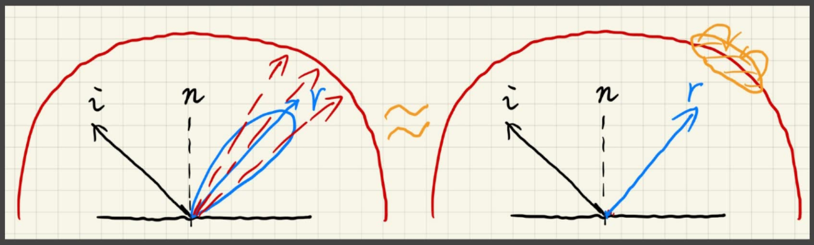

同时可以预计算出 BRDF 对 Roughness 和 Cosθ 的 LUT

### Shadow from Environment Lighting

- 多光源的可见性不好表达，需要大量 ShadowMap，
- 当前 Unity 是使用一个直接光的级联阴影作为主光源阴影，另外用一张大的合并的 shadow map 做点光源和聚光源阴影。

### Fourier Transform  傅里叶变换

- 高频信号能用多个低频信号累加来表达
- 时域上的卷积为频域上的乘积
- 频域上的相乘具有滤波意义，只留下低频或高频信号

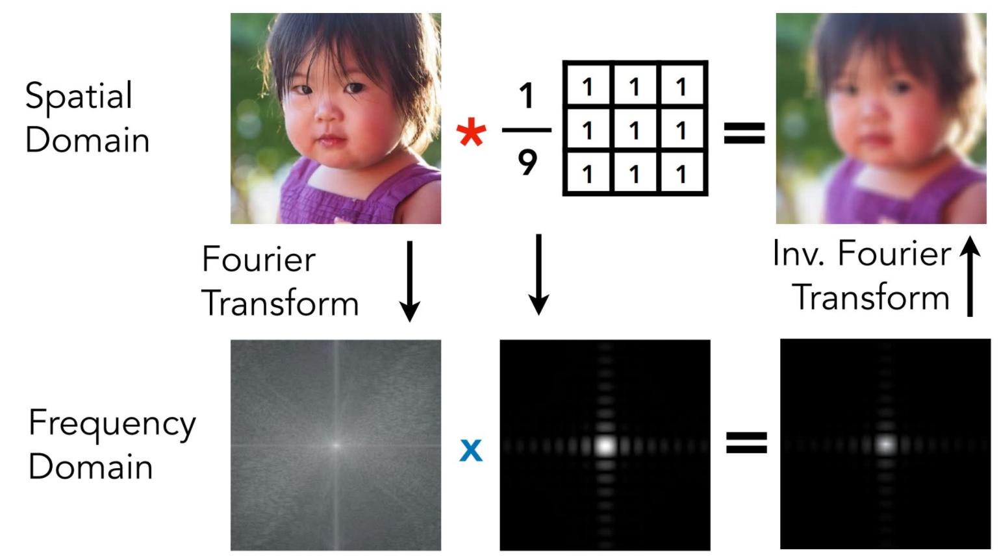

### Shperical Harmonics  球谐函数

- SH 是定义在球面上的一组正交基函数 f(θ, φ)，即球面上的低频信号。
- 三阶 SH 可以还原成模糊的 EnvMap 中的一个通道，
- 三阶 SH 9 个系数，还原成 3 通道 EnvMap 需要 27 个系数，即 7 个 float4
- 每个 Reflection Probe 都会使用 7 个 float4 拟合烘培好的 EnvMap

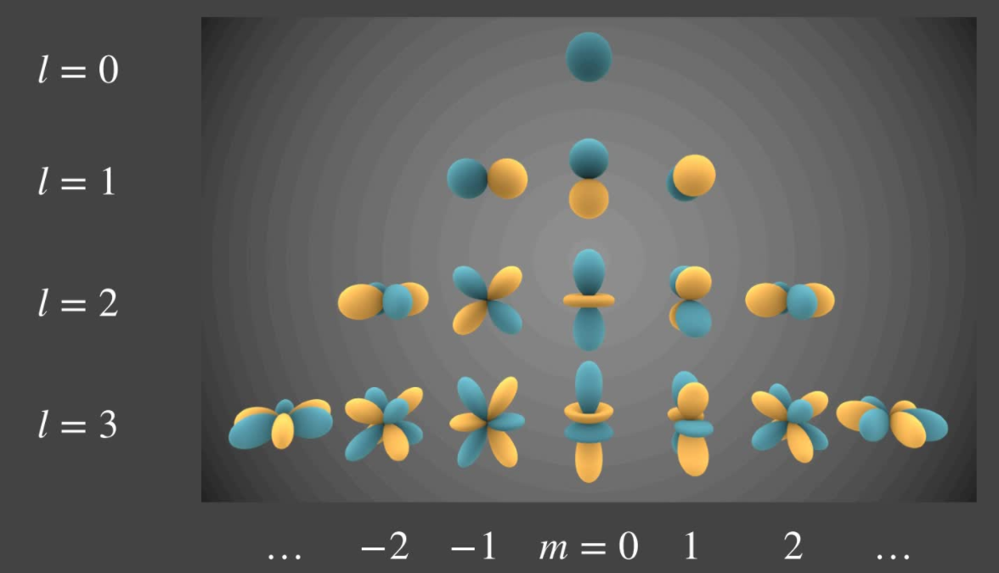

### Prefiltering  预过滤

- 使用低频信号表示 EnvMap 就是预过滤的思想
- Prefiltering  + single query = no filtering + multiple queries

#### Analytic Irradiance Formula (WIP)

- BRDF 用公式不好表达，对于从二维方向进入，二维方向出去的四元方法。可能没有什么公式能去精准的表达 BRDF。
- 这时候就使用预计算的方式，将相应的输入在纹理上用坐标表示，将输出用 RGBA 表示，离线记录在纹理上。理论上，一张纹理通过离散化加线性插值的方式可以记录任意多输入和任意多的输出。
- 当使用纹理记录 BRDF 后，还能使用 SH 去拟合这张纹理，光滑程度低，接近漫反射的 BRDF 投影到三阶 SH 足够了

### Rendering under environment lighting

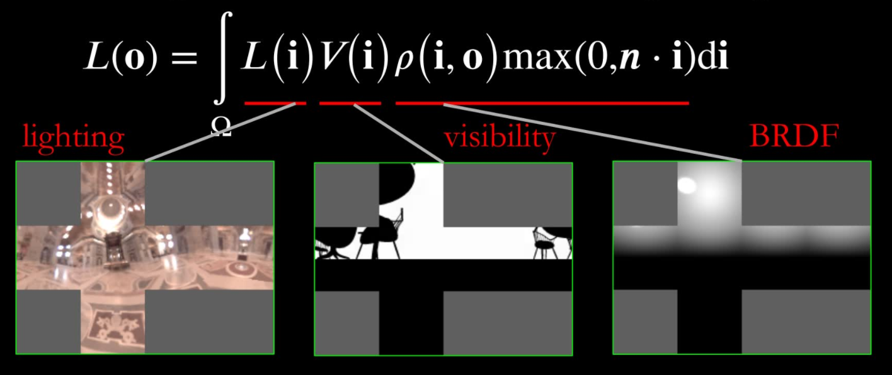

#### Precomputed Radiance Transfer (PRT)

##### overview

- PRT 是一个基于预计算的快速的全局光照渲染方案

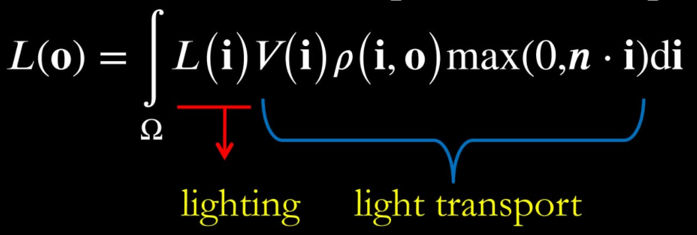

##### Diffuse case

- 假定物体的 BRDF 是 Diffuse 的，Diffuse 的特点就是 BRDF 公式和出射方向无关，所以变成了二元公式。
- 对所有需要用到的数据其进行预烘培成纹理，再用 SH 拟合
    - EnvSH 环境光，对于物体所在的位置
    - VisibilitySH 可见性，对于物体的每个顶点
    - BRDFSH 反射函数，对于整个物体
- 所以 VisibilitySH 占用的空间是最多的，每个顶点需要 9 个系数 （3 阶 SH 拟合出单通道结果）
- 着色的计算就是 EnvSH * VisibilitySH * BRDFSH，非常快。
- 通常还会把 VisibilitySH * BRDFSH 会预先计算好为一个 SH，称为 TransportSH
- 考虑到环境光的变化导致重新烘培或者旋转 EnvSH ，所以不提前乘好 EnvSH 与别的 SH
- 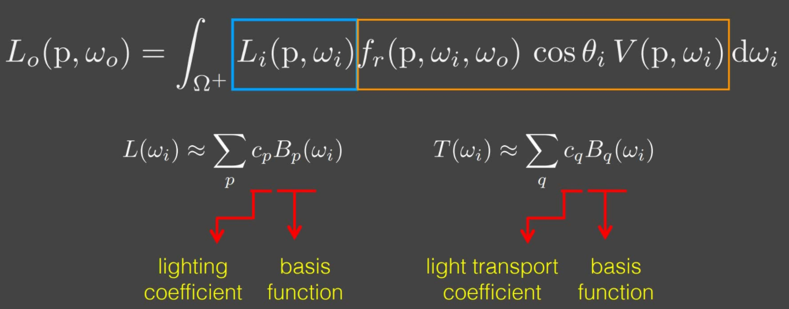
- 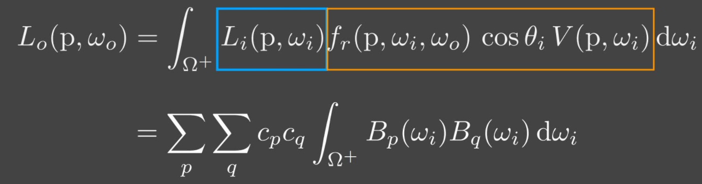

##### Glossy case

- 在 Diffuse 下，3 阶 SH 可以表示球面光照输入，9 个系数，在使用 9 个系数作为入射方向组成 TransportMatrix。
- 最后通过输入方向选择基函数得到特定方向 BRDF

##### Summary

- PRT 速度快，但是只适用于渲染粗糙的静态场景。

### Wavelet 二维小波

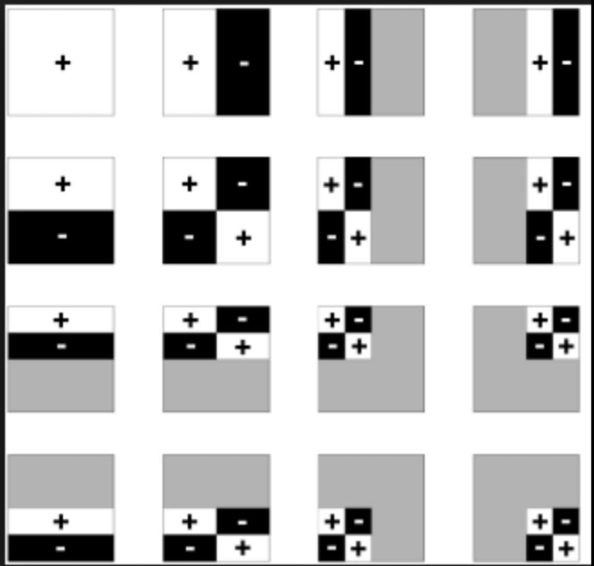

- Jpeg 离散余弦变换，类似小波变换\
- 类似 Mipmap，高频留右下加，能保留全部高频信息
- 旋转光照需要重新生成纹理

## Real-Time Global illumination  实时全局光照

### 3D Space

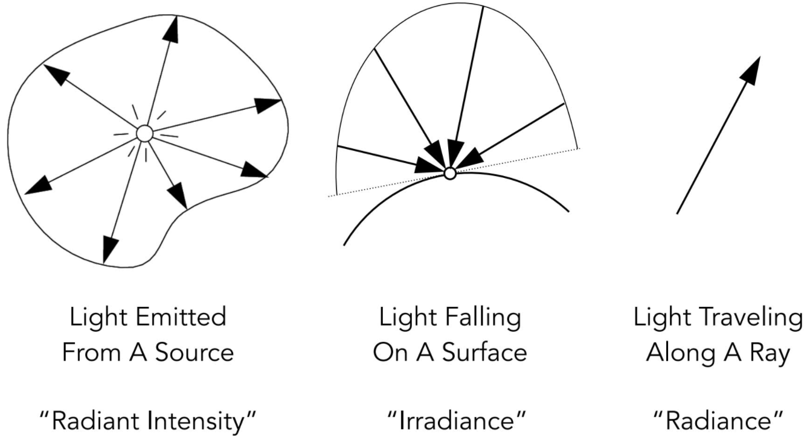

#### Reflective Shadow Maps （RSM）

##### Theory

- ShadowMap 上的每个像素点都看作次级光源，都看成漫反射，能对目标着色像素作贡献。
- 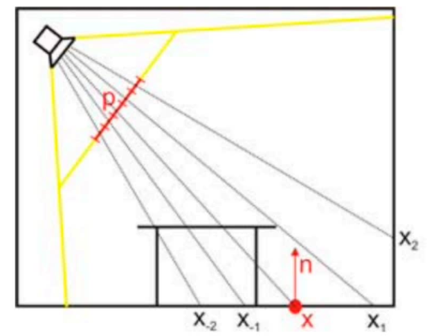

##### Steps

- 着色点附近点的离散采样
- 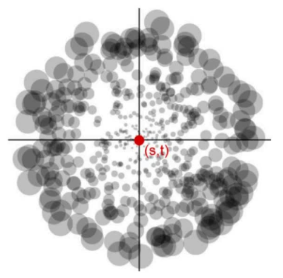
- 通过 Depth,l world coordinate, normal, flux 等 G-Buffer 调整贡献

#### Light Propagation Volumes（LPV）

- 在三维空间中的光线传播场
- 好又快，广泛应用
- 3D 网格中的 Radiance
- 

##### Steps

哪些点发出间接光，注入格子，传播光线

1. Generation of raidance opint set scene representation
2. Injection of point cloud of virtual lisght sources into radiance volume
3. Volumetric radiance propagation
4. Scene lighting with final light propagation volume

##### Problems

- 漏光现象，light leaking

#### Voxel Global illumination (VXGI)

场景体素化，存储光照信息。

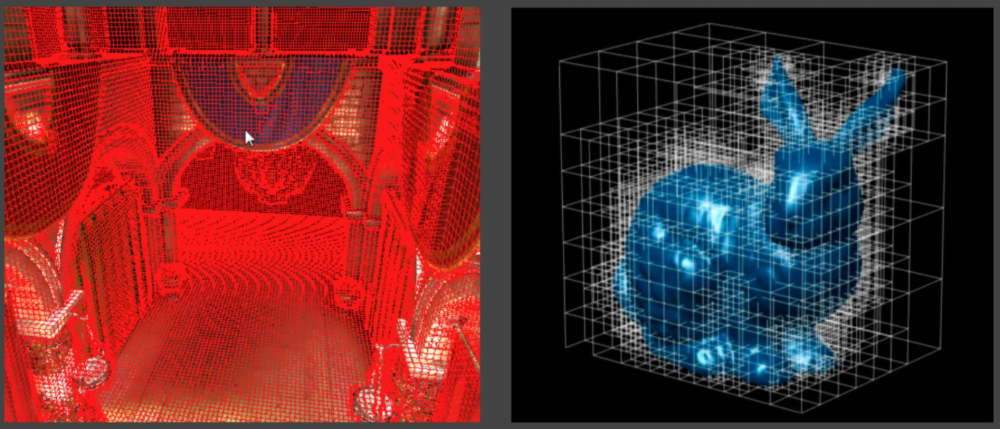

- 本质就是用 3D 纹理表示 Directional ShadowMap，然后进行 RSM。
- 从摄像机接收光的像素开始对场景进行 cone tracing，圆锥体光线追踪，
- 遇到反射介质，可以继续向四周进行 cone tracing

### Screen Space

#### Screen Space Ambient Occlusion (SSAO)

屏幕空间的环境光遮蔽

##### feature

- 物体接触的中间看上去有阴影
- 容易实现
- 对于全局光照的近似

##### key idea

- 表面一点对于任意方向收到的光强一致
- 是 Diffuse 物体
- 各个方向可见性不一致

##### Theory

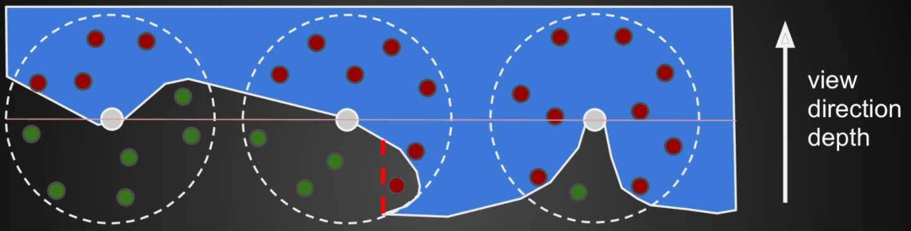

- 通过 z-buffer 以及 normal-buffer 大致模拟出像素点周围区域形状
- 像素周围球体范围内随机采样点，判断点是否处于物体内部，判断接收光线的数量
- 相隔较远的物体，不应当发生遮蔽
- 可以先少量采样加速，再统一模糊一遍

#### Screen Space Directional Occlusion （SSDO）

屏幕空间的直接光遮蔽

##### Theory

- AO 和 DO 的假设是相反的

    - DO 假设光照来源于附近物体的反射
    - AO 假设光照来源于非常远处，会被附近物体阻挡
- DO 在像素点附近的采样点，向光源处 trace 光线，将结果对像素点的着色做贡献

##### result

- 质量不错，比 AO 好
- Screen Space 会丢失表面之外的信息
- 只能表现出小范围内的全局光照
- 本质是在屏幕空间上，从着色点开始的光线追踪

#### Screen Space Reflection (SSR)

##### overview

- Shadedscene + Normal + Depth => SSR => Shaded scene with SSR
- 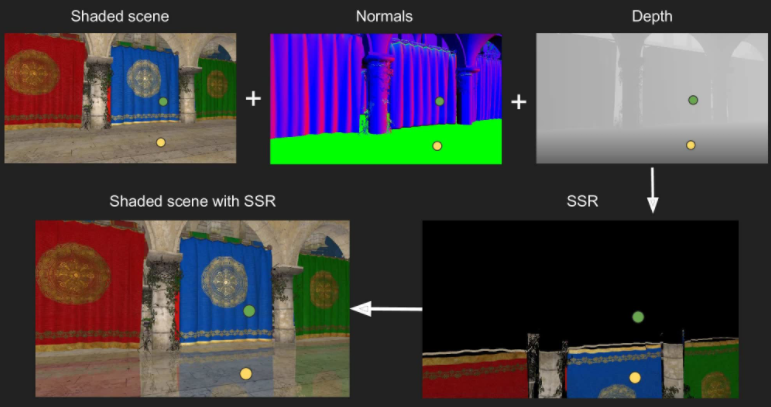

##### function

- Linear Raymarch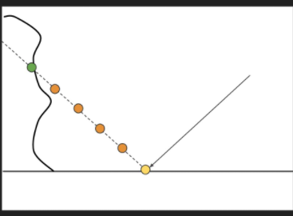
- Hierarchical ray march 层级步长方法
    - 先将场景中的深度做 Mip map，不是取平均而是最小值
    - 快速跳过不相交的格子
    - 从低到高找到前进不会产生交点的层级
    - 再从高到低找到有交点的最低层级，即像素

##### limitation

- 没法反射物体内部
- 没法反射屏幕外像素
- 只能假设被反射物是 Diffuse 的，因为已经着色了，没法使用 BRDF。反射物可以是 BRDF 的

##### Improvements

- Glossy 物体的重要性采样
- 空间上结果的复用，可以用周围 shading point 的结果

## Real-Time Physically-Based Materials

##### overview

- PBR 材质
- 种类和质量比离线渲染查，头发很明显
- 实际上的实现没法完完全全基于物理，只是相对于 NPR 更接近物理真实

##### target

- 在保证速度的条件下提高质量
- 体积上的渲染比表面难

### Microfacet BRDF 微表面模型

- F : Fresnel term
- G ：shadowing - masking term
- D : distribution of normals

#### D : Normal Distribution Function (NDF) 法线分布函数

- Backmann
    - Similar to a Gaussian
    - But defined on the slope space
- GGX
    - long tail
- Exxtending GGX
    - GTR
    - Even longer tails

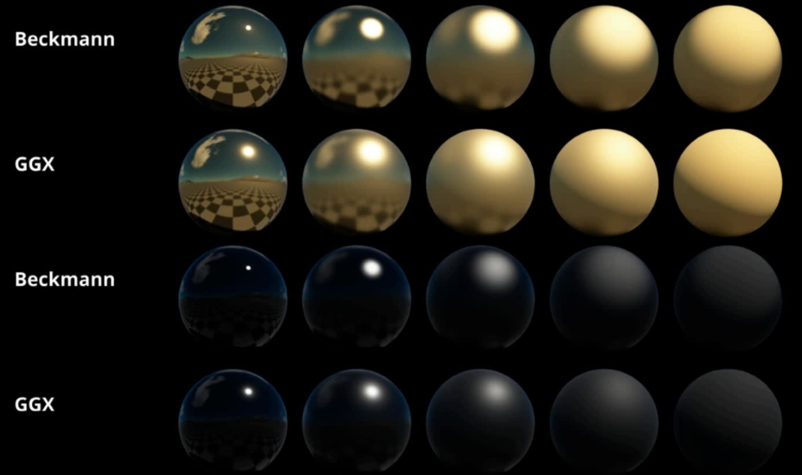

### G : Shadowing Masking Term 微表面自遮挡

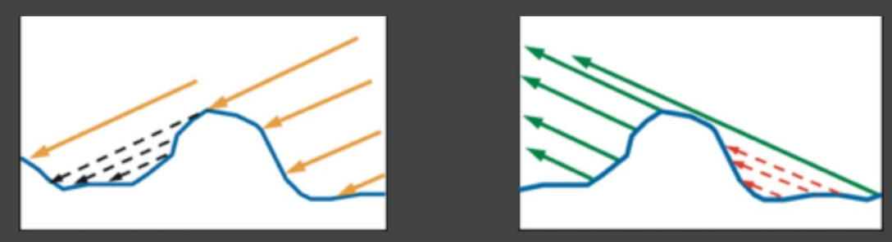

##### overview

- 在 grazing angle 处，表面接收到的能量会剧烈减少
- 在光线与法线成直角时，近乎无法接收到能量
- 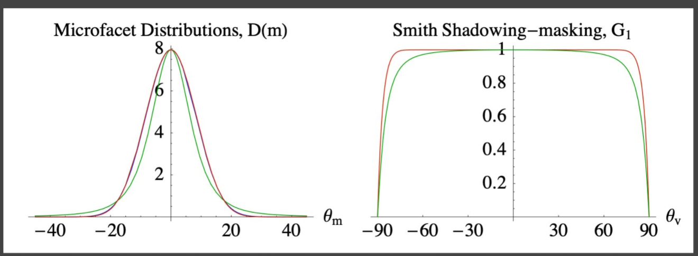

##### problem

- 直接应用 shadow masking 会使材质变粗糙，出现能量损失，变暗，
- 使用白炉测试，可以看到颜色与周围不一致，变暗
- 微表面粗糙，只考虑一次 bounce 导致光线被挡住
- 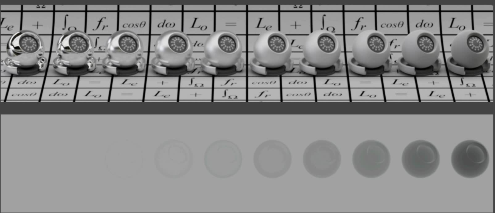

#### the kulla-conty Approximation（WIP）

- 经验性的方法，补全微表面的能量损失
- 希望设计一个 BRDF 积分起来能弥补能量损失
- 计算公式过于复杂，所以预先计算好
- 物体表面有颜色，颜色意味着能量的吸收
- 递归考虑所有反射的可能性

### An Undesirable Hack

- BRDF 加上 Diffuse 是完全错误的，在物理上不正确。
- 但是对于 disney's principled brdf 加个 Diffuse 比较好调美术效果。

### Linearly Transformed Cosines (LTC)  线性余弦变换 （WIP）

优化微表面模型

- 对于一个微表面，光线的接收区域呈现花瓣状，
- 对多边形光源进行采样

##### Observations

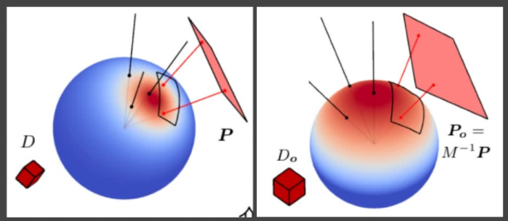

- 任意固定视角的 BRDF lobe 经过某种变换可以变成 cos
- 由于有不同视角，需要预计算成为
- 变量替换后，只剩 Cos 可以有解析解

### Disney's principled BRDF  迪士尼原则的 BRDF

- 微表面模型没法表示真是材质，它忽略了支持内部
- 艺术家不好调 PBR
- 先艺术家友好，其次在一定程度上保证物理的正确性
- 很多经验性的东西，有开源的的公式

##### 有代表性的效果

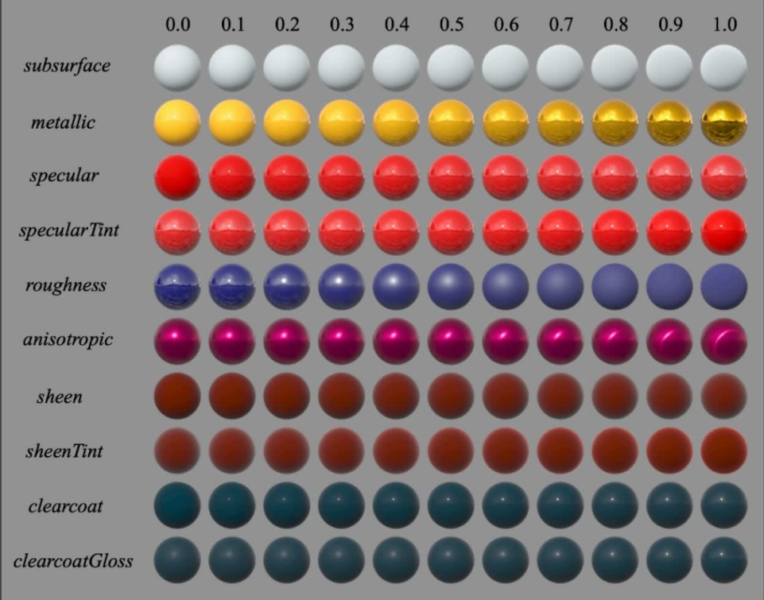

- 工业界名词：可能会影响到同个物理量，还有以 brdf 对效果进行模拟
- 次表面散射：光会进入材质，感觉会比漫反射还扁。金属性，高光性，粗糙度，各向异性
- sheen：天鹅绒，边缘雾效
- Tint ：颜色对效果光影响程度
- Cleurcoat ：清漆
- 不同参数组合可能出现相同效果，造成冗余

## Non-Photorealistic Rendering

快速、可靠、风格化

在风格化之前，有个好的真实感渲染也很重要

#### NPR 风格的重点

- 人物描边
- 草一整块
- 明暗离散

### Outline Rendering 外描边

Silhouette 边界，共享边且在整个物体的外边界

- Shading ：使用类似菲涅尔的方式，无法控制描边粗细
- Geometry ：增加一个 Outline pass，把背向的面扩大一个距离渲染
- Image ：Sober 算子后处理提取轮廓，图像锐化。也可以从法线、深度综合考虑

### Color blocks 色块

- 阈值化：量化，离散化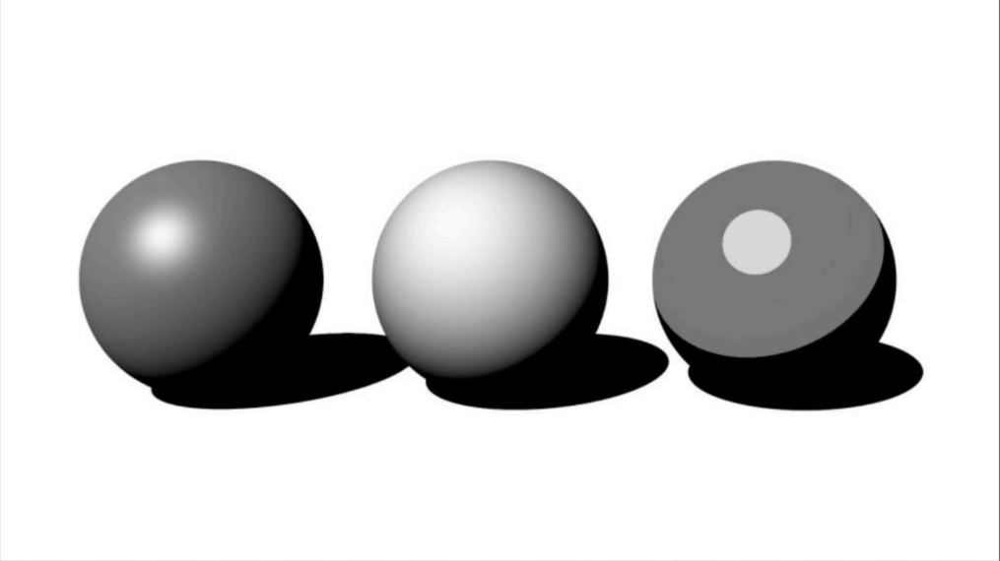

### Different styles on different components 不同渲染方式的组合

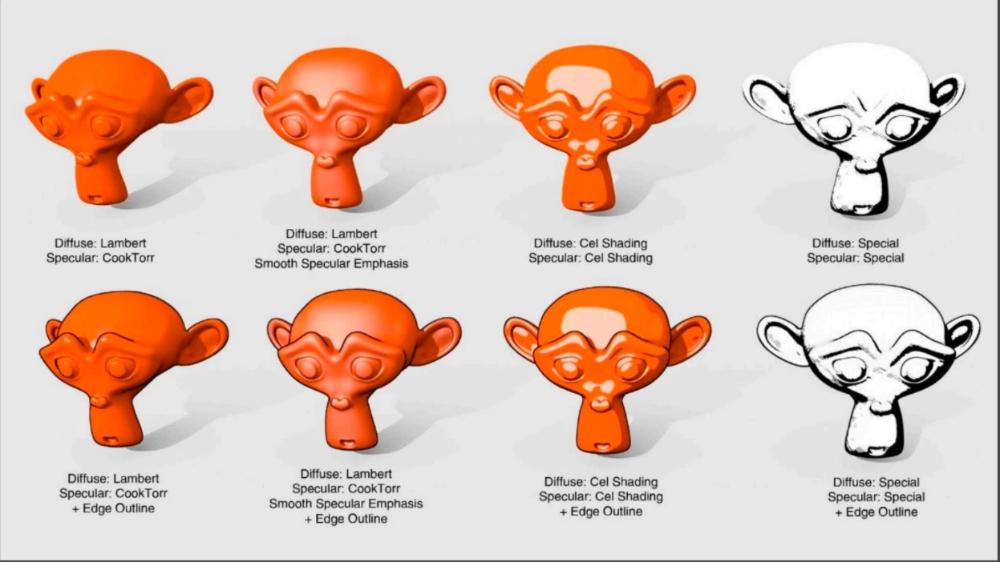

### Strokes Surface Stylization 素描效果

- 通过纹理查询来着色格子
- MipMap 方式缩小纹理分辨率，不改变素描线的密度，从而实现远处的素描效果

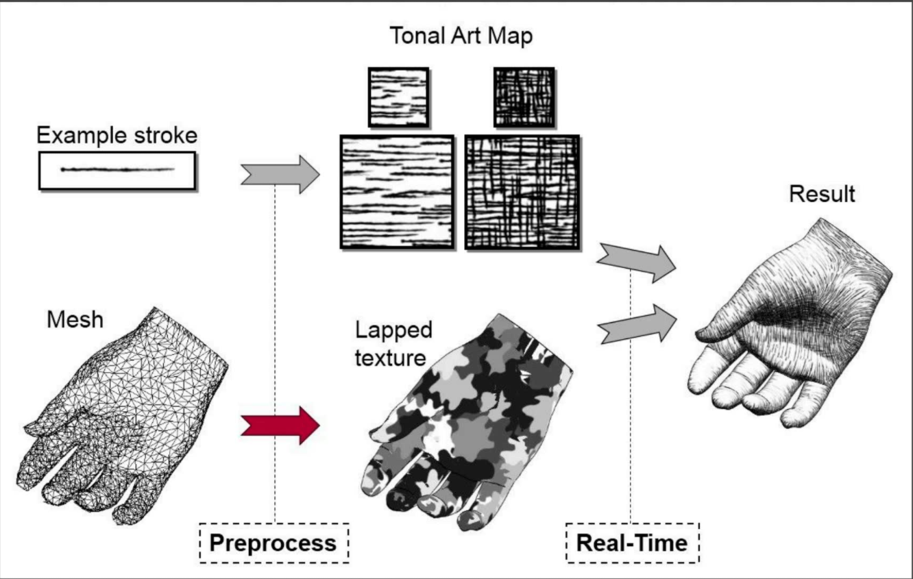

## Real-Time Ray Tracing

- 体积，散射，皮肤，毛发，将会在离线渲染的课上教

#### RTX

- 光线追踪实质上是做场景的 BVH 树的遍历
- RTX 专门遍历树，GPU 遍历树较慢
- 100 亿跟光线每秒，约等于每帧每像素一条光线

#### SPP

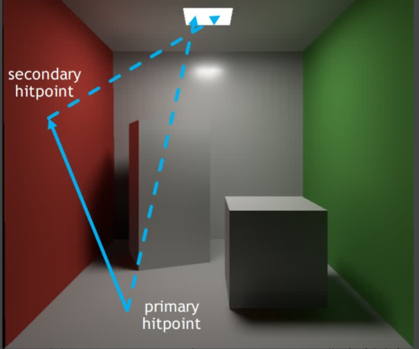

- 光路样本
    1. 1 rasterization primary
    2. 1 ray primary visibility
    3. 1 ray secondary bounce
    4. 1 ray secondary visibility
- 最基本的两次弹射光路
- 第一条 primary 等价于光栅化
- 1 SPP 看作 3 条光线求交

#### Key technology

- 实时光追也是使用 path Tracing，出现是因为 GPU RTX 架构
- 降噪技术是配合光追的重要技术

### Denoising 降噪

#### goads

实时光追目标

- 不模糊，没 Bug，具有细节，速度快
- 当前方法都不可能在短时间内实现

#### Temporal

- 时间上的滤波，时间上的复用
- 认为前一帧已经滤波完毕
- 利用帧之间的连续性，认为前一帧的颜色输出可以对当前帧做重大贡献

#### G-Buffer 几何缓冲区

- 直接光照，法线，表面颜色结果，世界空间坐标等
- 廉价，屏幕空间信息
- 光栅化时顺带记录的像素信息

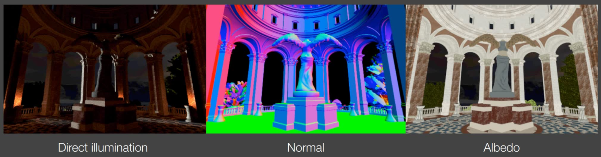

#### Motion vector

- 当前帧某像素坐标，对于上帧同 mesh 位置所对应的像素坐标，在屏幕空间上的偏移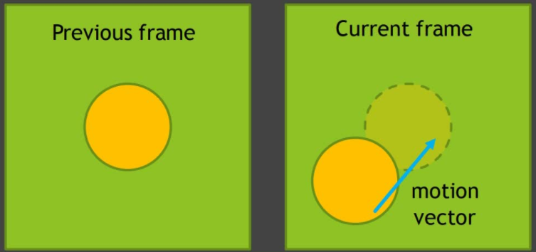

##### Back projection 方法求 motion vector

1. 取像素点的屏幕坐标
2. 求像素点的世界坐标
3. 取对应物体上一帧的变换矩阵
4. 求像素点在上一帧的世界坐标
5. 求像素点在上一帧的屏幕坐标
6. 计算位移向量

- motion vector 是准确的，不像深度学习的光流，只有图像信息，没有物体信息
- 也可以通过 z-buffer 里的深度信息求像素点的世界坐标

### Temporal Accum Denoising

1. 当前帧自己的降噪
2. 和上一帧的输出 Color Buffer 线性混合
3. 上一帧的权重为 80% ~ 90%

#### 滤波效果

- 降噪前图片看起来暗
- 因为噪点亮度超过显示范围
- 整体图片的亮度期望降噪前后应当是相同的
- 降噪会亮化 AO 信息

#### Temporal Failure 时间方法的缺陷

- 画面巨变，需要预热 burn-in period
    - 换场景
    - 镜头切换
- 屏幕外信息
    - 看前方，倒着走
- 出现原本被遮挡的位置
    - 容易出现残影（拖影、鬼影）
- 阴影出现滞后情况
- 反射也会出现滞后情况
    - 任何与环境光相关的着色改变，都会出现滞后
    - 因为在物体与环境光相对移动后，上一帧的像素着色和当前帧的输入已经是不同了，没有对当前帧贡献的意义

#### Adjustments to temporal failure

- 提高当前帧权重
- 是否应当废弃该位移向量

#### TAA

时间上的抗锯齿 Temporal anti-aliasing 和时间上的降噪 Temporal denoise 原理几乎是一样的

### Implementation of Filtering

#### 空间上的降噪技术

- 通过模糊操作去掉噪声
- 由滤波核决定如何滤波

#### 高斯滤波核

- 对于每个像素，以高斯滤波核，取附近像素的加权和，归一化
- 理论上是无限远的，通常只考虑 3 sigma 内

#### Bilateral Filtering 双边滤波

- 希望高斯去噪声的同时保留边界，使图片不模糊
- 使用颜色差异指导滤波核大小，动态滤波核

##### options

- 滤波核贡献变小
- 不适合降噪，分不出明显的噪声和边界
- 认为颜色剧烈变化时是图像边界
- 颜色剧烈变化时，周围像素给予权重变小，更似原图

#### Joint Bilateral Filtering 联合双边滤波

- 在双边滤波的基础上，使用更多的 Buffer 指导滤波核强度
- 在 ColorBuffer 和 DepthBuffer 之上
- 取各个滤波方式的加权和

##### G-Buffer

- 使用 G-Buffer 中的各种信息指导
- Position Normal Albedo
- G-Buffer 本身是无噪声的

##### metric

- 定义函数，从周围像素到中心像素，任意变量上的距离和贡献的关系
- 不一定同高斯函数指导滤波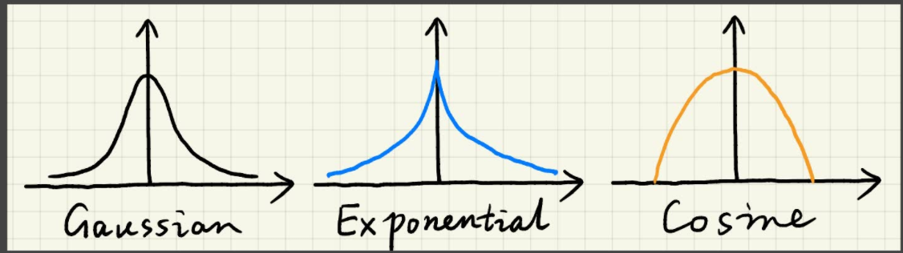

### Implement Large Filters 大型滤波器优化

- 大型滤波器减少采样次数优化
- 拆成多个 pass 执行

#### Solution 1 ：Separate Passes

- 将维度拆成次数
- 减少一个维度数量级 Mnxn -> Mi x n + Mn x i
- 二维高斯描述为两个一维高斯相乘
- 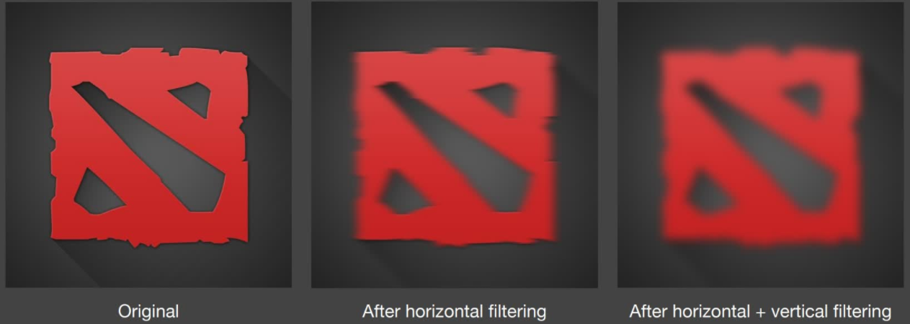

#### Solution 2 ：Progressively Growing Sizes

- 使用逐步增大的滤波器
- 同样大小的滤波器，采样的距离逐渐增大
- 多趟统一形成大的 filter image
- 如果滤波器大小为 5x5，采样 5 层，那么每个像素相当在一次 pass 中采样了 64 x 64
- 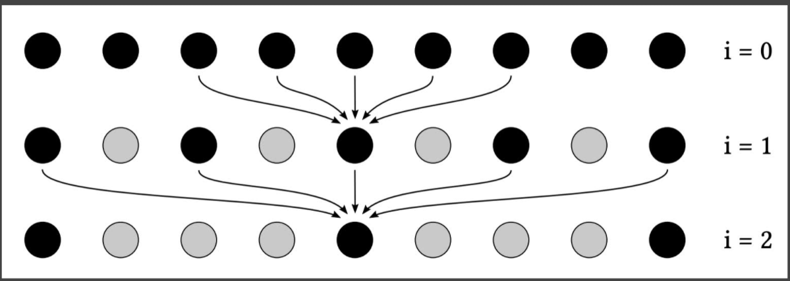

##### deeper understanding

- 每次使用越来越大的 Filter，过滤掉越来越低的频率
- 每迭代一次，图就越模糊
- 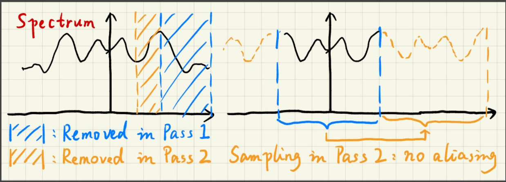

### Outlier Removal

- 非常亮的点，不但没被过滤，还会在过滤时摊开影响到周围 ：Blocky

##### solution

- 预处理，滤波前处理掉 outlier
- Removal 实际上做的是 clamp，通过均值方差描述值范围

### Specific Filtering Approaches for RTRT

- 对于 RTRT 选用的过滤方法

#### Spatiotemporal Variance-Guided Filtering （SVGF ）

一种当期效果最好的联合双边滤波

- Depth
    - 以深度值，根据贡献函数得到对当前点的贡献
    - 考虑贡献点在切平面法线方向上的深度，而不是朝向摄像机方向的深度
- Normal
    - 考虑用点击代替法线纹理
- Color
    - 用灰度表示差异，用方差防止噪声，灰度或者方差越大贡献能力越低

#### Recurrent denoising AutoEncoder （RAE）

基于 G-Buffer 和神经网络的图像降噪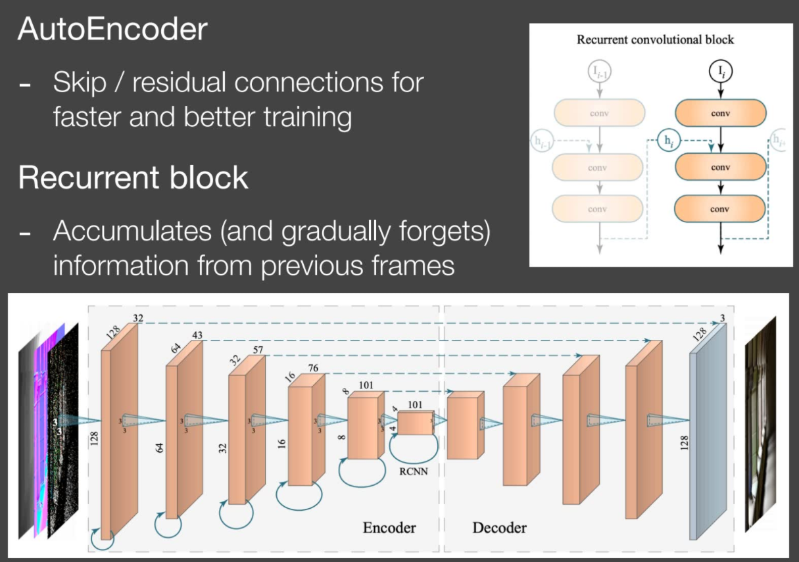

- 使用 AutoEncoder 结构，
- 使用 G-Buffer 以及上一帧的图像信息
- 可能出现 Ghosting，来回抖，看起来像沸腾的水
- RAE 可以在任意数量的 SPP 中运行
- 英伟达 RAE 去掉了时间上的自循环部分

### Practical Industrial solutions

实际上工业解决方案

#### Temporal Anti-Aliasing （TAA）

- 四帧一个循环，每帧都进行四分之一个采样
- 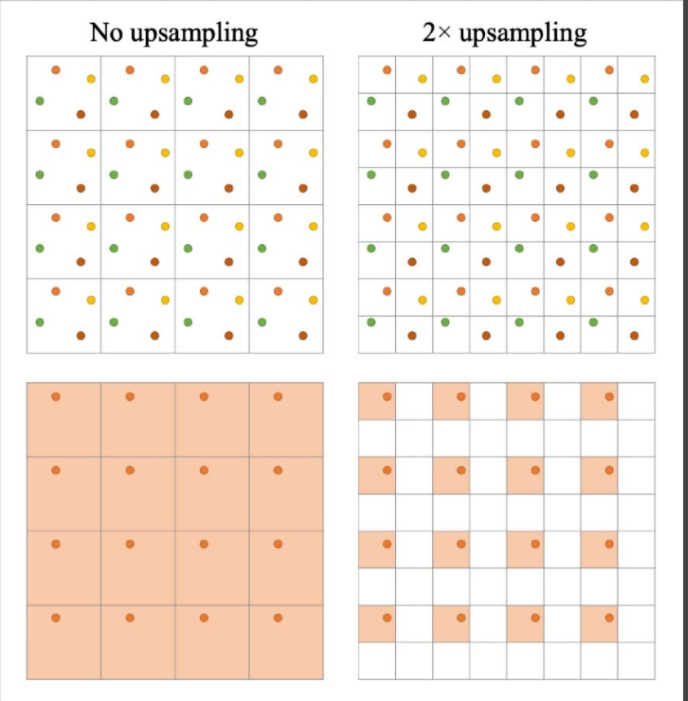
- 移动的物体使用 Motion vector 找到上一帧着色像素对应的屏幕位置
- 对于 Jitter sampling pattern 的处理和 RTRT filter 基本一致

#### Space Anti-Aliasing

- SSAA ：渲染高分辨率的纹理后，双线性插值降采样
- MSAA ：
    - 在同个像素对于每个对这个像素参与贡献的三角形都会进行采样，在硬件光栅化的时候实现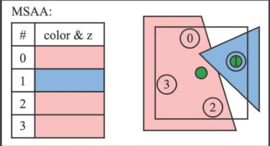
    - 对于采样点的复用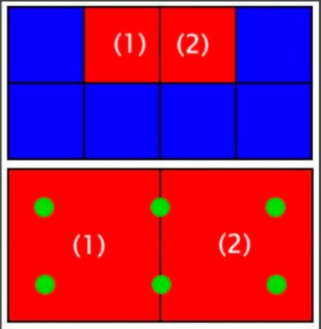
- FXAA -> MLAA -> SMAA ：基于图像的抗锯齿
    - SMAA：图象矢量化，提取为无限分辨率，离散变连续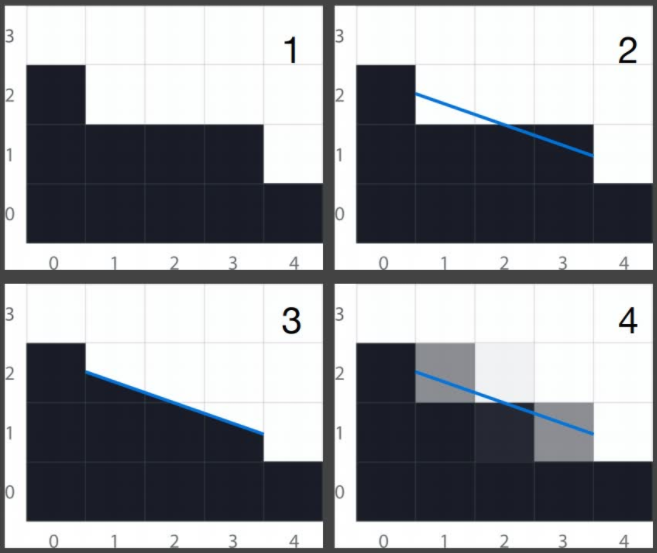

G-Buffer 不能进行抗锯齿，一定是得走样的

#### Temporal Super Resolution 超分辨率方案

- DLSS ：基于当前输出的图像信息和时间上的图像信息

#### 避免没有意义的着色

##### Deferred Shading 延时渲染

- 只 shading 可见的 Fragment ，通过 GBuffer 中的 Depth Buffer 时间
- 光栅化两次，第一次着色 G-Buffer，第二次通过了深度测试才着色 ColorBuffer
- 延时着色也只能对写入深度的不透明物体起作用，前向渲染需要在延时着色之后执行。

##### Deferred Lighting 延时光照 （这块是我自己的理解课外的内容）

- 在默认都是 PBR 着色的时候，只需要将 PBR 着色所需的所有数据存储在 G-Buffer 内
- 光照着色时通过 G-Buffer 内的数据完成所有像素点着色
- 优点是速度快，一个材质渲染整个屏幕上的所有像素
- 缺点是所需 G-Buffer 数量多，着色材质需求不灵活

#### Tiled Shading

- 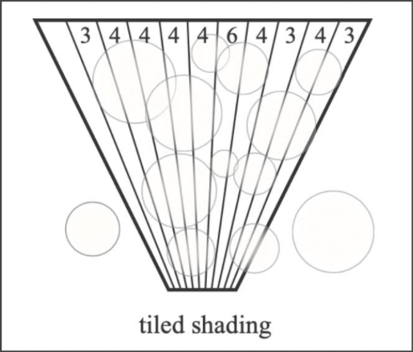
- 屏幕中的每个条不会被所有的光源影响
- Tiled Shading 在 deferred shading 的基础上，对所需的光源做优化

#### Clustered Shading

- 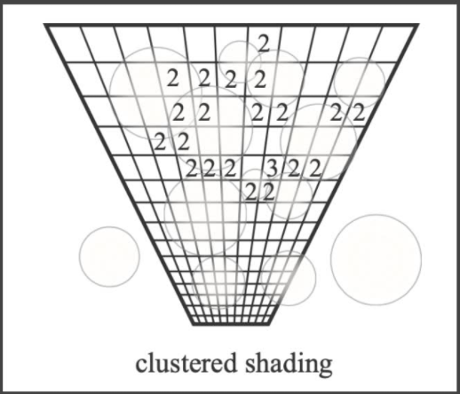
- 深度上继续切片
- 这两渲染管线都是在延时渲染中基于 G-Buffer 实现的，此时已经没有网格物体，三角形的概念了

### Level of Detail Solution

多层次细节 ：近处精细，远处粗糙，再远不可见

#### Cascaded 级联

Cascaded shadow map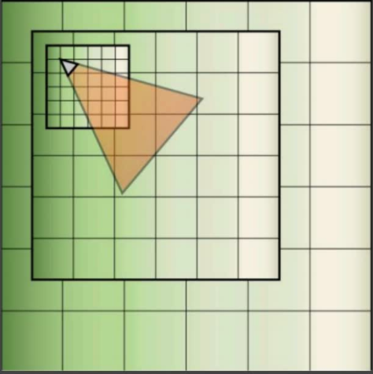

- 使用多张 ShadowMap
- 离摄像机越远的区域采样表示范围越大的 ShadowMap

#### Geometry LOD

- Nanite，UE5 的无限精度几何体 LOD 算法
- LOD 方法最大的问题是在线性插值不好起作用时的精度突变
- 可以采用 TAA 来模糊突变
- 可以考虑三角形的调度，纹理的调度，虚拟纹理
- 几何纹理也可以来表示 Geometry

### Global illumination Solution

- 全部实时光追太慢，采用混合模式的性能光追
- 先光栅化，再 SRR，再 RTRT
- 用场景 SDF Trace 光线，RSM 反光手电
- DDGI，用 probe 记录并发射间接光
- 光照探针，低模近似
- Lumen 是全局光照，是以上方式的结合
