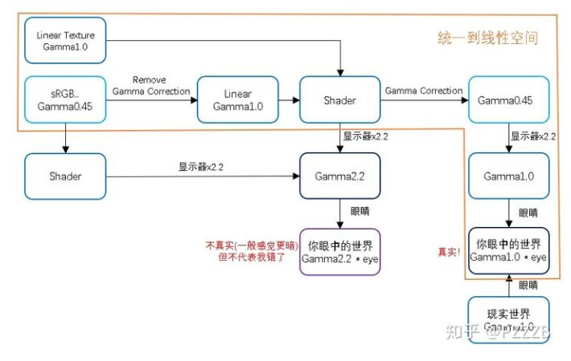

# 颜色空间

## Reference

[Unity - Manual: Working with linear Textures](https://docs.unity3d.com/Manual/LinearRendering-LinearTextures.html)

[Unity - Manual: Linear or gamma workflow](https://docs.unity3d.com/Manual/LinearRendering-LinearOrGammaWorkflow.html)

## sRGB  translation

1. sRGB 颜色的纹理 （Gamma 0.45）将在变暗后输入 shader（Gamma 1.0）
2. shader 的输出 （Gamma 1.0）传入显示器 BackBuffer 将会变亮 （Gamma 0.45）
3. 显示器的输出将会压暗颜色 （Gamma 1.0）

### 总结

- 只有第一步的需要手动操作，其他都是自动的。
- sRGB 纹理不启用 sRGB 将会整体偏亮，反之整体偏暗
