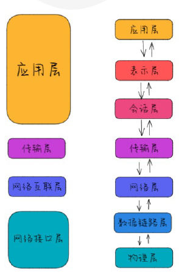
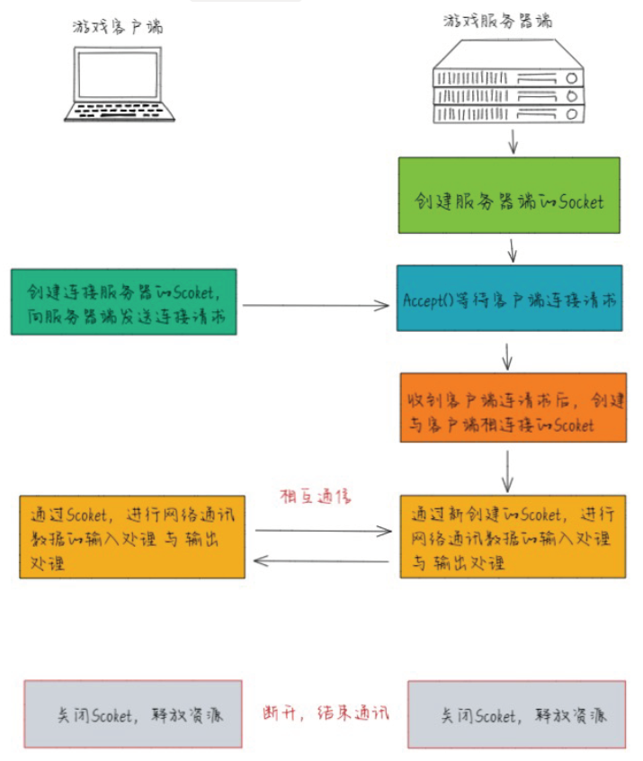
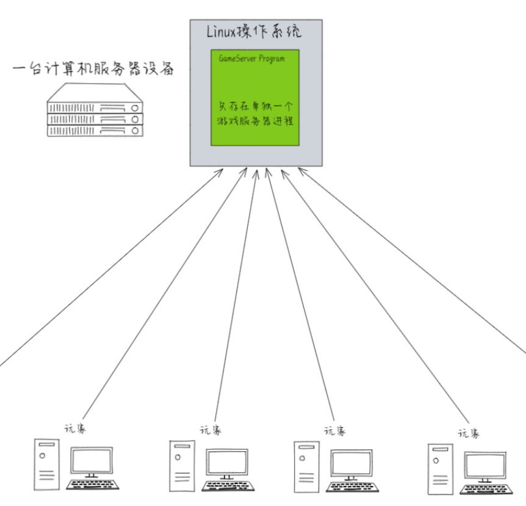
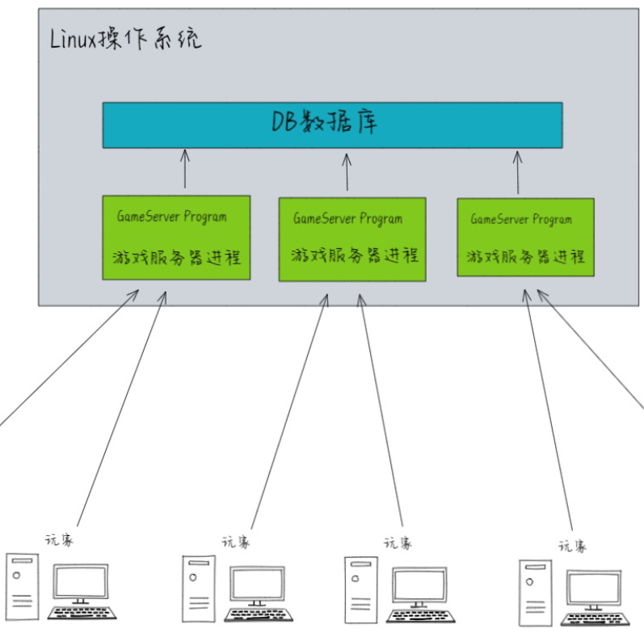
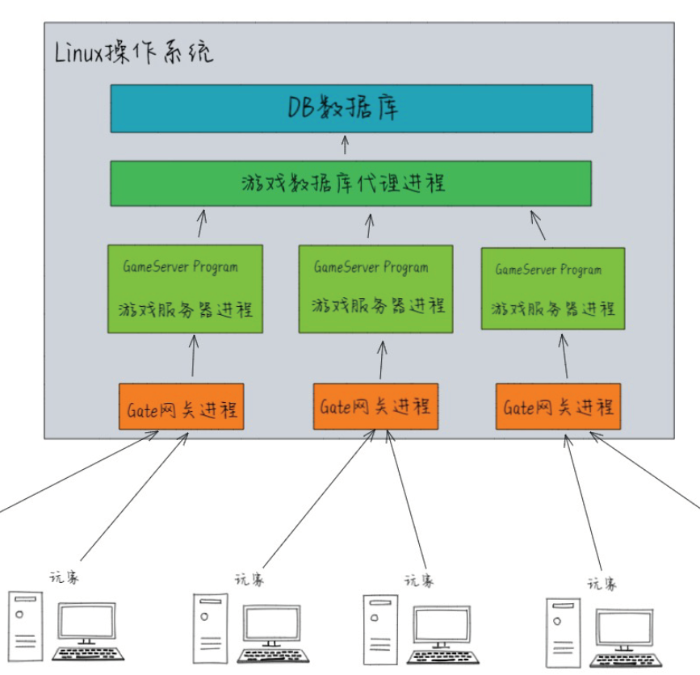
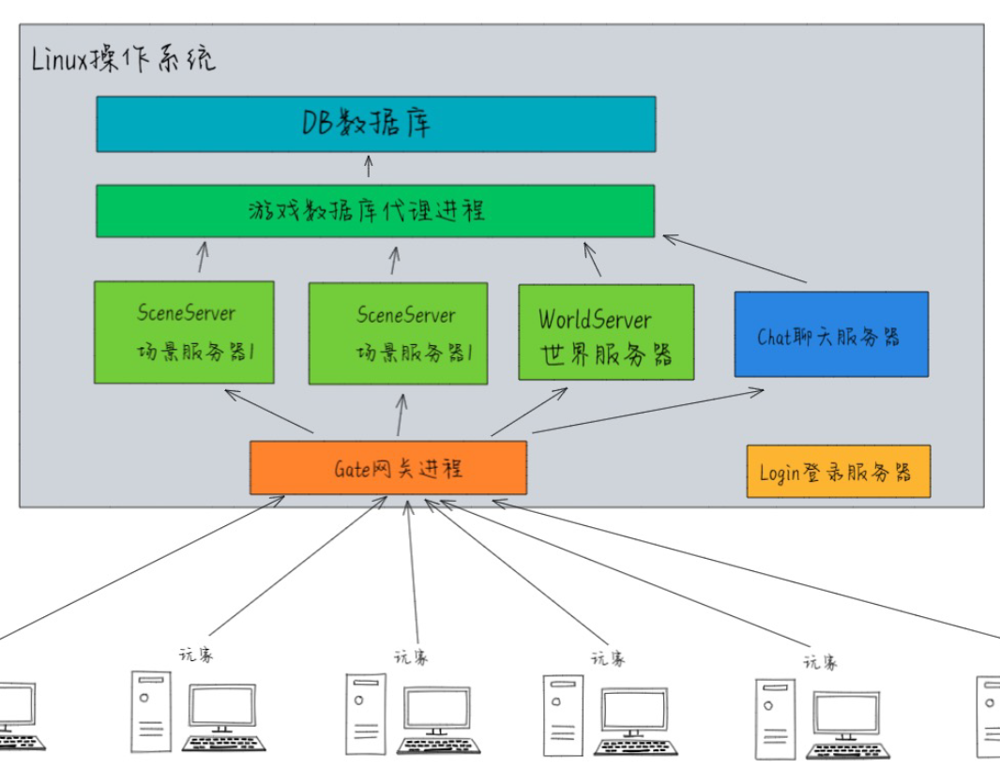
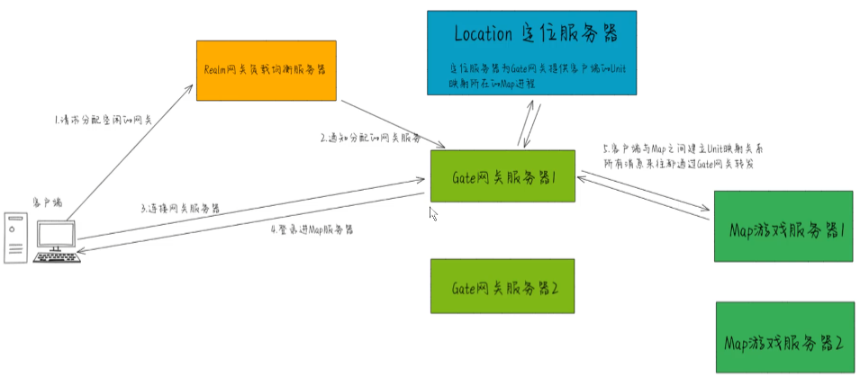
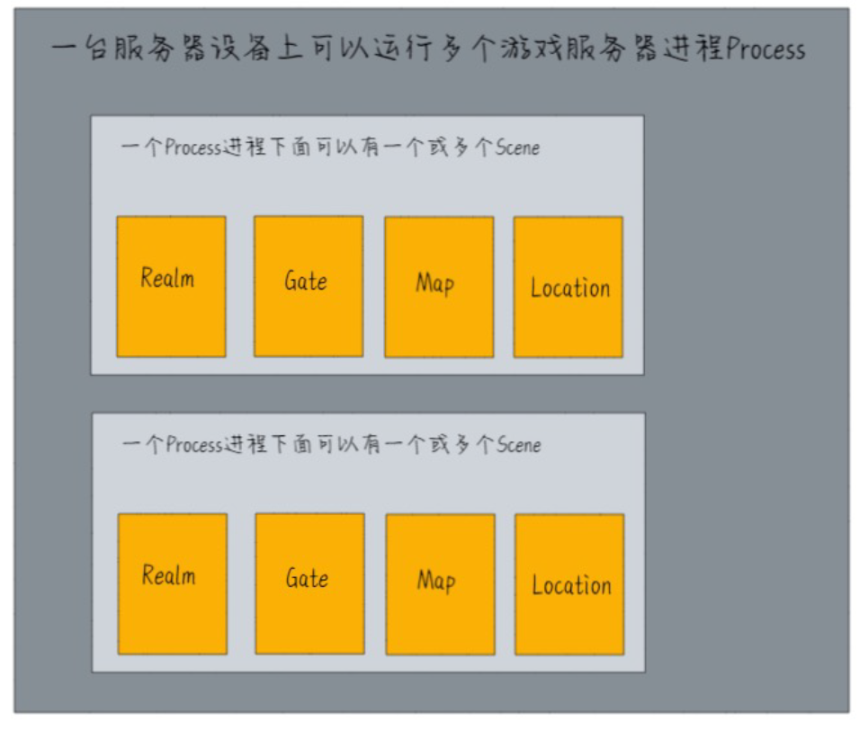

# ET Framework

## 相关资料

[ET 视频教程](https://edu.uwa4d.com/course-intro/1/375)

[egametang/ET: Unity3D Client And C# Server Framework](https://github.com/egametang/ET)

[UWA 学堂](https://edu.uwa4d.com/course-intro/1/375)

[egametang/ET: Unity3D Client And C# Server Framework](https://github.com/egametang/ET)

## 01 ET 框架以及课程介绍

### 什么是 ET 框架

• ET框架是一个开源的双端全栈式网络游戏开发框架。
• ET框架的服务端部分则是基于.net(.net core)开发的多进程分布式高性能游戏服务端。
• ET框架的客户端部分则是基于Unity 3D游戏引擎。
• 前后端都使用的是C#编程语言，可以轻松地做到前后端代码共用。

### 特色

• 商业网络游戏双端C#全栈式开发体验
• 服务器端实现了不停服动态热重载，客户端则提供开发时热重载与C#逻辑热更新
• ECS组件式开发，提供协程支持，使用异步变同步语法，逻辑连贯，逃离回调地狱
• 服务器端采用功能拆分式设计，单进程开发，多进程部署，降低调式门槛
• 多进程分布式服务器架构，提供位置透明的Actor消息机制，为大型商业项目保驾护航
• 提供易于编写的机器人框架，测试框架，AI框架，对于商业项目的性能有直观的把握
• 基于快速可靠的KCP协议，强劲且稳定的网络传输性能，更低的服务器性能消耗
• 经过完整的大型MMORPG的上线商业项目的锤炼与验证(前后端均使用ET框架进行开发)

## 02 环境安装

#### .Net SDK 6.0
cmd => dotnet --version

#### vs 
.net 桌面开发，通用 windows 平台开发，Unity 游戏开发

#### rider

#### Mongodb

https://www.mongodb.com/try/download/community
不需要可视化软件
环境变量 > 系统变量 > Path > 添加 C:\Program Files\MongoDB\Server\5.0\bin
cmd => mongo

#### robo3t
https://robomongo.org/

先打开 Unity 项目
- 删掉 TestRunner
- 新建 StreamingAssets
- IL2Cpp 改成 Mono

## 网络通信

游戏服务器端业务逻辑代码不能写在 Get 网关中

osi 模型，网络通信七层协议
实际使用网络通信 四层模型，TCP/IP 协议

Socket 是应用程序调用操作系统的 API，用来调用 TCP/IP 协议的

Session.id -> channel -> socket
向 socket 写入数据，socket 调用 TCP/IP 传输数据

游戏服务器端也有 Session

### Socket 通信模型

1. 游戏服务器端创建-Socket对象，绑定和监听IP地址，端口
2. 游戏服务器端调用Accept方法监听和等待客户端的连接请
3. 游戏客户端创建Scoekt对象，通过游戏服务器的IP地址与
4. 游戏服务器端收到游戏客户端的连接请求，创建出一个专进行读/写操作，也就是通过Socket完成网络数据的相互通信
5. 游戏服务器端与游戏客户端，都关闭数据输入输出流，关

## 多进程和分布式

客户端连接上之后断开原 Section
创建新的网关 Section

#### 第一代服务器架构

- 单台物理机，单进程，单线程，无阻塞 socket
- 每隔一秒数据同步更新
- 文本存储数据，需要 IO 操作

#### 第二代服务器架构

- 分区分服，每个区服都是一个单独的进程，互不干涉，
- 数据库软件

#### 第三代服务器架构

三层架构

增加 Gate 网关进程在服务器进程和玩家之间

游戏服务器进程不再管理 Socket 连接，减少 IO 读写时间。

同样的原因使用游戏数据库代理进程，就是缓存

游戏服务器进程专门快速处理逻辑

#### 第三代服务器架构 （无缝地图）

游戏服务器进程进行拆分

- 场景服务器
  - 玩家连接
  - 角色控制
  - 场景相关的业务逻辑
- 外围服务器
  - 不依靠游戏地图系统
  - 聊天
  - 背包
  - 账号

进程间可以进行相互通信

网关进程合为一个

### ET 服务器 Demo 的登录流程

### ET 框架，组件式架构

## 当前总结

1. 服务端框架结构复杂，我应该是不需要网关或进程协同，只需要每个房间一个通用的场景服务端进程
2. 为了热更放弃 Unity 的编译系统，现在不需要考虑热更新
3. 虚假的 ECS 结构，实体和组件成了同一个东西，使用托管内存进行排布。
   1. 具有 ECS 在网络同步方面的好处，但没有 ECS 在客户端进行逻辑更新时快速的性能。