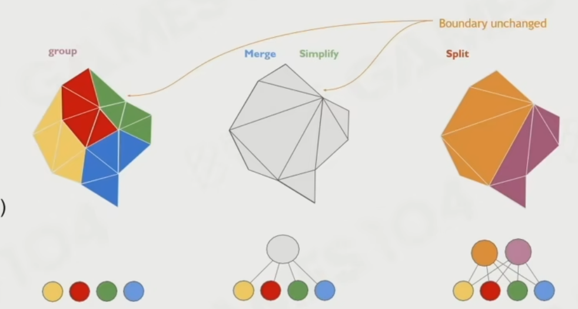
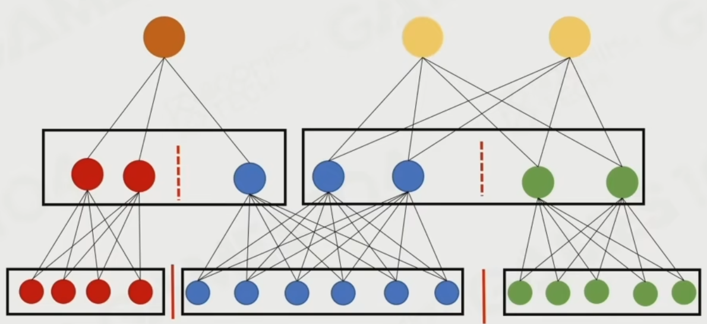
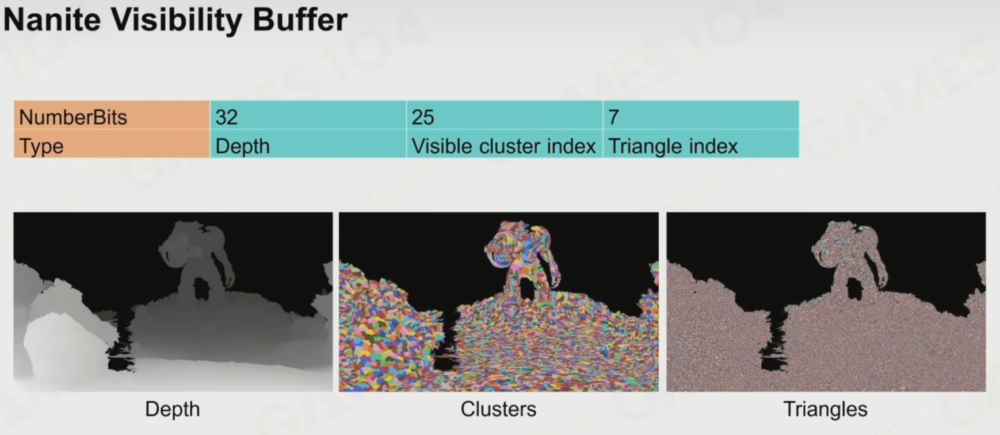

# Nanite - 2

## Virtual Geometry

无限的几何细节

### Virtual Texture

纹理是 unifrom 的，可以进行插值，制作 clipmap，也好实现 Virtual Texture

Virtual Texture 就是根据角色所在位置密度不一样的纹理

### Geometry filter

三角形几何没法做过滤，没法自然的 LOD

### Voxel 体素

体素好做过滤，但是不合适工作流，存储量大

### Subdivision Surfaces

几何细分，四边形面合适，没法做简化

### Maps-based

用纹理表示几何，display map，不好做硬表面

### Point Cloud

点云，overdraw 严重，uv 不好做

最终选择三角形。

## Nanite Geometry Representation

nanite 的几何表达

根据屏幕精度决定 nanite 精度

#### Represent geometry by cluster

#### 对每个物体，不同的位置三角形密度不同

#### 每层的 Lod 都和上一层差一个单维度的两倍，构建出一个 LOD 树

先合并 Cluster 成为 Group 再简化 Group，而不是直接简化 Cluster

树就产生了环

每层 LoD 接缝缝合边的时候生成的缝合边都不重合，类似于渲染的 jiter

每帧都不一样，让人眼不容易看出来

Dag 有向无环图

### Mesh 简化

mesh 简化算法

## Runtime LoD Selection

Parallel 如何并行化，如何每个 LOD 节点判断自己是否应当被绘制

ClusterError 可见值

threshold 根据 Cluster

## BVH Acceleration for LoD Selection

提前使用 BVH 粗阶段 Cull 掉明显不用渲染的 clucter group

再把剩下的 cluster group 并行化

## Nanite Rasterization

当三角形大小等于屏幕像素大小是，硬件光栅化不再好用，使用 compute shader 加速

### Nanite Visibility Buffer

手动 early z

只能处理不会变形的网格

### Imposters for Tiny Instance

当物体特别远的时候，非常简化的模型表现失真

12 * 12 的方向去渲染一个对象，存到一张纹理里，在很小的情况下，直接采样到屏幕上。

## Nanite Deferred Material

使用 Tile base 的方法，

对于每个材质，在 Tile 里画出材质的深度，TIle 里有几个材质就用几张纹理

当屏幕深度等于材质画的深度时，说明材质对应的物体可被绘制

## Shadows

lumen 间接光照与几何数量无关，可以直接用

### 级联阴影

cascaded shadow map，即 view depend sampleing

### Virtual Shadow map

16k * 16k 的 virtual shadow map

### Streaming and Compressed

几何，用到即加载，不用到即卸载

浮点转顶点

Hardware LZ decompression

直接从硬盘读到显存
