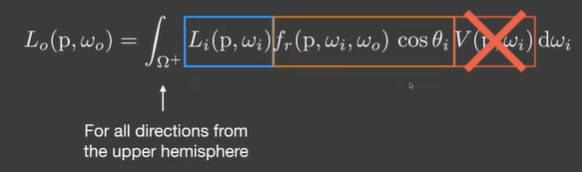
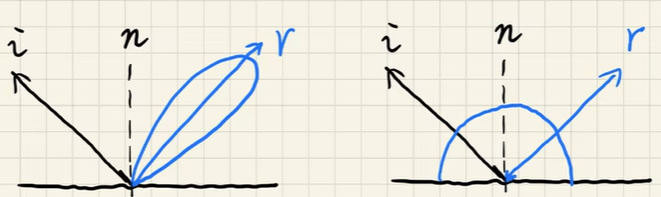
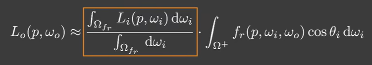
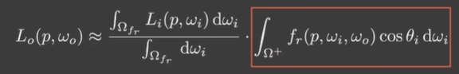
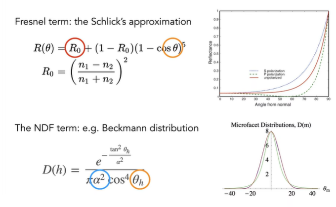

# 实时环境光 上

## Distance Field Soft Shadow

### Distance Function 距离函数

可以得到几何上，像素上的过度

### The Usages of Distance Fields

- Ray marching 光线步进每步的安全距离
- determine the percentage of occlusion 某个点都的大概的被遮挡的概率
- infinite resolution characters [无限分辨率字符](https://github.com/protectwise/troika/tree/main/packages/troika-three-text)

## Environment Lighting

来自于无限远的入射光

Image-Based Lighting IBL, 解渲染方程

不考虑遮挡

需要积分所有入射光

- General solution - 通用方法，积分，蒙特卡洛积分
- 可能会慢，shader 里不能做大量采样

### Split Sum

#### Observation

特性

对于某一条出射光，对于 glossy 和 diffuse 有两种入射光贡献 lobe

Split render equation

对于 Specular

1. Prefiltering of the environment lighting，类似 specular 的 mipmap
2. 对于 Spherical map, 更好的 Filter 不应当是 uniform 的，应当是球面上的
3. 等于 模糊 IBL

对于 Diffuse

1. 需要做半球积分，即半球 Prefilter

BRDF 项

五维度参数，不能直接预计算

只关注菲涅尔项和法线分布，只有三个参数空间，反射率，入射角，粗糙度

BRDF 公式除以并乘以 F 项，提取出 R0 到积分外部，不作为积分内的参数空间

