# GAMES104-现代游戏引擎: 从入门到实践

[Games 104](https://www.bilibili.com/video/BV12Z4y1B7th)

## 第一节：游戏引擎导论

### 历史

Engine ，商业，inhouse，免费
Middlewares 中间件公司

### 游戏引擎

制作游戏的框架和工具合集

世界中的无限细节

### Complexity of Simulation

Combat

**Interaction**

Reaction

**Net Sync**

Prediction

Render

- Animation
- **Motor**
- *Camera
- Effect**
- Cloth
- **Sound**

### Developer Platform

为了艺术家，设计师，程序员设计工具

非常复杂的工具

#### 如何学习游戏引擎

需要学习几乎所有计算机科学知识

学习路径：沿着主干道前进

#### MVVM 模型

#### Cause about

- Render
- Animation
- Physics
- Gameplay （Game World Rules）
- MIsc Systems
  - Effects
  - Navigation
  - Camera

#### Tool Set

- C++ Reflection
- Data Schema

#### Online Gameing

- Lockstep Synchronization
- State Synchronization

#### Advanced Technology

- Motion Matching
- Procedural Content Generation
- Data-Oriented Programming
- Job System
- Lumen
- Nanite

#### References

- No required textbooks
- Game Engine Architecture

#### Mini Engine

- Mini runtime framework
- Mini editor
- Building basic knowledge system of game engine

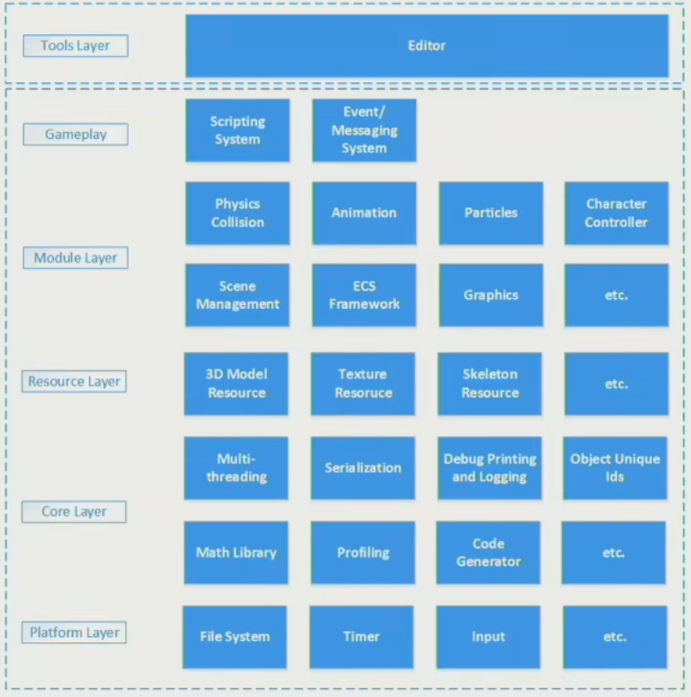

#### 作业目标

联网对战游戏

## 第二节：引擎架构分层

### 游戏引擎分层简介

#### Layers

- Tool Layer
- Function Layer
- Resource Layer
- Core Layer
- Platform Layer
- 3rd Party Libraries

5 + 1 层次涵盖了几乎所有引擎功能

#### Chans of Editor

- Editor GUI

#### Make it visible movable and playable

- Physics
- Animation
- Rendering
- Camera HUD and Input
- Script FSM and AI

#### Data and Files

#### Swiss Knife of Game Engine

#### Launch on Different Platforms

- Operation Systems
- Platform File Systems
- Graphics API
- Platform SDK

etc

- Consoles
- Input Devices
- Publishing Platforms

#### Practice

make an animate character

### Resource Layer

- How to Access My Data
  - Resource -> asset
- Rentime Asset Manager
- Manage Asset Life Cycle

### Function Layer

- How to Make the world alive
- 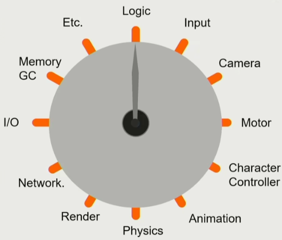
- 每个 Tick 进行一遍所有的系统执行

#### Dive into Tick

- tick logic 先世界模拟
- tick render 再进行渲染

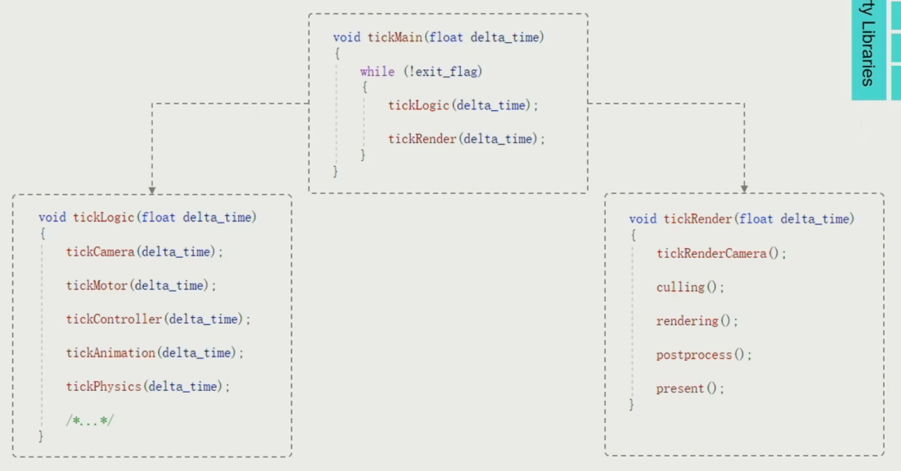

#### Heavy - duty Hotchpotch

#### Multi-Threading

难点在 Dependency 管理

### Core Layer

#### Math Library

- math efficiency
- 倒数平方根很慢，quake 3 有一个近似算的很快
- SIMD ：专门做向量运算的组件，可以同时进行 4 次相加

#### Data Structure and Container

需要重新写游戏引擎手动控制的容器数据结构，因为语言自带的托管内存的数据结构所占据的内存会产生很多空洞，内存的消耗是不可控的。

出现很多内存碎片，访问效率很低。

#### Memory Management 内存管理

现代计算机的内存数据读写还是图灵机方式

高效的内存分配模式

- Put data together 数据在一块
- Access data in order 数据按顺序读写
- Allocate and de-allocate as a block 按照块状分配内存

#### Foundation of Game Engine

### Platform Layer

#### Target on Different Platform

需要做到平台无关性

- File system
- Graphic api
- Hardware Architecture 特定机器优化

### Tool Layer

#### Allow artists to create game

Manual Editors

- Level Editor
- Logical Editor
- Shader Editor
- Animation Editor
- UI Editor
- Flexible of coding languages

#### Digital Content Creation

Asset conditioning pipeline

tool chains

### Why Layered Architecture

- Decoupling and Reducing Complexity
- Response for Evolving Demands

### Mini Engine : Pilot

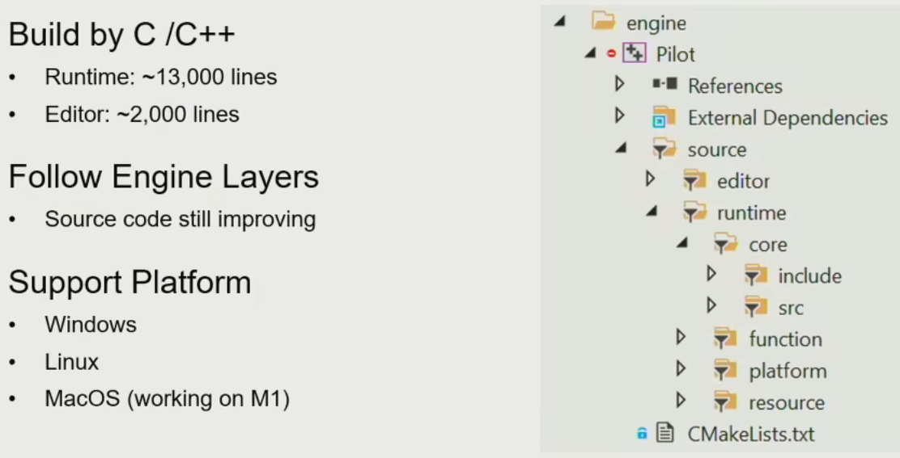

### Simple ECS framework

### Takeaways

- Engine is designed with a layered architecture
- Lower levels are more stable and upper levels are more customizable
- Virtual world is composed by a set of clocks - ticks

## 第三节：如何构建游戏世界

### 游戏世界中的物体

#### Dynamic Game Object

#### Static Game Object

#### Environment

- Sky
- Vegetation
- Terrain

#### Other Game Objects

- Air wall
- Trigger Area
- Ruler
- Navigation mesh

#### Everything is a Game Object

### How to Describe a GameObject

- Name
- Property

  - Shape
  - Position
  - Capacity of battery
- Behavior

  - Move
  - Scout

##### OOP

通过面向对象的方式描述游戏物体，实际上的现实中的物体不是清晰的树状派生关系，而是组合居多

##### Component Base

组件化，通过组件组合成游戏对象

#### Takeaways

- Everything is a game object in the game world
- Game object could be described in the component-based way

### Make world alive

- Object-based Tick
- Tick 的执行是遍历同类型的每个个体，而不是同个体的每个类型
- 按照流水线的做法比较高效

### Interactive

- Events
- Interface
- 可拓展的消息系统

#### Manage Game Object

- Game object uid
- position
- Scene management 空间管理的核心
  - No division
  - Divided by grid
    - Quadtree
  - Hierarchical segmentation 树状结构划分

#### 复杂情况

- GO Binding，父子节点情况，时序很重要，因为有并行情况
  - 逻辑上的混乱性，而好的程序执行是确定性的
  - 挑战性是在多线程情况下执行还是确定性的
  - 需要有同步点，GameObject 间不能直接发送消息
  - 可能逻辑间有循环依赖，根据处理方式可能会导致延时情况

## 第四节：游戏引擎中的渲染实现

### 渲染概述

#### Challenges on Game Rendering

1. Complex render objects
2. Deal with architecture of modern computer with a complex combination of CPU and GPU
3. Commit a bullet-proof framerate, 
   1. 30 or 60 or 120 fps
   2. HD, 1080p, 4k, 8k
4. CPU memory

#### Rendering on Game Engine

A heavily optimized parctical software framework to fulfill the critical rendering requirements of games on modern hadware

#### Outline of Rendering

1. Basics of Game Rendering
   - Hardware architecture
   - Render data organization
   - Visibility
2. Materials, Shaders and Lighting
   - PBR
   - Shader permutation
   - Lighting
   - Point / Directional lighting
   - IBL / Simple GI
3. Special Rendering
   - Terrain
   - Sky / Fog
   - Postprocess
4. Pipeline
   - Forward, deferred rendering forward plus
   - Real pipeline with mixed effects
   - Ring buffer and V-Sync
   - Tiled-based rendering

### 渲染系统的对象

#### Building Block of Rendering

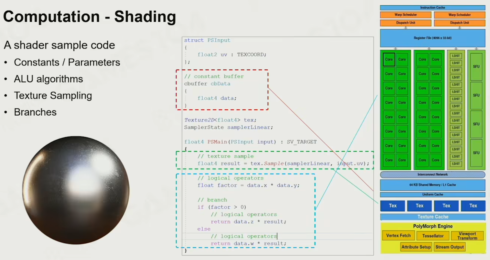

#### Computation - Texture Sampling

1. Use tow nearest mipmap levels
2. Perform bilinear inerpolation in both mip-maps
3. Linear interpolate between the results

### GPU 架构

The dedicated hardware to solve massive jobs

#### SIMD and SIMT

- SIMD 单指令多数据
- SIMT 单指令多线程

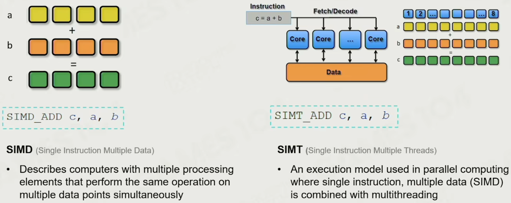

#### GPU Architecture

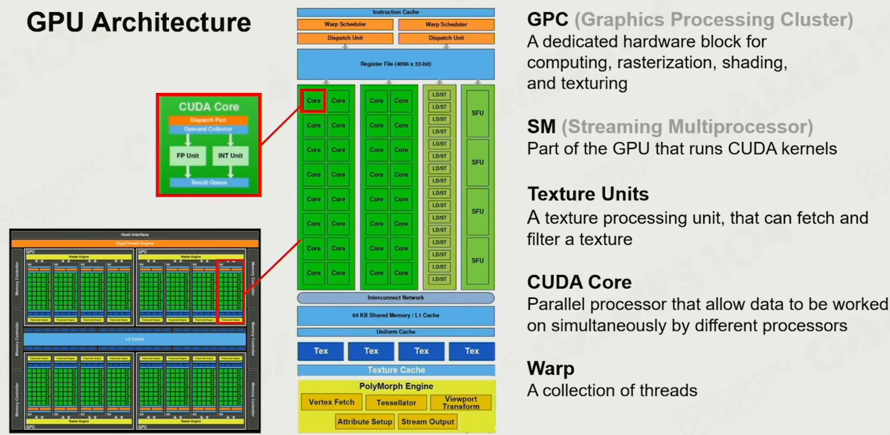

#### GPU Bounds and Performance

- Memory Bounds
- ALU Bounds
- TMU (Texture Mapping Unit) Bound
- BW (Bandwidth) Bound

### Renderable
可绘制的东西

- Mesh Render Component

- Building Blocks of Renderable

- Mesh Primitive
  - struct Vertex
    - position
    - color
    - normal
  - struct Triangle
    - Vertex[3]
  
- Vertex and Index Buffer
  - Vertex Datda
  - Index Data
  
  
  
- We Need Per-Vertex Normal

- Materials

  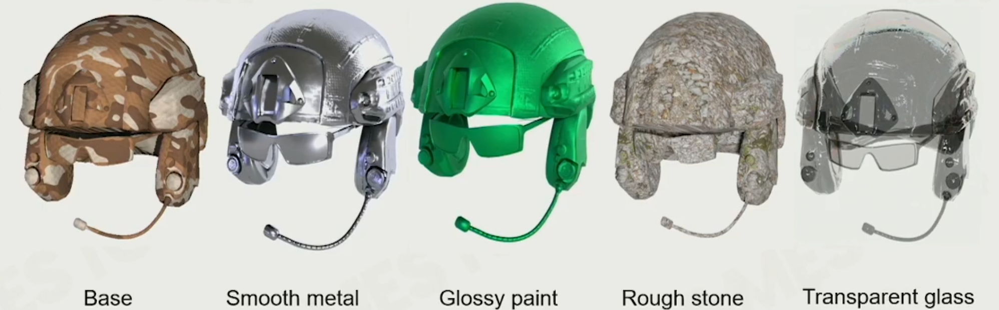

- Material Model

  

- Various Textures in Materials

- Variety of Shaders

### Render Objects on Engine

- Coordinate System and Transformation

- Object with Many Materials

- Resource Pool
  - Use Handle to Reuse Resources
  
    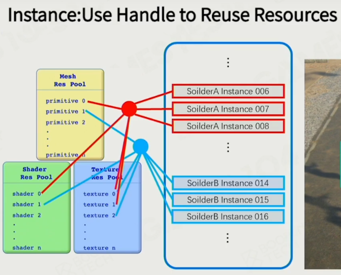
  
    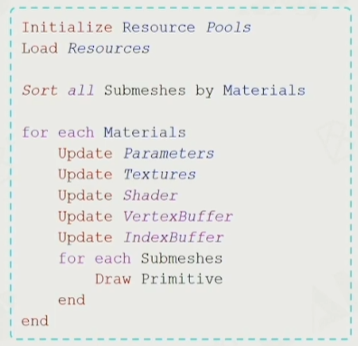
  
- Instancing 实例化，前边的都是物体绘制的定义，实际上绘制到屏幕上才是实例

- Sort by Material

- GPU Batch Rendering

  

### Visibility Culling 可见性裁剪

  - Culling One Object
    - View Frustum
    - Bounding Box
    - Hierarchial View Frustum Culling
    - Construction and Insertion of BVH in GameEngine
      - BVH 在动态物体多的情况下构建成本低
      - PVS (Potential Visibility Set) 对于空间上的一点关于其他物体的潜在可见性，即是否不会被其他物体遮挡
      - The Idea of Using PVS in Stand-alone Games
    - GPU Culling
      - Depth pre pass / early z 提前渲染深度到 z buffer，防止重复像素点着色

### Texture Compression

纹理压缩

- Traditional image compression like JPG and PNG
- In game texture compression
  - 需要支持随机访问
- Block Compressions
  - Common block-based compression format
  - On PC BC7 or DXTC
  - On mobile, ASTC or ETC

### Authoring Tools of Modeling

- Modeling
  - Polymodeling : MAX, MAYA, Blender 网格建模
  - Sculptiong : 雕刻
  - Scanning : 扫描
  - Procedural Modeling : 程序化生成

### Cluster-Based Mesh Pipeline

- Sculpting Tools Create Infinite Details 无数的细节

- GPU-Driven Rendering Pipeline

- Geometry Rendering Pipeline Architecture

- Programmable Mesh Pipeline

- Mesh shader, cluster base mesh

  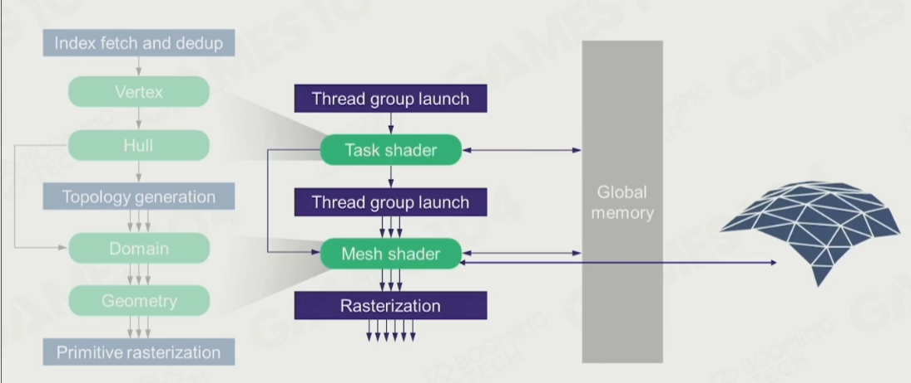

- GPU Driven
  - 把越来越多 CPU 上的计算放到 GPU 上做

### PILOT

小引擎项目 https://github.com/BoomingTech/Pilot

## 第五节：光和材质

### Participants of Rendering Computation

#### The Rendering Equation

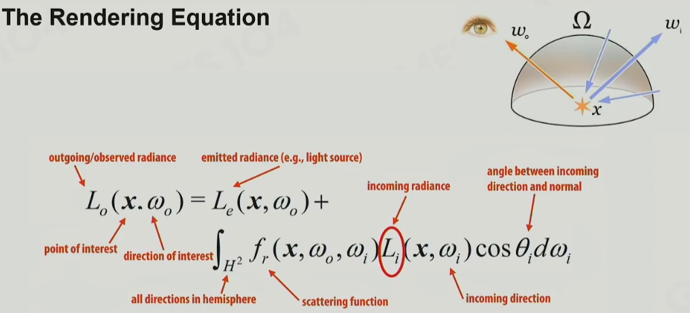

实时解渲染方程

#### Three Main Challenges

- Light Challenges 光的表现
  - visibility to Lights
  - Light Source Complex
- How to do Integral Efficiently on Hardware 对光的积分
- Any matter will be light source 全局光照
  - Indirect illumination
  - Global illumination

### Simple Light Solution

#### Simple Light

- Using simple light source as main light
- Using ambient light to hack others
- Supported in graphics API

#### Environment Map Reflection

- Using environment map to enhance glossary surface reflection
- Using environment mipmap to represent roughness of surface

#### Blinn-Phone Materials

- 基于光叠加原理，光的线性叠加
- 漫反射 + 高光 + 环境光
- 能量不守恒
  - Unstable in ray-tracing
  - non-energy conserving
- 无法表达真实材质
  - 都是塑料质感 

#### ShadowMap

- 使用纹理记录距离光源最近像素的深度
- Resolution limit ，纹理精度导致阴影锯齿
- Depth precision ，自遮挡，加 bias 和提高纹理精度解决

#### Basic Shading Solution

- Simple light + Ambient
  - dominent light solves
  - ambient and EnvMap solve
- Blinn-Phong material
- Shadow map

#### Precompute global illumination

- 空间换时间
- Good compression rate，存储百万个 probes
- do integration with material function
- Fourier Transform 傅里叶变换
  - 任何频谱都是不同频率的波长的叠加，
  - 图片由时域转到频域，去掉高频信息或低频信息，再转回时域，能对图片保留相应信息
- Convolution Theorem 卷积
- Spherial Harmonics 球谐函数
  - 1阶 SH 只需要 9 个值，压缩后是 4 Bytes 就能存储一个 Diffuse 光场
- SH Lightmap ：Precomputed GI
  - LightMap 是预计算的，对静态物体的表面的每个点的环境光照存储
  - 基于上面 SH 的理论，规定 LIghtMap 中一个 4 Bytes 颜色块定义了空间中的一个静态物体表面中的一个点接收到的全局光照
  - 全局静态物体的表面需要二维展开到 LightMap 上，所以 LightMap 也是一个 Altas
- Light Probe: Probes In Game Space
  - Probe 在玩家感知强的地方，在环境光变换大的地方密集
  - LightProbe 可以看作定义在 3 维空间的 LightMap，但不需要逐像素体素，所以可以实时预计算
  - LIght Probe Point Generation 工业上需要自动化生成 LIghtProbe 采样点
  - Reflection Probe：反射探针可以看作高精度的，做了范围限定的 LightProbe

- 现代游戏入射光
  - 直接光照：光源类型 + shadowmap
  - 静态间接光照：LightMap
  - 实时间接光照：LightProbe，Reflection Probe
  - 后处理光照：SSAO，SSR

### Physicaly base rendering (PBR)

#### Microfacet Theory 微表面理论

#### BRDF Model Based on Microfacet

- 常用 GGX 模型
- 

#### Normal Distribution Function : D 法线分布函数，表示高光强度曲线

- 相比 Phone 高光，高频波峰足够抖，高光逐渐消失的时候是柔和过度

#### Geometric attenuation term (self-shadowing) ：G，几何遮挡，表示能量损失

#### Fresnel Equation :

F 菲涅尔现象，视线越垂直，折射越明显，反之反射越明显

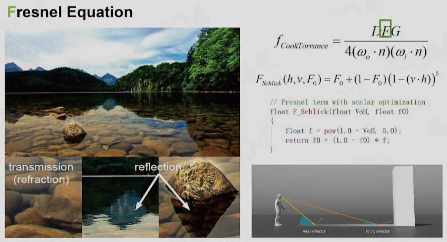

#### Physical Measured Material 实际上去测量真实物理材质的 BRDF

#### Disney Principled BRDF 迪士尼原则的 BRDF 模型

- 每个参数必须符合迪士尼原则
- 参数需要尽可能的少
- 数值参数需要归一化到在 0 ~ 1
- 参数的任意组合不能出现 BUG
- 引擎不是真实世界模拟器，而是游戏程序创造工具

- Disney Principle Material Parameters 迪士尼材质参数

#### PBR Specular Glossiness

SG 模型，全部参数都用纹理表达

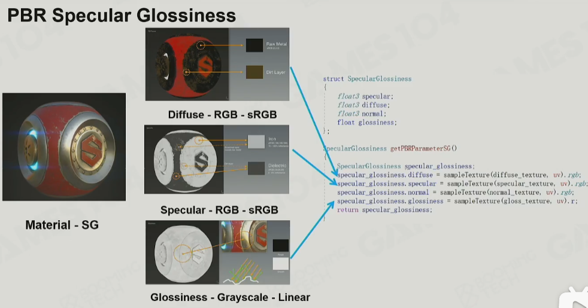

#### PBR Metallic Roughness

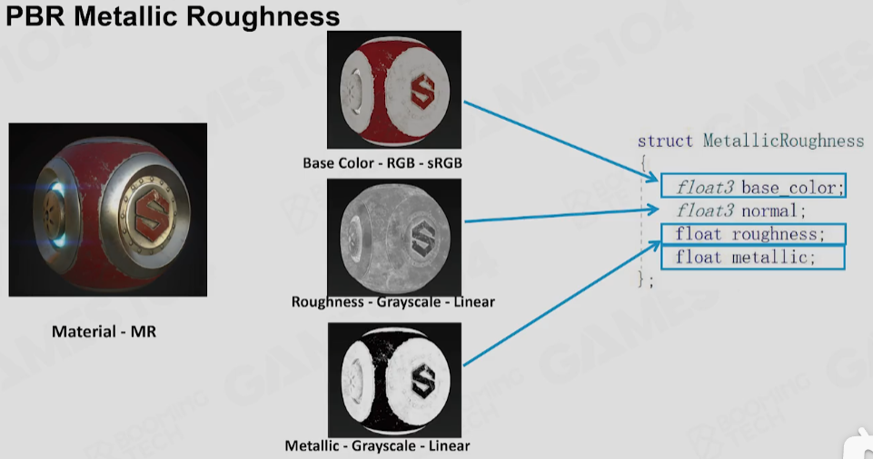

convert MR to SG，MR 是对于 SG 的封装，依赖 SG，参数相对 SG 对艺术家更友好

#### PBR Pipeline MR vs SG

MR 在金属与非金属过度容易出现白边

