# 引擎中的动画技术基础

## 动画系统简介

Humans have been trying to represent object in motion

视觉残留

### Challenges in Game Animation

* Interactive and dynamic animation
  * Interactive with game play
* Real-time
  * Compute per frame
  * Massive
* Realism 真实感
  * 表情
  * 物理真实
  * Motion Matching

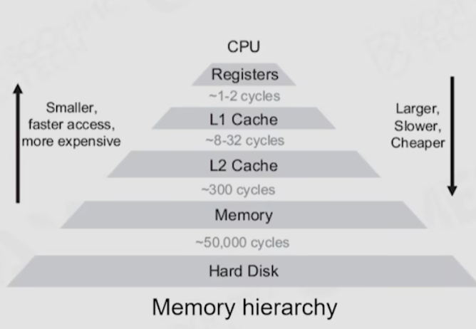

### Outline of Animation system

## 2D Animation

### Sprite animation

* 2D character
  * sprite on 2D background image
  * sprite on top of 3D rendered environment
* Game effect
  * sprite sheet texture for particles

### Live 2D

A technology to generate 2D animation without 3D model

* By applying translation, rotation and transformation to different parts and layers of image
* Combined with real-time motion capture, could be used for vtubing

## 3D Animation Techniques in Game

### DoF : Degrees of Freedom

refers to the number of independent variables or parameters of a system

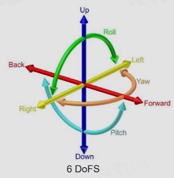

### Rigid Hierarchical Animation

层级骨骼动画

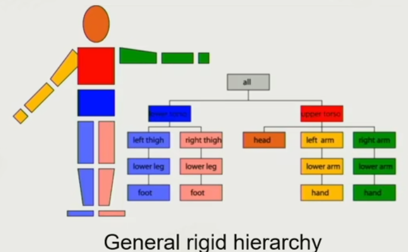

### Per-vertex Animation

顶点动画

可以使用纹理进行存储，存储顶点的位移和旋转

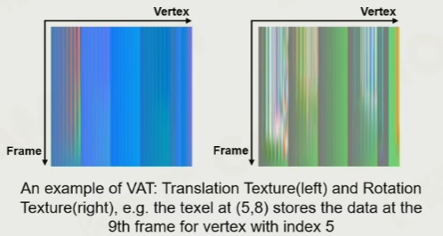

### Morph Target Animation

顶点影响权重的动画

key frame lerp

### 3D Skinned Animation

骨骼蒙皮动画，每个皮肤上的顶点受到多个骨骼的加权影响

### 2D Skinned Animation

Derived from 3D skinned animation

### Physics-based Animation

* Ragdoll
* Cloth and Fluid simulation
* Inverse Kinematics

### Animation Content Creation

* Digital Content Creator + Animator
* Motion Capture

### Skinned Animation Implementation

#### How to Animate a Mesh

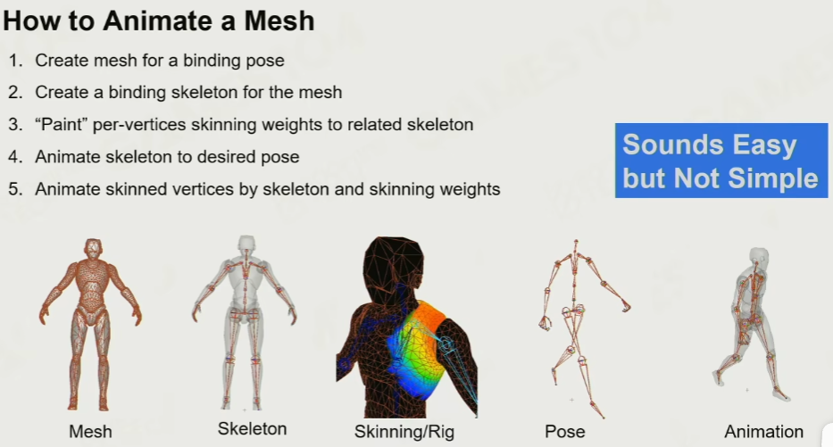

#### Different Space

空间变换可能会有 6 个自由度的变化

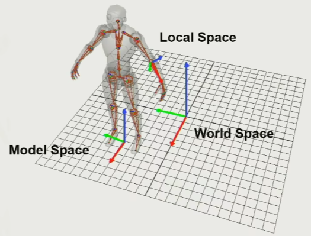

#### Skeleton for Creatures

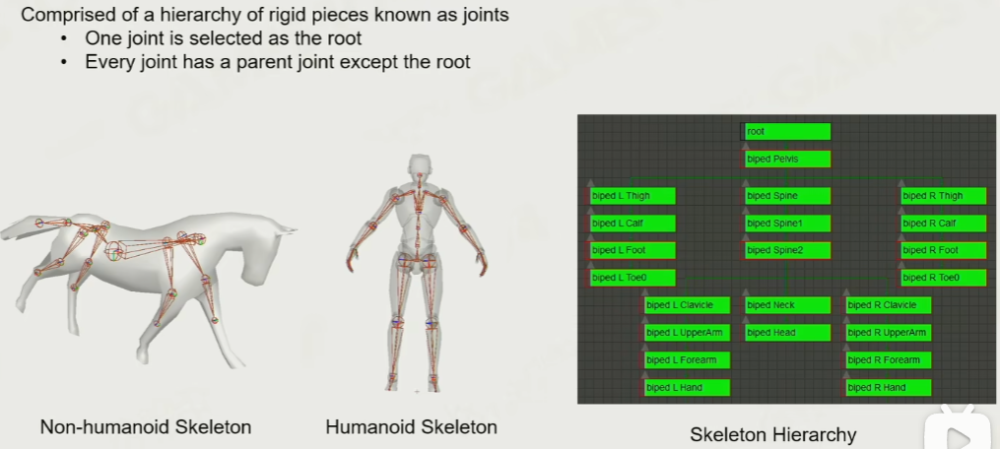

#### Joint vs Bone

* Joint : directly manipulated by the animator to control motion
* empty space between the joints

#### Humaniod Skeleton in Real Game

有时把衣服也做成 skin mesh 对骨骼蒙皮

#### Joints for Game Play

* Weapon joint 武器绑定的骨骼
* Mount joint 骑乘的骨骼

#### Where to Start th Skeleton

* Root Joint
  * The center of the model
* Pelvis joint
  * 尾椎骨骼
  * The first child joint of the root joint

#### Bind Animation for Objects

#### Bind Pose - T-pose vs. A-pose

T-pose 肩膀皮肤会被挤压，A-pose 现在更加适合

#### Skeleton Pose

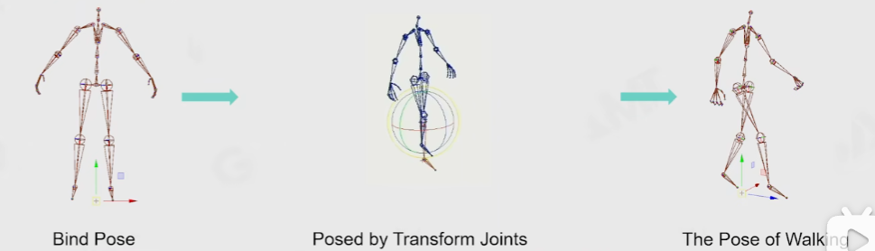

## Math of 3D Rotation

### 2D Orientation Math

### 3D Orientation Math

#### Eular Angle

欧拉角

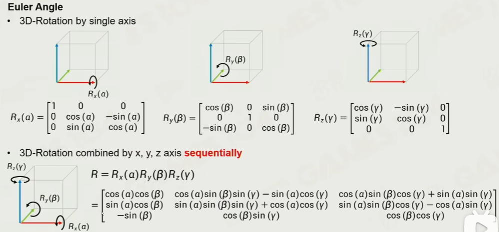

可以用航空术语表示

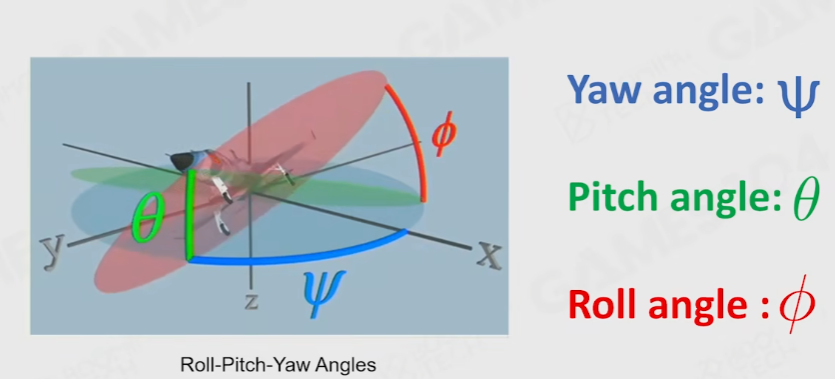

1. 从三个维度分别旋转，注意是当一个旋转完成后，在当前的坐标系下进行下个维度的旋转
2. Yaw-Pitch-Roll 分别对应 z，x，y

##### Con

1. 是顺序依赖的，调换 z，x，y 旋转计算顺序，将会导致旋转的结果不同

2. Gimbal Lock 万向节
3. 欧拉角的退化情况，
   1. 当沿 xyz 旋转，其中 y 为 90° 的时候，z 轴与一开始的 x 轴共轴，两者旋转方向一致，只有他们旋转的差值才有意义了
4. 插值不好算
5. 旋转叠加困难
6. 没法直接使用一个任意向量进行旋转

#### Quaternion

四元数

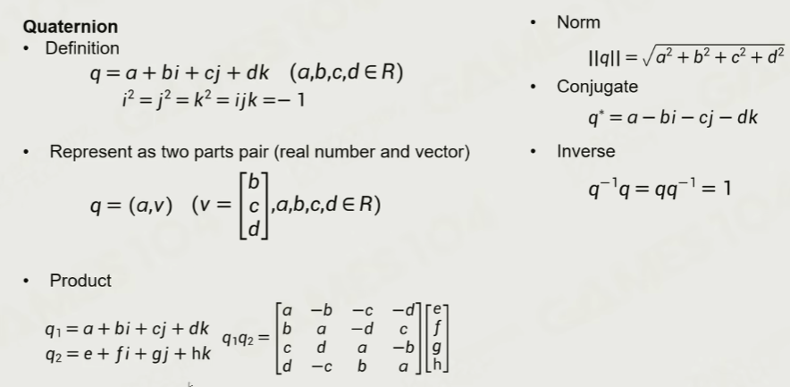

四元数方便用于

1. 逆向旋转
2. 旋转叠加
3. 向量间的旋转差
4. 向量对给定轴的旋转

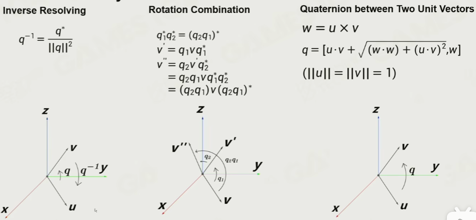

