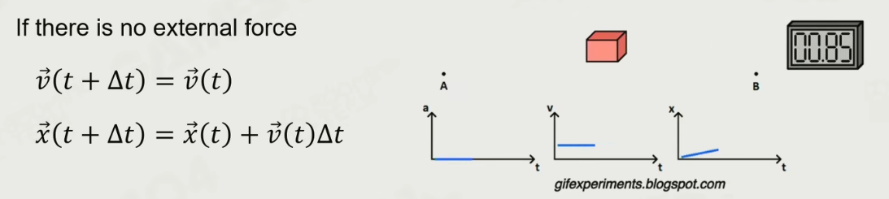
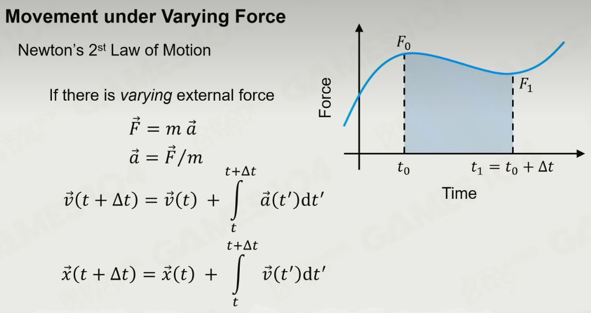

# Physics System

- Physical Intuition
- Dynamic Environment
- Realistic Interaction
- Artistic

Outline of Physics System

## Basic concepts

Actor

- Static 静态
- Dynamic 动态
- Trigger 不影响物理系统，和逻辑交互
- Kinematic 位置或者速度的强行设置，不符合物理约束

Actor Shapes

- 球、胶囊体、box 是最省的
- 精细的结构可以用多个 box 近似
- Convex 可以用来模拟碎片运动
- Triangle Mesh 和 Height Field 不能用来作为动态物体、

### Wrap Ojbets with Physics Shapes

用简单的 Shape 包裹复杂物体

### Shape Properties 属性

- Mass and Density

  - 质量和密度
  - Gomboc Shape 干波体，只有一个平衡点
- Center of Mass 质心
- Friction and Restitution 摩擦和弹性，物理材质定义的

### Force 力

- 长期的力
  - Gravity
  - Drag
  - Friction
- Impulse 冲量

### Movement 移动

- 牛顿第一定律

- 牛顿第二定律

Movement under Varying Force

+

Solar System movement

- 显式欧拉积分 Explicit Euler Method，计算没法收敛
- 隐式欧拉积分是稳定解
- 半隐式欧拉积分,结果最稳定

