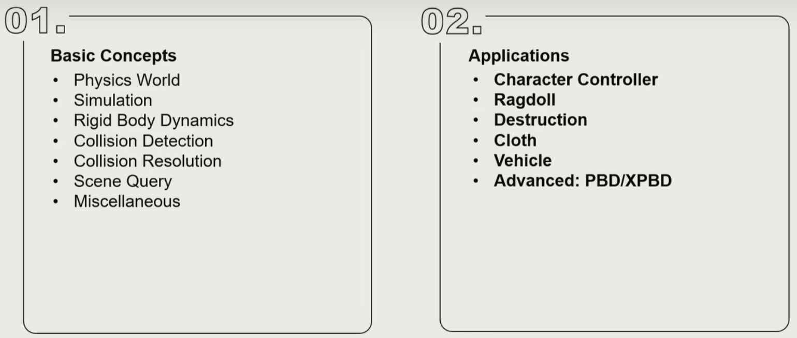
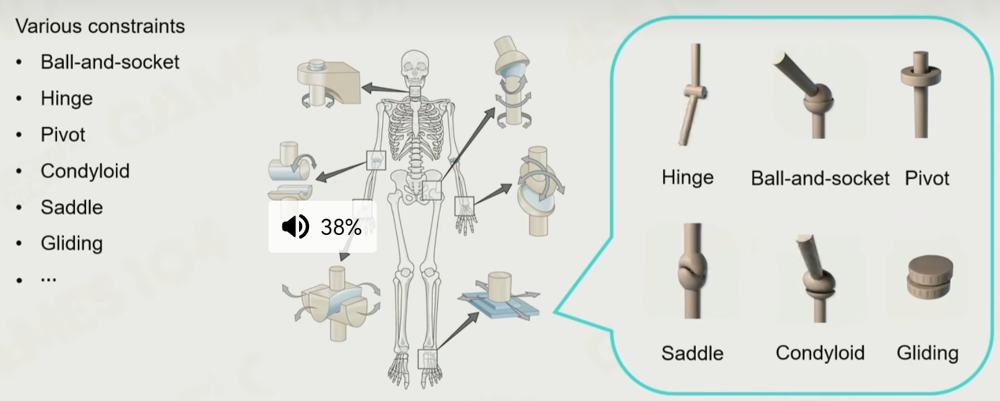

# 物理系统应用

Outline Of Physics system

## Charactor Controller

vs Rigid Body

1. 和 rigid body 交互
2. 近乎无限摩擦力
3. 沿着特定平面移动

- Build a Controller，需要有两层的 Collider
- 与环境碰撞，需要沿着墙壁横移
- Steping，检测到前面有楼梯需要向上瞬移一点
- Slope，特定角度的斜坡需要能冲上去，过大也能冲上去，也得滑下来
- Volume，不同的姿态碰撞体要变化，又不能无视条件任意改变姿态变化 Volume
- Push Ojbect，角色去推动物体，物体推动角色容易出 bug，此时如果是平台可以用 Hack 特殊处理

## RagDoll

布娃娃系统，人体物理自然下落。一般用于角色被击杀后使用

把关节加上铰链和 rigidbody，同时要制定旋转约束

