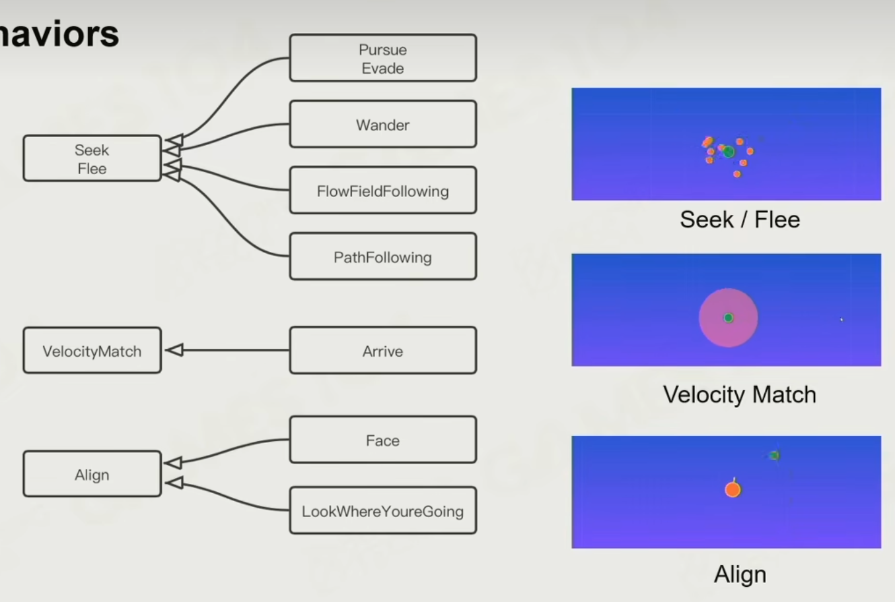

# 基础 AI 下

## Steering 指导行为

### Seek / Flee

朝向目标行走

- Pursue
- Path Following
- Weander
- Flow Field Following

### Velocity match

反向减速

### Align

面向目标

角速度也有加速度减速度

## Crowd

群体系统，群体行为

#### 从底向上

1. Separation：斥力
2. Cohesion ：引力
3. Alignment ：同向趋势

行进方向是不可控的

#### 从宏观开始

定义行进路线，即方向场

#### 结合起来

同时受到两种方法的约束

### Collision Avoidance

基于力的避障 Force base

避免碰撞，加力，障碍物距离场，热立场

### Velocity Obstacle 速度障碍

基于速度的避障 Velocity base

当速度相对时，互相避让偏移

- Force base

## Sensing or Perception

对环境的感知

Static Spatial Information ：静态地图

- Navigation Data
- Tactical Map 关键点
- Smart Object 物体
- Cover Point 掩体

DynamicSpatial Information ：动态地图

- Influence Map 危险系数图
- Mark on navigation ：动态障碍物
- Sight Area ：视野

Sensing Simulation

- ai 不能知道地图里所有发生的事
  - 视线，阻碍
  - 听觉，地面不同的脚步声

Classic Decision Making Algorithms

经典决策算法

#### Finite State Machine 有限状态机

- 真实的状态太多了，不好维护
- HFSM 层次有限状态机，不同的状态包之间跳转太慢了

#### Behavior Tree 行为树

- SOP 标准作战条例，形式化的决策语言
- 每帧从树根节点开始，以前序遍历决策树的形式，可以打断行为
- 通过条件点和控制点选择当前的行为，而不是在状态内判断当前的行为进行跳转。
- 好处是可以通过条件任意切换状态
- Condition node : true false，
- Action node : true false running，是任务而不是状态
- Control node : Sequence, Selector, Parallel, Decorator
  - Parallel 可以同时处于多个状态，处理多个事情
- Decorator ： 前置条件，用来封装 Control node + Condition node
- Blackboard ：行为树的全局变量，可以给不同的节点消耗和使用
