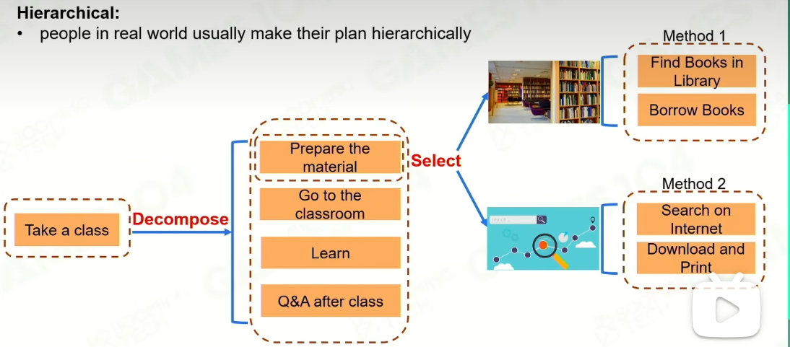
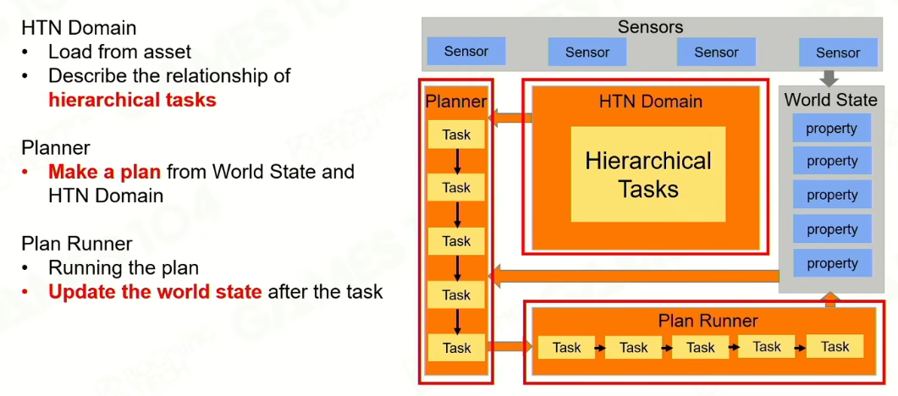
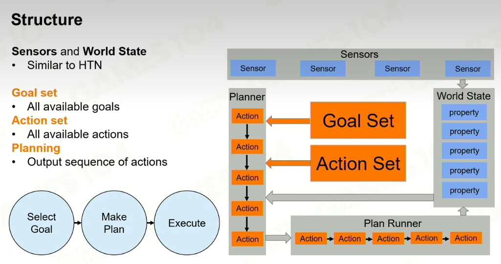

# 高级 AI 上

## Hierarchical Task Network

行为树有缺点，更像是反应机器，没有目标性的

1. 做计划
2. 拆解计划
3. 选择不同的方法来完成计划

### Framework

1. Sensors 感知器
2. World State 角色眼中的世界

Primitive Task 是原子任务

1. pre condition， 读入数据
2. action，操作数据
3. effect，写入数据

Compound Task 复合任务

定义原子任务的优先级，顺序

定义一个角色是 Task 的复合体，AI 角色就是复合任务集合

角色根据当前条件输出原子任务的集合，Plan runner 来执行这个任务系列

#### Replaining

当感知到世界（包括自身）的参数发生变化，要重新制定计划

HTN

是对 BT 的任务型抽象，可以不用每帧去更改计划

过长可能会有无效计划，造成震荡或不稳定性

## Goal-Oriented Action Planning

目标导向行为规划

**GOAP**

和 HTM 的区别

1. 需要显示定义目标
2. 可执行的行为
3. 行为的规划

目标 goal，可以进行定义，goal 是由多个 state 组合而成。

先确定目标，反向推导 Action 链，Action 链的预计执行结果要满足 goal 的所有 state

推导 Action 链的时候，每个 Action 也有自己的 state 前提。

每当确定执行 Action 的时候，要动态维护需要满足的 state 集合。

还要让 Action 链的 cost 尽量的小。

#### Build States-Action-Cost

动态规划问题指数型增长，需要转化为有限 node 的有向图问题

创建出所有节点，每个节点都是一种 states 集合状态。

节点间的连线 cost 为对应的 action cost

start node : states of the goal

end node : currect states

HTM 是按照 Action 优先级正向构建 Action list，需要手动调整

GOAP 是根据目标条件和 Action cost，反向构建图来规划 Action list

GOAP 数据化表达目标，无法用在很复杂的游戏上。

### Monte Carlo Tree Search

也是 Alpha Go 的算法

蒙特卡洛随机采样，足够的采样数量来逼近不可导的积分

建模，把现实中的 实际问题处理成计算机可以处理的数学模型

state space 或 state tree

构建树形结构代表各种状态

判断每个节点下赢的概率，方法是按照一定规则从这个状态快速下完这盘棋

default policy，操作的基础方法，即人类的基础棋谱，快速控制策略

同个 state 要多次测试，蒙特卡洛方法

Q：成功的模拟次数，N：总的模拟次数

Backpropagate ：需要反向调整

#### Selection 探索节点的选择

Exploitation 开发，选择 Q/N 比较大的节点

Exploration 探索，选择 N 比较小的节点

Choose the Best Move

- Max child : highest Q
- Robust child : highest visit
- Max-Robust child : both highest visit and highest reward
- Secure child : maximises lower confidence bound，综合所有的折中方案

没法放在复杂的游戏中使用

- 回合制
- 结果明确
- 状态改变明确
