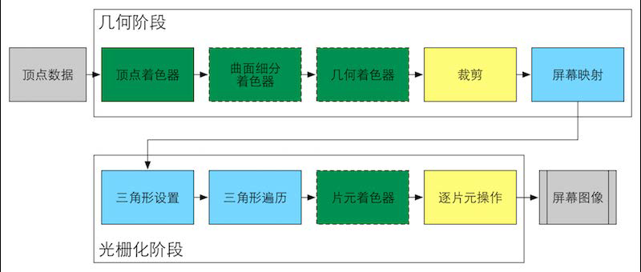
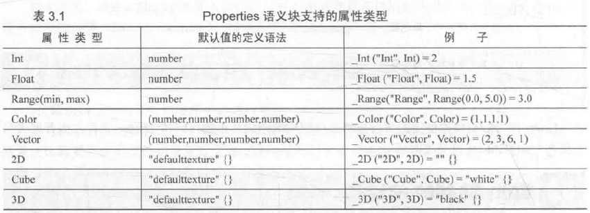
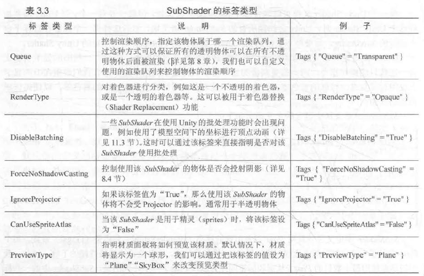
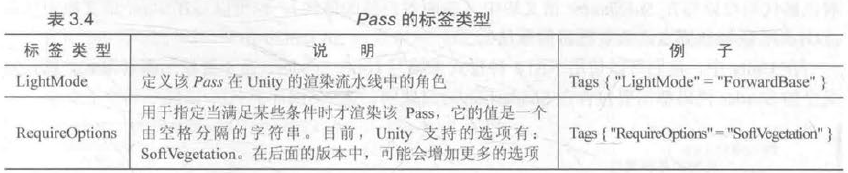
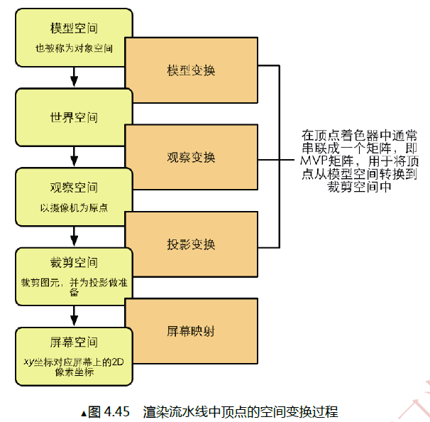

# Shader 入门精要笔记

第2 章渲染流水线

渲染流水线

22 CPU 和IPU 之间的通信

(1) 把数据加载到显存中。
(2) 设置渲染状态。
(3) 调用Draw Call

gpu 流水线

2.4.1 什么是OpenGUDirectx

C# -》 引擎 C++ -》 OpenGL -》 显卡驱动 -》 显卡二进制

2.4.3 什么是Draw Call

3.3.2 材质和Unity Shader 的桥梁Properties

3.3.3 重量级成员SubShader

UsePass: 如我们之前提到的一样，可以使用该命令来复用其他Unity Shader 中的Pass:
GrabPass: 该Pass 负责抓取屏称并将结果存储在一张纹理中，以用于后续的Pass 处理

4.2.4 Unity 使用的坐标系

Unity 使用的是左手坐标系，但对于观察空间来说， Unity 使用的是右手坐标系。

如果一个方阵 M 和它的转置矩阵的乘积是单位矩阵的话，我们就说这个矩阵是正交的(orthogonal)。

旋转表示：

矩阵，转轴，四元数

4.6.6 观察空间

由于观察空间使用的是右手坐标系，因此需要对z分揽进行取反操作。

4.6.7 裁剪空间

4.8.1 变换矩阵

4.8.2 摄像机和屏幕参数

4.9.3 Unity 中的屏幕坐标 ComputeScreenPos

[透视投影(Perspective Projection)变换推导](https://blog.csdn.net/linuxheik/article/details/78969526)
