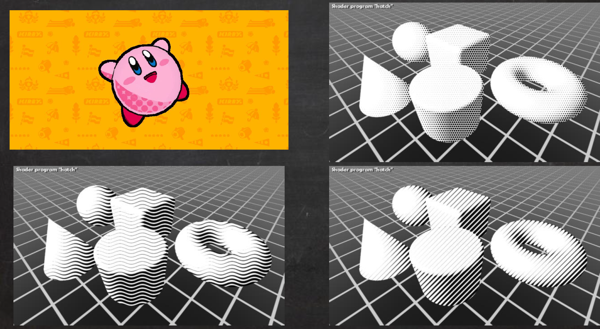
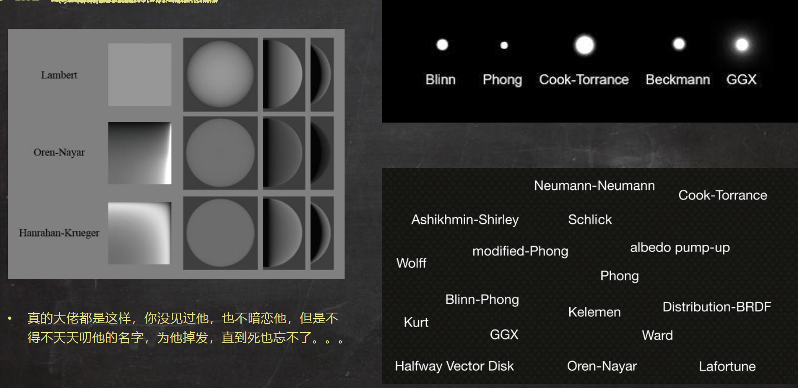
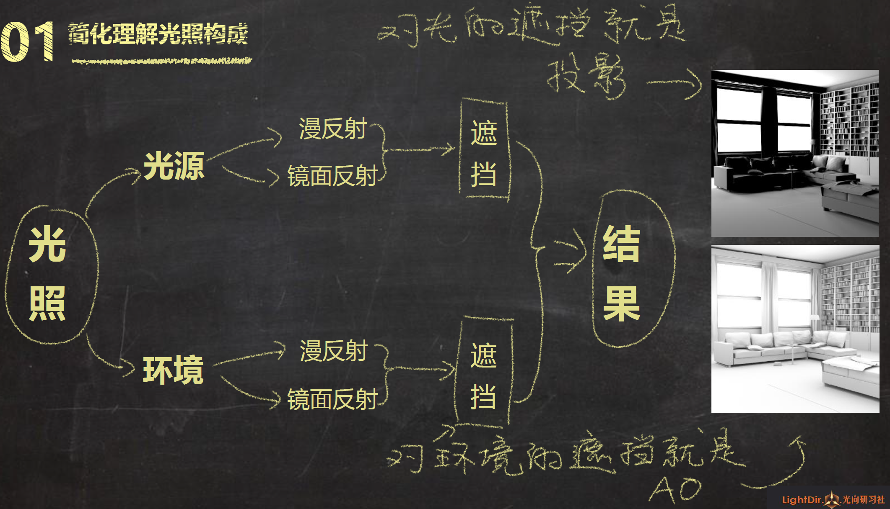

# 庄懂-美术向 TA 课程

## 零

- 自我介绍 开课目的
- 课程内容 授课方式
- 课程特色 学习方法
- 学员抽取 分组
- 答疑

## 一

#### 抽象的渲染过程

模型 > input > vertex shader > output > fragment shader > color

#### 值结构

- 标量 Scalar
- 向量 Vector

#### 乘

- dot
- cross

#### Lambert

- Max(0, nDir * lDir)

#### HalfLambert

- Lambert * 0.5 + 0.5

#### 调子映射

- 将半 Lambert(0~1) 的调子视为 uv 坐标的 u 坐标，再附加一个常量作为 v 轴，得到的 uv 坐标对 RampTex 采样，假SSS的透光效果。

## 二

#### 卡通渲染

- 卡通渲染不止一种风格
- 技术不止一种风格
  - 
  - 
- 常用技术 · Cell / ToonShading
  - [罪恶装备](https://gdcvault.com/play/1022031/GuiltyGearXrd-s-Art-Style-The)
  - [火影·究极风暴](http://psv.tgbus.com/news/ynzx/201306/20130603141025.shtml)
- 常用技术 - HatchingShading

  - 

  - 

#### 规范

- 路径规范
- 命名规范
- 提交形式规范

##  三

#### Lambert

- 渲染流程

- 关联编辑器

- SF 新建最简 Shader 模板

  

- HelloWorld
  
```clike
Shader "AP1/L03/Lambert"
{
    Properties {}
    SubShader
    {
        Tags
        {
            "RenderType"="Opaque"
        }
        Pass
        {
            Name "FORWARD"
            Tags
            {
                "LightMode"="ForwardBase"
            }
            CGPROGRAM
            #pragma vertex vert
            #pragma fragment frag
            #include "UnityCG.cginc"
            #pragma multi_compile_fwdbase_fullshadows
            #pragma target 3.0
            // 输入结构
            struct VertexInput
            {
                float4 vertex : POSITION; // 将模型顶点信息输入进来
                float4 normal : NORMAL; // 将模型法线信息输入进来
            };

            // 输出结构
            struct VertexOutput
            {
                float4 pos : SV_POSITION; // 由模型顶点信息换算而来的顶点屏幕位置
                float3 nDirWS : TEXCOORD0; // 由模型法线信息换算来的世界空间法线信息
            };

            // 输入结构>>>顶点Shader>>>输出结构
            VertexOutput vert(VertexInput v)
            {
                VertexOutput o = (VertexOutput)0; // 新建一个输出结构
                o.pos = UnityObjectToClipPos(v.vertex); // 变换顶点信息并将其塞给输出结构
                o.nDirWS = UnityObjectToWorldNormal(v.normal); // 变换法线信息并将其塞给输出结构
                return o; // 将输出结构输出
            }

            // 输出结构>>>像素
            float4 frag(VertexOutput i) : COLOR
            {
                float3 nDir = i.nDirWS; // 获取nDir
                float3 lDir = _WorldSpaceLightPos0.xyz; // 获取lDir
                float nDotl = dot(i.nDirWS, lDir); // nDir点积lDir
                float lambert = max(0.0, nDotl); // 截断负值
                return float4(lambert, lambert, lambert, 1.0); // 输出最终颜色
            }
            ENDCG
        }
    }
    FallBack "Diffuse"
}
```


## 四

#### HalfLambert

```c
            // 输入结构
            struct VertexInput
            {
                float4 vertex : POSITION; // 将模型顶点信息输入进来
                float4 normal : NORMAL; // 将模型法线信息输入进来
            };

            // 输出结构
            struct VertexOutput
            {
                float4 pos : SV_POSITION; // 由模型顶点信息换算而来的顶点屏幕位置
                float3 nDirWS : TEXCOORD0; // 由模型法线信息换算来的世界空间法线信息
            };

            // 输入结构>>>顶点Shader>>>输出结构
            VertexOutput vert(VertexInput v)
            {
                VertexOutput o = (VertexOutput)0; // 新建一个输出结构
                o.pos = UnityObjectToClipPos(v.vertex); // 变换顶点信息 并将其塞给输出结构
                o.nDirWS = UnityObjectToWorldNormal(v.normal); // 变换法线信息 并将其塞给输出结构
                return o; // 将输出结构 输出
            }

            // 输出结构>>>像素
            float4 frag(VertexOutput i) : COLOR
            {
                float3 nDir = i.nDirWS; // 获取nDir
                float3 lDir = _WorldSpaceLightPos0.xyz; // 获取lDir
                float nDotl = dot(i.nDirWS, lDir); // nDir点积lDir
                float halfLambert = nDotl * 0.5 + 0.5; // 映射至0~1
                return float4(halfLambert, halfLambert, halfLambert, 1.0); // 输出最终颜色
            }
```

#### 预积分

- 预积分皮肤渲染：Pre-Integrated Skin Shading
- 2 维的 RampTex，可以根据不同的情况采样不同的 RampTex

## 五

#### 漫反射和镜面反射

- 初中物理

  - 漫反射 ：Diffuse Reflection

  - 镜面反射 ： Specular Reflection 

- **黑话** 各种向量 （命名规范）
```
常用向量：（全要记）
• nDir：法线方向，点乘操作时简称n；
• lDir：光照方向，点乘操作时简称l；
• vDir：观察方向，点乘操作时简称v；
• rDir：光反射方向，点乘操作时简称r；
• hDir：半角方向(Halfway)，lDir和vDir的中间角方向，点乘操作时简称h；
所在空间：（暂时只记WS，其余看热闹）
• OS：ObjectSpace 物体空间，本地空间；
• WS：WorldSpace 世界空间；
• VS： ViewSpace 观察空间；
• CS：HomogenousClipSpace 齐次剪裁空间；
• TS：TangentSpace 切线空间；
• TXS：TextureSpace 纹理空间；
例：nDirWS：世界空间下的法线方向；
```

- 漫反射-Diffuse:
  - 因其向四面八方均匀散射，所以反射亮度和观察者看的方向无关；
  - 实现方式：Lambert（n dot l），显然vDir不参与计算；
- 镜面反射-Specular:
  - 因其反射有明显方向性，所以观察者的视角决定了反射光线的有无，明暗；
  - 实现方式：
    - Phong（r dot v），即光反射方向和视角方向越重合，反射越强；
    - Blinn-Phong（n dot h），即法线方向和半角方向越重合，反射越强；

#### Old School

- Lambert 漫反射 + Blinn-Phong 镜面反射
- 这样一个光照模型相对完善的Shader；这是一种上古套路，所以吾称之为OldSchool；

## 六

#### OldSchoolP

- Lambert+Phong

- ```
  6. 像素Shader需要修改：
      1. 向量准备：不需要hDir，但要追加rDir；rDir：光反射向量= reflect(-lDir, nDir)；注意lDir是光方向的反方向；
      2. 点积结果准备：不需要ndoth，追加vdotr；
      3. 改blinnPhong为phong，phong=pow(max(0, vdotr), _SpecularPow);
  ```

#### BRDF

- 双向反射分布函数
  - 想象你有一个不透明的桌面，一个激光发射器。你先让激光向下垂直地射在那个桌面上，这样你就
    可以在桌面上看到一个亮点，接着你从各个不同的方向来观察那个亮点，你会发现亮点的亮度随着
    观察方向的不同而发生了改变。然后你站着不动，改变激光发射方向和桌面的夹角，你又会发现亮
    点的亮度发生了改变。这就是说，一个表面对不同的光线入射角和反射角的组合，拥有不同的反射
    率。BRDF就是用来对这种反射性质进行定义的。---- 知乎用户
- 一些分布函数

  

- [BRDF Explorer](https://github.com/wdas/brdf/downloads)

## 七

#### 环境光

- 三色环境光 ColAmbient

  ```
  3. 定义面板参数：
  • 贴图参数的定义方法：_XXX (“面板标签”, 2d) = “white” {}
  • “white”{} 代表缺省纹理为纯白贴图，其他还有“black”{}“gray”{} …
  
  9. 通过nDir计算朝上，朝下，侧面各部位遮罩；
  10. 通过部位遮罩混合最终环境光颜色；
  11. 采样Occlusion图，获得环境遮挡信息；采样贴图方法：tex2D(_Texture, uv)；
  ```

#### 投影

- Unity 内置投影调用

  ```
  6. 输出结构追加：LIGHTING_COORDS(0, 1)：
  • 此为Unity封装好的输出结构内容，照写就行，暂时不看细节；
  • 括号中的参入，如(0, 1)；0，1分别代表占用了TEXCOORD1和TEXCOORD2；
  7. 顶点Shader中必须调用Unity封装好的方法：TRANSFER_VERTEX_TO_FRAGMENT(o);
  8. 像素Shader中获取投影信息同样通过Unity提供的方法：LIGHT_ATTENUATION(i)；
  ```

#### OldSchoolPlus

- 简化理解光照的构成

  

- OldSchoolPlus

  

## 八

#### OldSchoolPlus

```
1. 分析构成：
    • OldSchoolPlus=OldSchoolP+3ColAmbient+Shadow；
    • 以OldSchoolP为模板，追加3ColAmbient，Shadow功能；
    • OldSchoolPlus_SF作为参考；

7. 像素Shader
    1. 向量，点积结果准备部分与OldSchoolP一致，不用改；
    2. 光照模型拆为直接光照环境光照两部分：
        1. 直接光照：在Lambert+Phong的基础上追加：
            • 投影：算法可Copy自L07_Shadow；
            • 光颜色：乘以_LightCol；
        2. 环境光照：算法可Copy自L07_3ColAmbient；
        3. 将直接光照和环境光照相加输出；
```

#### NormalMap 采样

```
5. 输入结构追加：
    1. UV0：用于采样法线贴图；
    2. Tangent：用于构建TBN矩阵；
6. 输出结构追加：
    1. UV0：用于采样法线贴图；
    2. tDirWS，bDirWS，nDirWS：切线空间3轴向方向，用于构建TBN矩阵；
```

