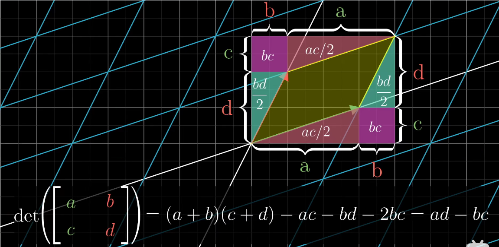

# 线性代数的本质

## 0.序言

## 1.向量

物理 : 向量是长度和方向
计算机 : 向量是数字列表 数字模型
数学:相加或与标量相乘有意义的东西

线性代数:向量是空间中的 Tail 在原点的箭头
为每个维度的基向量的长度

#### 向量相加

向量首尾相连，从总的首尾构建新向量

#### 向量和标量相乘

基向量系数相乘

## 2.线性组合、张程、向量的基

用数字描述向量，都依赖于所使用的基

坐标基的线性组合(乘以标量和相加)可以表示张成空间(span)中的所有向量。

如果这一组基向量是线性相关的，即某一个向量可以表示为其他向量的线性组合，即某个向量没对张成空间的加维做出贡献

张成空间的一组线性无关的向量集合

## 3.矩阵与线性变换

### 线性变换

linear transformation

#### transformation 变换

变换是指某个函数输入和输出两个维度相同的向量，可以理解为向量箭头的移动前和移动后

#### linear 线性

1. 直线在线性变换后保持直线
2. 原点保持不变

网格保持平行且等距

对坐标基进行线性变换

#### 线性变换矩阵

向量的线性变换可以看作是基向量的线性变换后的组合

基向量的变换就是空间的变换，这边把向量的线性变换看作向量空间的线性变换了

以变换后的基向量为列的矩阵描述了如何进行线性变换，相乘即可

A -> B 变换矩阵即 A 基向量变换到 B 空间，被 B 的基向量的表示

## 4.矩阵乘法和线性变换复合

向量左乘矩阵表示为向量的线性变换，矩阵乘法支持结合律，可以把两个线性变换矩阵合成为一个矩阵。但是不支持交换律

## 5.行列式

行列式符号 det

n 阶矩阵具有行列式

原始单位空间以该矩阵进行线性变换后的空间，对于原始单位空间的缩放比例

行列式为 0 说明二维度空间被压缩为一条线或点，可以进行降维

行列式具有负数，对于有定向的空间，相当于空间翻转了（对于 2 维相当于，z 轴正朝向反转）

空间可降维，说明矩阵的列线性相关

三维度的空间，改变定向说明改变了左右手定则

行列式的数值计算

