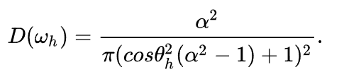
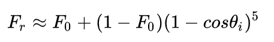
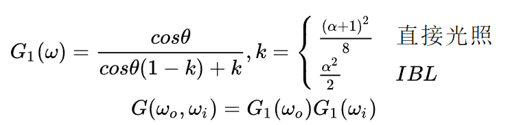
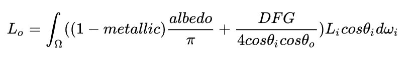
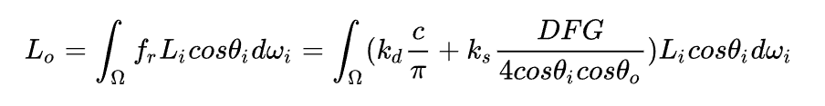
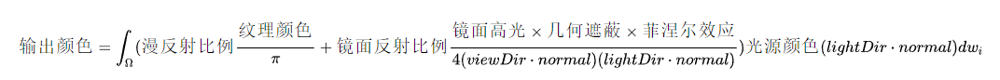

# BRDF

## 参考资料

[彻底看懂PBR/BRDF方程](https://zhuanlan.zhihu.com/p/158025828)

[猴子都能看懂的PBR - 知乎](https://zhuanlan.zhihu.com/p/33464301)

## 解析

### 单位

### 公式拆解

渲染方程为入射光强度（每单位面积）经过 BRDF 贡献到出射角度之和
$$
L_o = BRDF * L
$$

入射光亮度（每单位面积单位立体角）对光照的光强的贡献
$$
L = L_icos\theta_i
$$

$$
E(p) = \int_\Omega L_i(p,w)cos\theta_idw_i
$$

BRDF 分为漫反射项和镜面反射项
$$
BRDF = D + S
$$

漫反射项为漫反射系数与表面颜色 c
$$
D = k_d \frac c\pi
$$
镜面反射项为 镜面反射系数和 DFG 项
$$
S = k_S\frac {DFG}{4cos\theta_i cos\theta_o}
$$
D 为法线分布函数
$$
w_h = \frac {w_i + w_o}2
$$

Trowbridge-Reitz GGX:

F 为菲涅尔项，菲涅尔代表反射和折射对颜色贡献的占比，

系数越大反射率越大，其与入射光方向无关

漫反射项中默认菲涅尔项为 1，因为当其值小的时候，会在物体边缘，此时反射光强度大，会改过漫反射

Schlick近似来表示菲涅尔系数:

G 几何衰减项

Schlick-GGX近似:

综合公式

- - 
- 
- 

## 全局光照

使用 IBL（image base lighting）来实现 GL （global illumination）

上边的公式对于单光源只需要算一次，对于环境光作为无穷光源需要积半球

如果是真正积分半球颜色运算量过大，提前模糊 EnvironmentMap 假装采样点是已经积分后的光亮度。

根据金属度的不同，模糊程度也要不同，所以使用 MipMap 来采样对应模糊度的环境 EnvironmentMap
