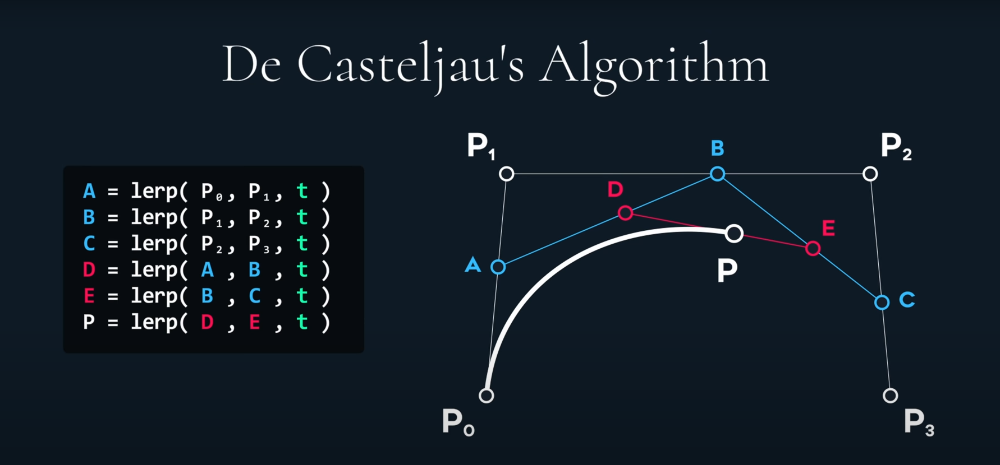

# 曲线

## 这里简单介绍 4 种曲线

### Bezier

贝塞尔曲线，4 个输入点，1，4 为路径点，2、3 为控制点。

曲线具有原子性

### Hermite

三个输入，1、3 为路径点，2 为控制点

### Catmull-Rom

四个输入点，全部为路径点

### B-Spline

全部为输入点，全部为控制点

## 引用

[折线拟合、过顶点的曲线（CATMULLROM方法）](https://www.freesion.com/article/6828246732/)

[Catmull-Rom插值算法](https://blog.csdn.net/wsf09/article/details/103453496)

[Bezier曲线与Catmull-Rom曲线](https://blog.csdn.net/u012154588/article/details/98977717)

[ 如何得到贝塞尔曲线的曲线长度和 t 的近似关系？ - 知乎](https://www.zhihu.com/question/27715729)

[三阶贝塞尔曲线一分为二的一般公式](http://www.360doc.com/content/16/0101/20/1489589\_524673502.shtml)

[Hermite （埃尔米特）曲线 - 那些消散不去的是寂寞 - 博客园](https://www.cnblogs.com/jqm304775992/p/5044728.html)

[(13条消息) Hermite 与 Bezier 曲线的转换公式_Hustlion 的技术博客-CSDN博客_hermite转bezier](https://blog.csdn.net/techfield/article/details/113744152)
